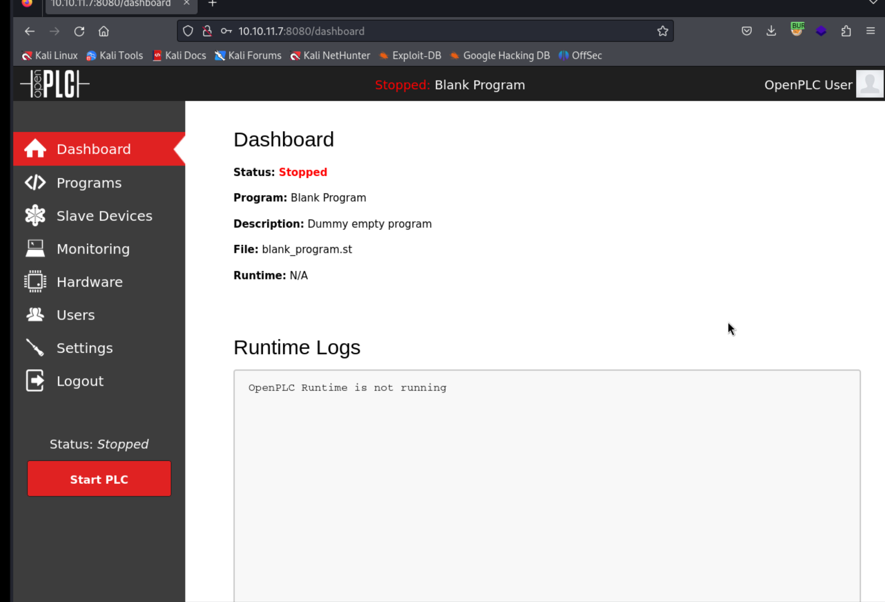
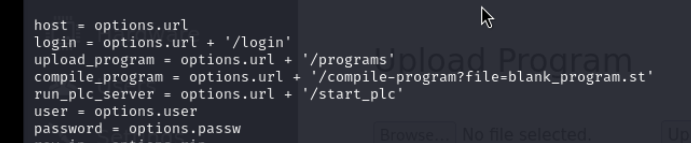

## Reconnaissance

### nmap 


### Web Service 


### Research default credential of OpenPLC


> Login successful


### Gobuster Result 


### Research Exploit code for openPLC

> Find CVE - CVE-2021-31630
> Command Injection in Open PLC Webserver v3 allows remote attackers to execute arbitrary code via the "Hardware Layer Code Box" component on the "/hardware" page of the application.
> After login, check the /hardware page


> It might be the place that I can write the exploit code 
> But I also found exploit code
> 2 exploit code 
> 1 is in Exploit DB
> The other is someone who also play this machine and he has solved it.

1. [(EXPLOIT DB)OPENPLC Exploit Code](https://www.exploit-db.com/exploits/49803)
2. [(GITHUB)CVE-2021-31630-HTB](https://github.com/Hunt3r0x/CVE-2021-31630-HTB)
> According to the exploit code, it might set the reverse shell payload in /program


> Hence I check /program 
> It provides a upload function which might can upload a code with extension (.st)
> And it has an existing code named blank_program.st currently


> In the dashboard page, The file also indicates the program file is blank_program.st


> But the st file is 681871.st  in the file parameter for compile-program function in exploit code


> At first, I didn't do any change and execute it directly
> It works, but the reverse shell and payload didn't work as expect.
> Hence, I change the file to blank_program.st



## Exploit 

> After modification, both of the exploit code are works well 
> Using 1st one from exploit DB


> Gain reverse shell


> The user is root. it's surprised me
> But I only find user flag in /root directory


## Privilege Escalation 

> Start to find the clue to gain root flag 
> The network interface 

- eth0
- lo
- wlan0 - mean wifi 


> With the lab name -wifinetictwo
> It's also a kind of hint, I think the PE part must related to wifi 
> I start to research how to enumerate the information about wifi 

- [(HackTricks)Wifi](https://book.hacktricks.xyz/generic-methodologies-and-resources/pentesting-wifi)


> Get information about wifi 

```
ip link show
```


```
iwconfig
```


> Search available SSID
> Find SSID : plcrouter 

```
iw dev wlan0 scan 
```


> Checking the result, I got the following information 

1. SSID: plcrouter 
2. WPS Enable

> According to HackTricks, WPS has the following description 


> And there are some Brute Force attack for WPS 
> There are 2 tools introduced in HackTricks

1. Reaver
2. Bully


> WPS Pixie Dust attack  
> Using potential hash value to crack PIN


> With discussion forum, I got some hint about the tool for WPS Pixie Dust attack

1. [(GITHUB)oneshot](https://github.com/kimocoder/OneShot)

> Executing result
> Get WPA PIN & WPA PSK

```
PIN : 12345670
PSL : NoWWEDoKnowWhaTisReal123!
```


> With this information, I have to set up wpa and try to connect to 'plcrouter'
> First, I follow this article

- [Connecting to WiFi network using systemd and wpa-supplicant](https://wiki.somlabs.com/index.php/Connecting_to_WiFi_network_using_systemd_and_wpa-supplicant)

1. Set up wpa_supplicant.conf in /etc/wpa_supplicant
```
ctrl_interface=/var/run/wpa_supplicant
ctrl_interface_group=0
update_config=1

network={
  ssid="<NETWORK_SSID>"
  psk="<NETWORK_PASSWORD>"
  key_mgmt=WPA-PSK
  proto=WPA2
  pairwise=CCMP TKIP
  group=CCMP TKIP
  scan_ssid=1
}
```
2. Set up network file in /etc/systemd
```
[Match]
Name=wlan0

[Network]
DHCP=ipv4
```
3. Restart the wifi interface service
```
systemctl enable wpa_supplicant@wlan0.service
systemctl restart systemd-networkd.service
systemctl restart wpa_supplicant@wlan0.service
```
4. Check interface status 
```
ip a
```

> With above step, the wifi interface still can't get ip address 
> I also use some command about wpa_supplicant from this article

- [Using WPA_Supplicant to Connect to WPA2 Wi-fi from Terminal on Ubuntu 16.04 Server](https://www.linuxbabe.com/command-line/ubuntu-server-16-04-wifi-wpa-supplicant)

1. Check wireless interface 
```
iwconifg
```


2. Create wpa_supplicant.conf from wpa_passphrase
```
wpa_passphrase plcrouter 'NoWWEDoKnowWhaTisReal123!' > wpa_supplicant.conf
```


3. Now use the wpa_supplicant command to connect your wireless card to wireless access point 

```
sudo wpa_supplicant -c wpa_supplicant.conf -i wlan0 -B -Dnl80211
```


4. After above step, I check wireless interface again, I still can't get ipv4 address 

> Status check


> With the discussion forum in breachforums, someone provide the following step

- [Discussion - BreachForums](https://breachforums.cx/Thread-HTB-WifineticTwo?page=6)

```
wpa_passphrase plcrouter 'NoWWEDoKnowWhaTisReal123!' > config  
wpa_supplicant -B -c config -i wlan0  
ifconfig wlan0 192.168.1.7 netmask 255.255.255.0  
ssh root@192.168.1.1  
cat root.txt
```
> It assign the ipv4 address directly by ifconfig command 

```
ifconfig wlan0 192.168.1.7 netmask 255.255.255.0  
```


> Hence, I also do the same thing.


> Then, I can get the ipv4 address 


> After the wifi interface setting, I think I success to connect victim to another router.
> Using SSH to login 

```
ssh root@192.168.1.1
```


> I got into another environment


> Check user still is root


> Got root flag


## Reference 


### Discussion 

- [Official WifineticTwo Discussion](https://forum.hackthebox.com/t/official-wifinetictwo-discussion/309776/27)
- [Discussion - BreachForums](https://breachforums.cx/Thread-HTB-WifineticTwo?page=6)

### Write up 

- [Writeup 1](https://cn-sec.com/archives/2593193.html)
- [WifineticTwo WriteUp/Walkthrough: HTB-HackTheBox | Remote Code Execution | Mr Bandwidth](https://medium.com/@mrbandwidth/wifinetictwo-writeup-walkthrough-htb-hackthebox-remote-code-execution-33b501b69579)
- [WifineticTwo WriteUp: HackTheBox | Remote Code Execution & Pixie Dust](https://onurcangencbilkent.medium.com/wifinetictwo-writeup-code-injection-hackthebox-to-be-continue-5509436b2287)
- [Wifinetictwo HTB](https://www.youtube.com/watch?v=-N1fzVejUuo)
### OpenPLC 

- [OpenPLC default Credential](https://github.com/openplcproject/openplcproject.github.io/blob/master/runtime/windows/index.md)

#### CVE-2021-31630

- [(NVD)CVE-2021-31630 Detail](https://nvd.nist.gov/vuln/detail/CVE-2021-31630)
- [(EXPLOIT DB)OPENPLC Exploit Code](https://www.exploit-db.com/exploits/49803)
- [(GITHUB)CVE-2021-31630-HTB](https://github.com/Hunt3r0x/CVE-2021-31630-HTB)
- [Exploit for Code Injection in Openplcproject Openplc V3 Firmware CVE-2021-31630](https://sploitus.com/exploit?id=5EA21198-9FB0-5029-AF9C-E63B5974412A&utm_source=rss&utm_medium=rss)
- [(GITHUB)OpenPLC Project](https://github.com/openplcproject/openplcproject.github.io/blob/master/runtime/windows/index.md)
- [PoC - Authenticated Remote Code Execution on OpenPLC_V3 WebServer](https://youtube.com/watch?v=l08DHB08Gow)
### Wifi 

- [(HackTricks)Wifi](https://book.hacktricks.xyz/generic-methodologies-and-resources/pentesting-wifi)
- [Connecting to WiFi network using systemd and wpa-supplicant](https://wiki.somlabs.com/index.php/Connecting_to_WiFi_network_using_systemd_and_wpa-supplicant)
- [Using WPA_Supplicant to Connect to WPA2 Wi-fi from Terminal on Ubuntu 16.04 Server](https://www.linuxbabe.com/command-line/ubuntu-server-16-04-wifi-wpa-supplicant)

### WPS Pixie Dust Attack

- [WPS Pixie Dust Attack (Offline WPS Attack)](https://forums.kali.org/showthread.php?24286-WPS-Pixie-Dust-Attack-(Offline-WPS-Attack))
- [(GITHUB)oneshot](https://github.com/kimocoder/OneShot)
- [(GITHUB)oneshot](https://github.com/fulvius31/OneShot)
- [How WPS Attacks Work – And How to Protect Your Network](https://firewalltimes.com/wps-attacks/)
- [Wps pixie dust attack](https://www.slideshare.net/invad3rsam/wps-pixie-dust-attack)
- [(GITHUB)wifite2](https://github.com/derv82/wifite2)

### Others 

- [pwncat usage](https://pwncat.readthedocs.io/en/latest/usage.html)
- [pwncat 花式反弹shell|自动持久性+提权](https://www.ddosi.org/pwncat/)
- [pwncat - multiplatform](https://asciinema.org/a/417930)
### Linux command 

- [Use cURL and Wget to download network files from CLI](https://www.techtarget.com/searchnetworking/tutorial/Use-cURL-and-Wget-to-download-network-files-from-CLI)
###### tags: `HackTheBox`